# Mercury → PrimeAgent Long-Running Coding Orchestration

## 1. Objective

Build **Mercury** as the user-facing façade and orchestration/control plane for long-running software-engineering tasks executed by **PrimeAgent**.

Mercury provides:

- Chat
- Web UI
- Operations dashboard
- API
- Run history
- Real-time progress
- Human approval/input
- Cancellation and retry
- Agent selection
- Skill discovery and selection
- Observability

PrimeAgent acts as an asynchronous coding worker.

The central abstraction is a durable **Run**.

A user must be able to:

1. Submit a coding task.
2. Receive a `runId`.
3. Close Mercury.
4. Allow PrimeAgent to continue working.
5. Return hours later.
6. Observe the same run.
7. Provide input if required.
8. Inspect code changes, tests, commits, errors and results.

The lifetime of a coding task MUST NOT depend on a browser, HTTP connection, WebSocket, SSE connection or chat session.

---


## 2. Core Principles


### 2.1 Mercury Is the Control Plane

Mercury owns intent, orchestration, state and interaction.

PrimeAgent owns coding execution.

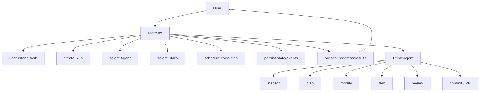


### 2.2 A Run Is Durable

A coding operation is:

```text
Run
```

not:

```text
HTTP request
```

and not:

```text
Chat message
```

Chat messages may create, control and observe Runs, but they are not the durable execution primitive.

### 2.3 Agents and Skills Are Different

An **Agent** is an execution backend.

Examples:

```text
PrimeAgent
Codex
Claude Code
LocalAgent
FutureAgent
```

A **Skill** is reusable knowledge, instructions, scripts or workflows supplied to an agent.

Examples:

```text
planning
repository-analysis
frontend
backend
testing
debugging
security-review
code-review
git-pr
documentation
deployment
```

Mercury decides **what** should happen.

Skills describe reusable guidance for **how** capabilities should be performed.

PrimeAgent performs the work.

The Agent Adapter defines **how Mercury communicates with the execution backend**.

The Worker controls **where and when execution happens**.

---


# 3. High-Level Architecture

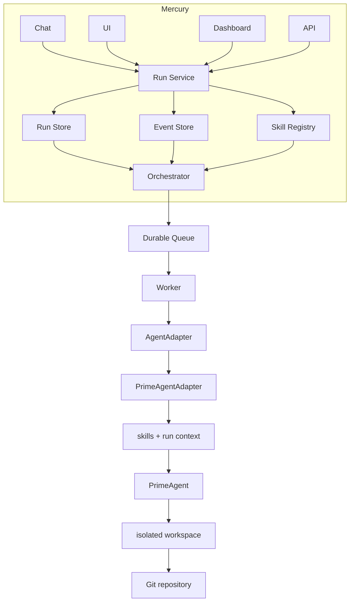

---


# 4. Responsibility Boundaries


## 4.1 Mercury

Mercury owns:

- Authentication
- Authorization
- User interaction
- Run creation
- Run lifecycle
- Persistent metadata
- Agent selection
- Skill selection
- Scheduling
- Event persistence
- Event streaming
- Human interaction
- Cancellation
- Retry
- Dashboard
- Audit trail
- Observability

Mercury SHOULD NOT contain PrimeAgent-specific coding logic.

---


## 4.2 Orchestrator

The orchestrator owns coordination.

Responsibilities include:

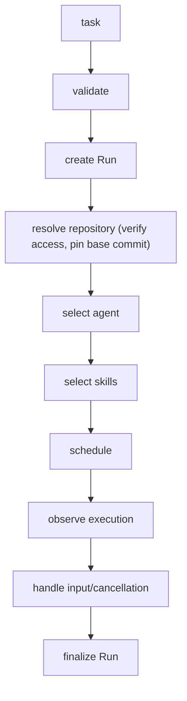

The orchestrator SHOULD NOT directly edit source code.

---


## 4.3 Worker

The worker owns long-running process execution.

It:

- Claims queued Runs.
- Creates isolated workspaces.
- Starts AgentAdapters.
- Streams agent events.
- Persists progress.
- Handles cancellation.
- Handles timeouts.
- Cleans up resources.
- Recovers from execution failures where possible.

The Mercury web server SHOULD NOT execute long-running PrimeAgent processes directly.

---


## 4.4 PrimeAgent

PrimeAgent owns software-engineering execution.

Responsibilities include:

- Repository inspection
- Planning
- Source-code changes
- Tool execution
- Tests
- Debugging
- Git operations
- Validation
- Reporting progress
- Requesting human input
- Final result generation

---


# 5. Run Model

Every coding task receives a globally unique stable `runId`.

Example:

```json
{
  "id": "run_01...",
  "ownerId": "user_01...",
  "agent": "primeagent",
  "status": "RUNNING",
  "task": "Upgrade dependencies and fix failing integration tests",
  "repository": {
    "url": "https://github.com/acme/project",
    "baseBranch": "main",
    "baseCommit": "abc123"
  },
  "workspace": {
    "branch": "agent/run_01..."
  },
  "skills": [
    {
      "id": "planning",
      "version": "1.0.0"
    },
    {
      "id": "testing",
      "version": "1.3.0"
    },
    {
      "id": "git-pr",
      "version": "1.1.0"
    }
  ],
  "attempt": 1,
  "retryOf": null,
  "error": null,
  "createdAt": "...",
  "startedAt": "...",
  "completedAt": null
}
```

v1 supports a single primary `repository` per Run. Multi-repository tasks are an extension point (e.g. a `repositories[]` array); do not design the v1 workspace layer around them.

Do not use chat message IDs as Run IDs.

---


# 6. Run Lifecycle

Initial state machine:

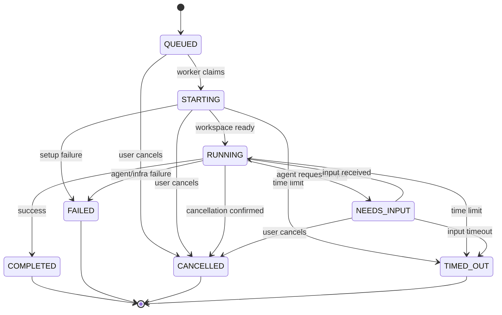

The diagram shows the main path. The complete transition table:

| From | To | Trigger |
| --- | --- | --- |
| QUEUED | STARTING | worker claims the Run |
| QUEUED | CANCELLED | user cancels before claim |
| STARTING | RUNNING | workspace ready, adapter started |
| STARTING | FAILED | setup failure (clone, workspace, adapter start) |
| STARTING | CANCELLED | user cancels during setup |
| RUNNING | NEEDS_INPUT | agent requests human input |
| NEEDS_INPUT | RUNNING | input received |
| RUNNING | COMPLETED | agent finished successfully |
| RUNNING | FAILED | agent or infrastructure failure |
| RUNNING | CANCELLED | cancellation confirmed |
| NEEDS_INPUT | CANCELLED | user cancels while waiting |
| STARTING / RUNNING / NEEDS_INPUT | FAILED | unrecoverable infrastructure failure (e.g. lease expiry without recovery) |
| STARTING / RUNNING / NEEDS_INPUT | TIMED_OUT | execution time limit or input timeout exceeded |
| STARTING / RUNNING / NEEDS_INPUT | QUEUED | the **owning** worker is shutting down gracefully (§6.1) |

All state transitions MUST be persisted.

Invalid transitions SHOULD be rejected.

Terminal states are:

```text
COMPLETED
FAILED
CANCELLED
TIMED_OUT
```

A worker receiving a terminal Run MUST NOT execute it again.

Retry is not a state transition: it creates a new Run (see §21).

### 6.1 The one exception to single-pass: graceful shutdown

`STARTING / RUNNING / NEEDS_INPUT -> QUEUED` is permitted **only** when the worker that currently
holds the lease is shutting down. The Run is not finished and no work was lost, so failing it would
turn every deploy into spurious `FAILED(infrastructure)` records and duplicate agent spend; merely
releasing the lease would strand the Run in `RUNNING` forever, because the reaper only selects rows
with a non-NULL `lease_expires_at`.

This exception is deliberately narrow, and MUST NOT be widened to lease loss. A worker that has
**lost** its lease no longer owns the Run and MUST NOT alter its status or clear its lease: another
worker may be executing it, and requeueing hands it to a third. Lease-expiry recovery belongs
solely to the reaper, which takes the `-> FAILED` row above and then retry-as-new-run per §21.

`RunQueue.requeueForShutdown` is the only implementation of this edge and is scoped to
`lease_owner = ?`. Its set of source states is generated from the state machine rather than
restated, so the two cannot drift.

---


# 7. Run API

Provide API functionality equivalent to:

```text
POST   /api/runs
GET    /api/runs
GET    /api/runs/:runId

POST   /api/runs/:runId/input
POST   /api/runs/:runId/cancel
POST   /api/runs/:runId/retry

GET    /api/runs/:runId/events
GET    /api/runs/:runId/stream
```

If Mercury already exists in the target codebase, follow its route conventions; otherwise use these routes as canonical.

`GET /api/runs` SHOULD support filtering and pagination (`owner`, `status`, `limit`, `cursor` — or the target codebase's convention).

`POST /api/runs` SHOULD accept an `Idempotency-Key` header (see §21).

---


## 7.1 Create Run

Example request:

```json
{
  "task": "Fix authentication regression and prepare a PR",
  "repository": {
    "url": "https://github.com/acme/app",
    "baseBranch": "main"
  },
  "agent": "primeagent",
  "skills": [
    "debugging",
    "testing",
    "security-review",
    "git-pr"
  ]
}
```

Example response:

```json
{
  "runId": "run_01...",
  "status": "QUEUED"
}
```

The endpoint MUST return after durable scheduling.

It MUST NOT wait for PrimeAgent completion.

---


# 8. Agent Adapter

Mercury MUST NOT call PrimeAgent-specific APIs or subprocesses throughout application code.

Create an abstraction conceptually equivalent to:

```ts
interface AgentAdapter {
  start(context: RunContext): Promise<AgentHandle>;

  sendInput(
    runId: string,
    input: AgentInput
  ): Promise<void>;

  cancel(
    runId: string
  ): Promise<void>;

  resume?(
    runId: string,
    context?: RunContext   // worker retry path: new run + workspace + resumeSessionFile
  ): Promise<AgentHandle>;
}
```

```ts
interface AgentHandle {
  runId: string;
  events: AsyncIterable<AgentEvent>; // raw agent output; the adapter translates it into Mercury events
  exit: Promise<AgentExit>;          // resolves when the agent process finishes
  terminate(): Promise<void>;        // forceful termination, last resort
}
```

The handle is the worker's only reference to the running agent. It MUST NOT depend on the original client connection.

`resume()` is optional; see §16 for what resume may and may not promise.

Initial implementation:

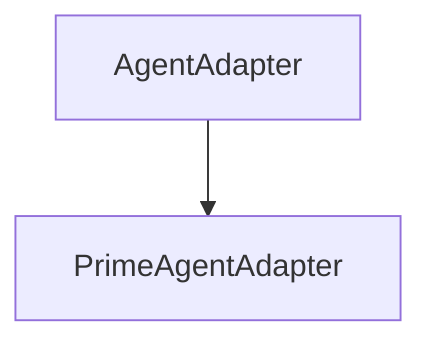

Implemented adapters (see `docs/agent-adapters.md`):

```text
PrimeAgentAdapter   (prime-agent --mode rpc)
HermesAgentAdapter  (hermes chat -Q)
LocalAgentAdapter   (declarative local CLI configs)
RemoteAgentAdapter  (declarative remote HTTP API configs)
RpcAgentAdapter     (declarative RPC JSONL configs: pi / omp / ...)
FakeAgentAdapter    (deterministic, for tests)
```

Planned adapters:

```text
CodexAdapter
ClaudeCodeAdapter
GeminiAdapter
AiderAdapter (config-only via LocalAgentAdapter)
OpenHandsAdapter (config-only via RemoteAgentAdapter)
DevinAdapter (config-only via RemoteAgentAdapter)
```

This boundary MUST remain independent from Mercury UI and chat implementation.

---


# 9. Run Context

The adapter receives an explicit execution context.

Conceptually:

```ts
interface RunContext {
  run: Run;
  repository: RepositoryContext;
  workspace: Workspace;
  skills: ResolvedSkill[];
  constraints: RunConstraints;
}
```

```ts
interface RunConstraints {
  maxDurationMs: number;
  maxRetries: number;
  budgetTokens?: number;       // RECORDED ONLY -- not enforced (see below)
  budgetCost?: number;         // RECORDED ONLY -- not enforced (see below)
  resourceLimits?: { cpu?: string; memory?: string; disk?: string };
  allowedNetworks?: string[];  // egress policy; empty = no network
}

**`budgetTokens` and `budgetCost` are recorded, not enforced.** No adapter reports token or cost
usage, so there is nothing to compare a budget against while a Run executes. They were formerly
`maxTokens`/`maxCost`, which sat beside two genuinely enforced `max*` fields (`maxDurationMs` and
`maxRetries`, both read by the worker) and so read as promises that were never kept. Enforcement
requires per-run usage reporting from every adapter; if that is ever added, enforcement belongs in
the drive loop next to the `maxDurationMs` deadline and the fields should be renamed back to `max*`.
```

It should contain everything needed to execute the task without depending on the original client connection.

---


# 10. Reusable Skills Architecture

Skills are first-class, reusable, version-controlled capabilities.

Prefer an Agent Skills-compatible filesystem convention where practical.

Example:

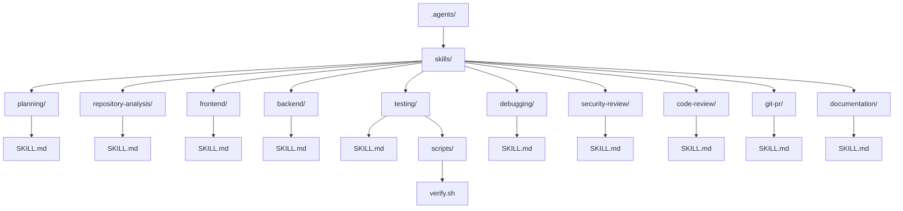

A skill may contain:

- Instructions
- Acceptance criteria
- Scripts
- Templates
- Examples
- References
- Verification procedures

Skills MUST NOT contain credentials.

When a Run resolves skills, snapshot the resolved skill content (files plus a content hash) into the Run record and the workspace. Recording only the version is not reproducible: the skill may change after the Run starts. The snapshot keeps Runs auditable and replayable.

---


# 11. Skill Registry

Mercury SHOULD expose a logical skill registry.

Conceptually:

```ts
interface Skill {
  id: string;
  version: string;
  description: string;
  path: string;
  capabilities: string[];
}

interface SkillRegistry {
  list(): Promise<Skill[]>;

  resolve(
    ids: string[]
  ): Promise<ResolvedSkill[]>;
}
```

The first implementation SHOULD use the filesystem if possible.

Do not introduce a dedicated Skill Registry microservice unless requirements justify it.

---


# 12. Skill Selection

Support both explicit and automatic skill selection.

## 12.1 Explicit Selection

A user or API caller can request particular skills.

```json
{
  "task": "Fix authentication regression",
  "skills": [
    "debugging",
    "testing",
    "security-review"
  ]
}
```

---


## 12.2 Automatic Selection

Mercury can infer capabilities from a task.

Example:

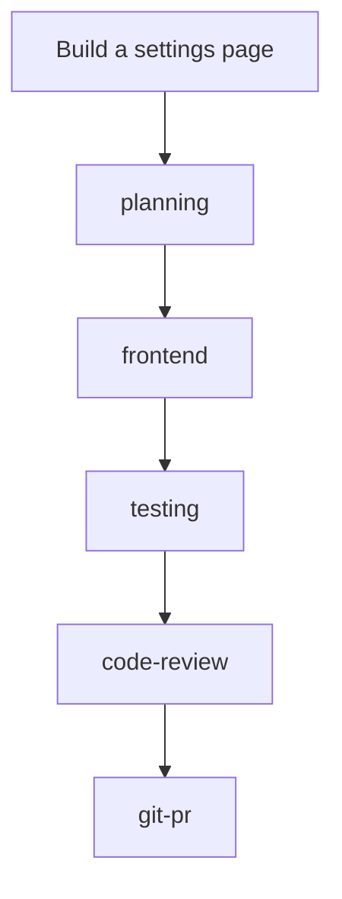

Initial automatic selection SHOULD be deterministic and easy to debug.

The chain above illustrates a typical order, not an enforced pipeline: skills are guidance, and the agent applies them as needed (see §13).

Avoid introducing semantic/vector retrieval until it solves an actual selection problem.

---


## 12.3 Load the Minimum Necessary Skills

Do not inject the entire skill library into PrimeAgent.

Instead:

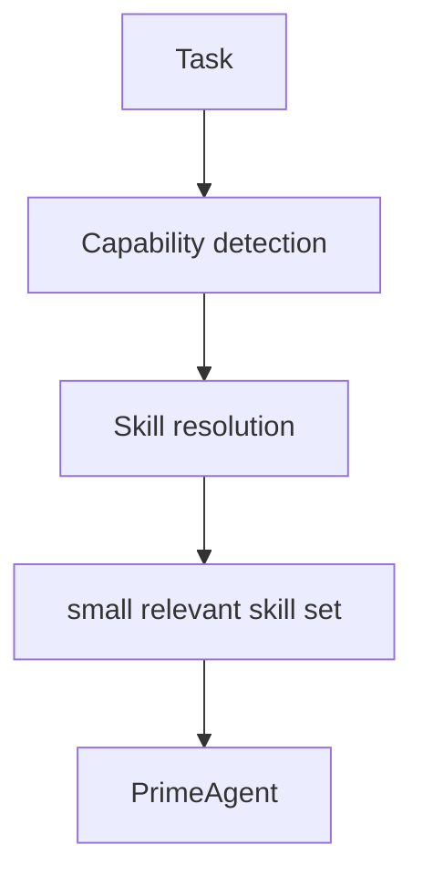

This reduces noise, context consumption and unintended behavior.

---


# 13. Skills vs Subagents

A Skill is NOT automatically a separate agent.

For example:

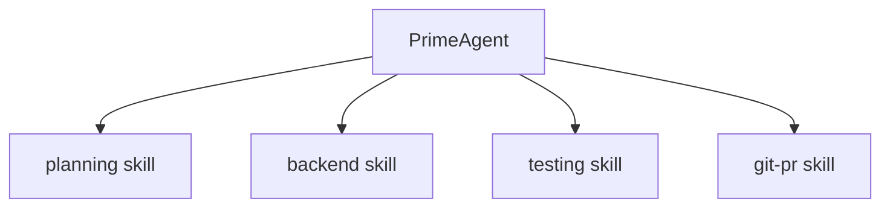

may remain a single Run.

Spawn another agent only where there is a concrete benefit from:

- Parallel execution
- Separate context
- Workspace isolation
- Different tools
- Different model capabilities
- Security boundaries
- Independent failure handling

Do not add multi-agent complexity when one PrimeAgent Run with several skills is sufficient.

Skills are guidance, not enforced phases. `skill.started` / `skill.completed` events are agent-reported markers for when the agent began and finished applying a skill; Mercury does not enforce a skill pipeline or ordering.

---


# 14. Structured Event Model

PrimeAgent activity MUST be translated into structured Mercury events.

A **step** is a named unit of work within a Run reported by the agent (e.g. "inspect repository", "run integration tests"). Steps are agent-reported, not enforced.

Minimum events:

```text
run.created
run.queued
run.started
run.cancelling

skill.selected
skill.started
skill.completed
skill.failed

step.started
step.completed
step.failed

agent.message

tool.started
tool.completed
tool.failed

git.changed
git.commit
git.pr

test.started
test.completed

input.required
input.received

error

run.completed
run.failed
run.cancelled
run.timed_out
```

---


## 14.1 Event Envelope

```json
{
  "id": "evt_01...",
  "runId": "run_01...",
  "type": "skill.started",
  "timestamp": "...",
  "sequence": 42,
  "payload": {
    "skill": "testing",
    "version": "1.3.0"
  }
}
```

Events SHOULD receive monotonically increasing sequence numbers within a Run. Sequence numbers MUST be assigned by a single writer (e.g. the persistence layer) so ordering stays correct with concurrent producers (worker events and API input events).

Events MUST be persisted before, or atomically with, broadcasting where practical.

A disconnected client must be able to recover missing events.

---


# 15. Real-Time Streaming

Prefer Server-Sent Events unless Mercury already provides an appropriate real-time mechanism.

Example:

```text
GET /api/runs/:runId/stream
```

The client should:

1. Fetch the current Run.
2. Fetch historical events.
3. Subscribe to new events, passing the last observed sequence (`?after=<sequence>`) to close the history/subscribe race.
4. Track event sequence.
5. Reconnect after interruption.
6. Continue from the last observed event.

The server SHOULD send periodic keepalive comments (e.g. every 15–30 s) so intermediaries do not close idle connections.

Closing the event stream MUST NOT terminate PrimeAgent.

---


# 16. Durable Execution

Long-running jobs MUST survive:

- Browser closure
- UI refresh
- Chat disconnection
- HTTP termination
- SSE/WebSocket termination
- Temporary network failure

Where practical, execution SHOULD also survive:

- Mercury backend restart
- Worker restart
- Queue reconnect
- Temporary database failure

**Resume semantics.** Mercury guarantees that orchestration state (Run record, events, queue) is always recoverable. The agent's in-flight state is NOT generally checkpointable, so:

- If the worker crashes before the agent produced durable output, the Run may be retried from scratch (new attempt, §21).
- A Run interrupted while waiting for human input resumes exactly: the pending input is persisted, and the agent restarts with it applied.
- If the agent backend supports persisted sessions, the adapter MAY implement `resume()`; otherwise omit it and use retry-from-scratch.
- A Run MUST NOT silently continue from a half-applied state; when in doubt, fail the attempt rather than corrupt the repository.

Reuse the project's existing queue/workflow system where possible (if the target codebase has one; otherwise use the smallest robust solution, e.g. a database-backed queue).

Potential mechanisms include:

```text
existing application queue
database-backed queue
Redis-backed queue
Temporal
other durable workflow engine
```

Do not introduce major infrastructure merely because it is architecturally attractive.

Use the smallest robust solution consistent with the existing system.

---


# 17. Worker Execution

Conceptually:

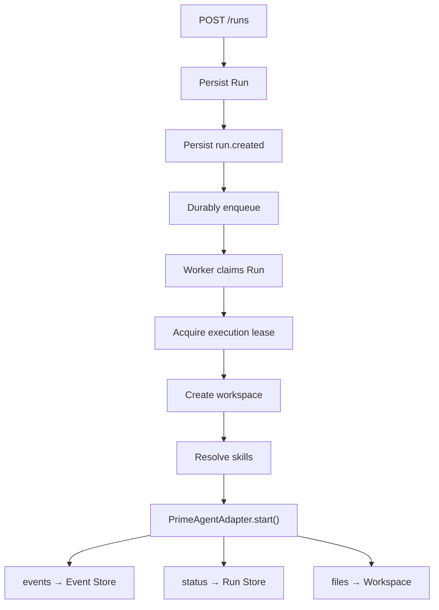

Multiple workers MUST NOT execute the same Run concurrently.

Use one of:

- Queue ownership
- Leases
- Database locks
- Distributed locks
- Existing workflow guarantees

If a worker crashes, its lease expires. The Run is then either re-queued for a new attempt (no durable agent output yet) or marked FAILED (the agent had started and cannot be resumed). A worker MUST verify the Run is still in a non-terminal state and that it holds the lease before executing.

---


# 18. Workspace Isolation

Every independent coding Run SHOULD receive an isolated workspace.

Preferred approaches:

- Git worktree
- Ephemeral container checkout
- Sandbox
- Ephemeral VM where stronger isolation is necessary

Example:

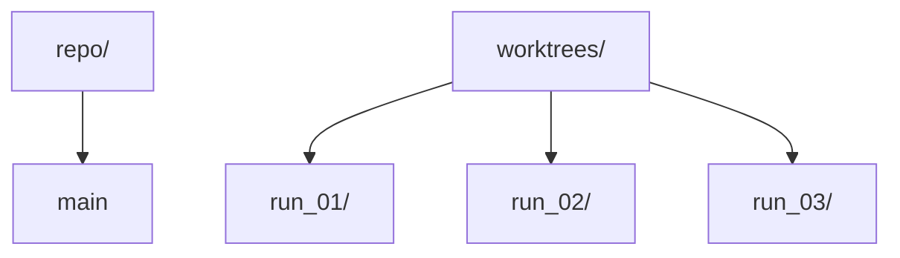

Never permit unrelated Runs to modify the same Git working tree concurrently.

Persist:

```text
repository
base branch
base commit
working branch
workspace ID/path
final commit(s)
PR if created
```

Workspaces SHOULD be retained for a defined retention period after the Run reaches a terminal state (for inspection), then garbage-collected. Enforce a disk quota on workspace storage.

---


# 19. Human in the Loop

PrimeAgent must be able to request a decision without failing the entire Run.

Example:

```json
{
  "type": "input.required",
  "payload": {
    "question": "This migration changes the public API. Continue?",
    "choices": [
      "continue",
      "abort"
    ]
  }
}
```

State transition:

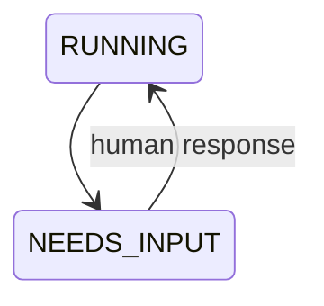

Input endpoint:

```text
POST /api/runs/:runId/input
```

Chat and dashboard should expose the same pending request.

A pending input request SHOULD have a configurable timeout; on expiry the Run transitions to `TIMED_OUT` with reason `input-timeout`. Multiple concurrent input requests MUST be queued and presented in order. Cancellation while `NEEDS_INPUT` is allowed and moves the Run to `CANCELLED`.

---


# 20. Cancellation

Cancellation should be cooperative first and forceful second.

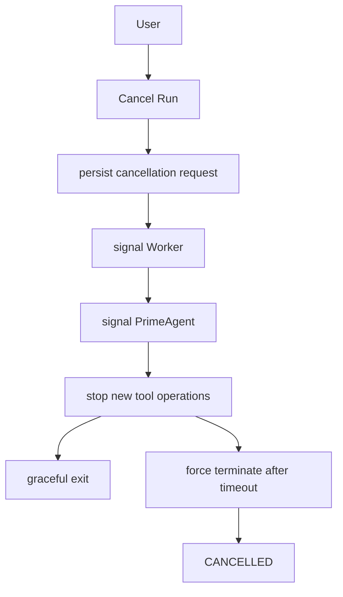

Cancellation while `QUEUED` or `STARTING` removes the Run from the queue without starting the agent.

Cancellation SHOULD preserve:

- Events
- Logs
- Code modifications
- Workspace metadata
- Commits
- Errors

for later inspection.

---


# 21. Retry and Recovery

Run creation SHOULD support idempotency.

Example:

```text
Idempotency-Key: ...
```

Workers MUST tolerate duplicate job delivery.

Event consumers SHOULD tolerate duplicate events.

Retries SHOULD distinguish between:

```text
infrastructure failure
agent failure
task failure
user cancellation
```

**Retry semantics.** Retry creates a new Run with a fresh `runId` and a `retryOf` reference to the original; the original keeps its terminal state. This keeps the state machine single-pass and makes idempotency straightforward (workspace branches derive from the new `runId`).

Suggested policy:

- infrastructure failure → automatic retry with backoff, up to `maxRetries`
- agent failure / task failure → manual retry only
- user cancellation → never retried automatically

A retried Run MUST reuse the original base commit unless the user explicitly opts into a newer base.

Retry must not accidentally create duplicate PRs, duplicate commits or concurrent executions.

**Resume on retry (implemented).** When the adapter implements `resume()` and the original
Run persisted an agent session file (`.mercury-session-path` in its workspace), the worker
calls `adapter.resume(runId, context)` with `context.resumeSessionFile` set instead of
starting fresh — the retry continues the parent's agent session. A `run.resuming` event is
recorded. If resume is unavailable or fails (no session file, adapter without `resume()`),
the retry falls back to a fresh `start()`. Cancellation of a hanging agent is honored
promptly: the worker races the cancellation flag into its drive loop (100 ms poll), so
`POST /cancel` reaches a stuck agent in well under a second instead of waiting for the
max-duration timeout.

---


# 22. Chat Experience

Chat acts as one façade over Runs.

Example:

```text
User

Fix the failing integration tests and prepare a PR.


Mercury

Started coding run run_01...


PrimeAgent

Inspecting integration tests...


PrimeAgent

Found three failures caused by the database migration.


PrimeAgent

Applying migration fix and running the integration suite...


PrimeAgent

24 tests passed.


Mercury

Run completed.

Files changed: 3
Tests: 24 passed
Commit: abc123
PR: #482
```

Every message associated with agent execution MUST remain traceable to its `runId`.

---


# 23. Dashboard


## 23.1 Run List

Display at minimum:


| Field      | Description                   |
| ---------- | ----------------------------- |
| Run        | Stable Run ID                 |
| Task       | Requested coding task         |
| Repository | Target repository             |
| Agent      | PrimeAgent or another adapter |
| Status     | Current lifecycle state       |
| Step       | Current execution step        |
| Created    | Creation timestamp            |
| Duration   | Current/final duration        |


---


## 23.2 Run Details

Display:

- Task
- Repository
- Branch
- Agent
- Selected skills
- Current status
- Progress
- Event timeline
- Agent messages
- Tool operations
- Changed files
- Tests
- Git commits
- PR
- Pending human input
- Errors
- Duration
- Cancel/retry controls

Skills can be visualized as:

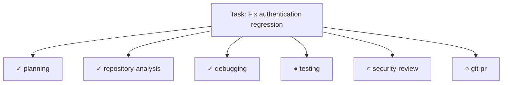

Do not make raw stdout the primary UI representation.

---


# 24. Security

Treat coding-agent execution as a high-risk workload.

At minimum:

- Authenticate every Run API.
- Authorize access to every Run.
- Verify repository access.
- Scope Git credentials.
- Scope external service credentials.
- Redact secrets from events.
- Redact secrets from logs.
- Apply resource limits.
- Apply execution time limits.
- Validate cancellation permissions.
- Validate human-input permissions.
- Isolate agent execution from the Mercury web process.

**Credential injection.** The worker injects scoped credentials into the agent environment at process start (env vars from a secret manager, or a git credential helper). Credentials MUST NOT appear in Run records, events, logs, prompts, or browser responses. The workspace MUST NOT contain platform-wide credentials — only the minimum scoped to the target repository.

Never expose arbitrary platform secrets to PrimeAgent.

Never execute downloaded third-party skill scripts merely because they exist.

Third-party skills must receive the same review, sandboxing and security treatment as executable code.

**Hardening (implemented in the Mercury slice):** every Run API request is authenticated (bearer token or `HttpOnly` session cookie) and authorized per-Run (owner scoping + admin); login and run creation are brute-force rate-limited; the API binds `127.0.0.1` by default and can serve TLS; secrets are redacted from events and logs; execution time is enforced per Run (`maxDurationMs` → `TIMED_OUT`), human-input waits time out (§19); `resourceLimits`/`allowedNetworks` are enforced by running the agent in a container (docker/podman) and the worker fails closed when a constrained Run has no runtime. Remaining: OIDC/SSO identity (token map is the identity source) and per-repository credential scoping.

---


# 25. Observability

Structured logs SHOULD include:

```text
runId
eventId
workerId
agent
skill
repository
duration
status
```

Track where possible:

- Queue wait time
- Run duration
- Agent duration
- Skill duration
- Number of retries
- Successful Runs
- Failed Runs
- Cancelled Runs
- Tool failures
- Test outcomes
- Token usage
- Model usage
- Cost
- Workspace resource consumption

Observability must follow the Run across Mercury, queue, worker and PrimeAgent.

Attach a trace ID to every Run and propagate it through queue, worker and agent logs. Alert on: Runs stuck in `RUNNING` or `NEEDS_INPUT` beyond thresholds, repeated infrastructure failures, and queue backlog.

---


# 26. Repository-Level Agent Instructions

Create or extend:

```text
AGENTS.md
```

Use it for project-wide knowledge such as:

- Architecture
- Repository conventions
- Development commands
- Testing commands
- Formatting conventions
- Important boundaries
- Common mistakes
- Deployment constraints

Avoid duplicating specialized skill instructions inside `AGENTS.md`.

Conceptually:

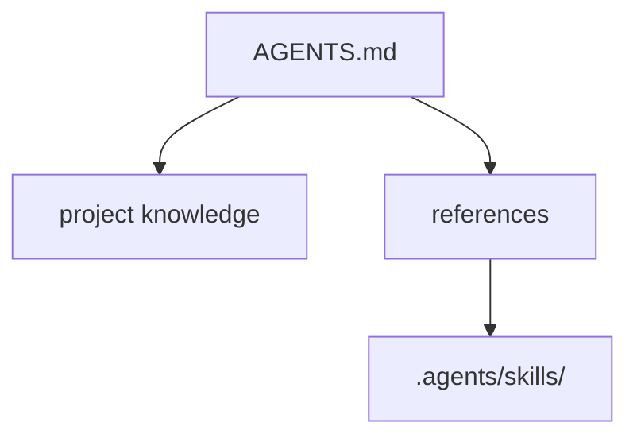

---


# 27. Initial Skills

Start with a small high-value skill library.

```text
.agents/skills/

planning/
repository-analysis/
implementation/
testing/
debugging/
code-review/
security-review/
git-pr/
```

Expand based on actual recurring tasks rather than trying to build a comprehensive library up front.

---


# 28. Suggested Skill Contract

Each skill SHOULD have a concise `SKILL.md`.

Example:

```markdown
---
name: testing
version: 1.0.0
description: Verify code changes using repository-appropriate tests.
---

# Testing

Determine the smallest relevant test suite first.

Run focused tests before the complete suite.

When failures occur:

1. determine whether they are caused by the current change
2. investigate the root cause
3. fix regressions caused by the implementation
4. rerun affected tests

Before completion, report:

-  commands executed
-  tests passed
-  tests failed
-  tests skipped
-  unresolved failures

Never claim tests passed unless they were actually executed.
```

Skills should specify behaviors and verification criteria, not unnecessarily prescribe implementation details.

---


# 29. Testing Strategy

Use a deterministic fake agent.

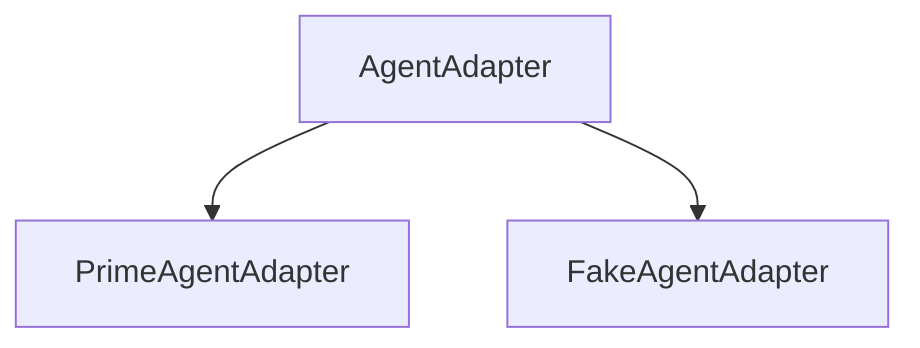

Normal automated tests MUST NOT require a real PrimeAgent invocation.

Test at minimum:

- Run creation
- Run persistence
- Valid state transitions
- Invalid state transitions
- Scheduling
- Duplicate dispatch
- AgentAdapter
- Skill resolution
- Skill version persistence
- Event ordering
- Event persistence
- SSE reconnect
- Cancellation
- Human input
- Worker failure
- Agent failure
- Retry
- Successful completion
- Authorization
- Secret filtering
- Adapter contract conformance (FakeAgentAdapter and PrimeAgentAdapter implement the same interface)
- Skill snapshot persistence
- Retry idempotency (no duplicate PRs/commits)
- Input timeout

An important integration test should cover:

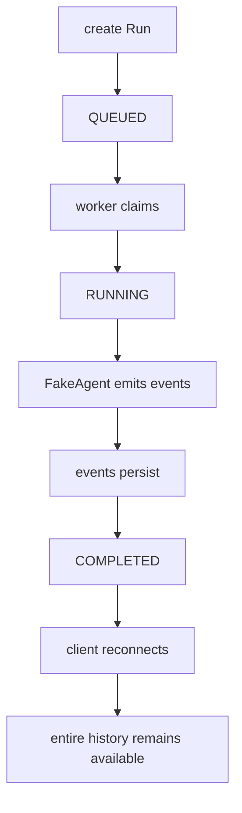

---


# 30. Implementation Phases

> **Implementation status** (updated 2026-08-26): the vertical slice (§31) is implemented at
> [.](.) — 32 source files, 112 passing tests, `tsc` clean. Phases 1–8 are
> functionally complete and verified end-to-end with the real PrimeAgent RPC protocol and
> the local model. Phase 8 (hardening) is done: workspace isolation, retention/GC,
> recovery, idempotency, security (offline), resource-limit enforcement (container sandbox,
> fail-closed) and observability (structured logs with run/worker context, queue-wait and
> duration metrics, backlog + stuck-run alerts, trace env propagated to the agent process).
> Remaining work is explicitly scoped below (OIDC/SSO identity, cross-process event push,
> daemon verification). See the per-phase status and the roadmap at the end of this section.

| Phase | Scope | Status |
| --- | --- | --- |
| 1 — Durable Runs | Run model, persistence, state machine, Run API | ✅ complete |
| 2 — Background Execution | queue, worker, AgentAdapter, PrimeAgentAdapter | ✅ complete (real `prime-agent --mode rpc`) |
| 3 — Skills | SkillRegistry, `.agents/skills`, resolution, version persistence, injection | ✅ complete (`--skill` per Run, content snapshots) |
| 4 — Events | structured events, persistence, sequence, PrimeAgent translation | ✅ complete |
| 5 — Live Progress | SSE, reconnect, historical event recovery | ✅ complete (`?after=` cursor, DB poller) |
| 6 — Dashboard | Run list, details, timeline, skill progress, tests, changes, results | ✅ complete (static SPA at `/`, live SSE, cancel/retry/input) |
| 7 — Human Control | NEEDS_INPUT, send input, cancel, retry | ✅ complete (RPC `extension_ui_request/response` bridge) |
| 8 — Hardening | workspace isolation, retention, recovery, idempotency, security, resource limits, observability | ✅ complete — isolation ✅, retention/GC ✅, idempotency ✅, security (offline) ✅, resource limits ✅ (sandbox, fail-closed), observability ✅ (durations, stuck/backlog alerts, trace env) |

### Roadmap (remaining work, priority order)

0. ~~**Input timeout + §19/§25 observability**~~ — **done**: pending human input has a configurable timeout (`MERCURY_INPUT_TIMEOUT_MS`, default 30 min; `0` = none) expiring to `TIMED_OUT` with reason `input-timeout`; stuck-run alerting (`MERCURY_STUCK_RUN_THRESHOLD_MS`, checked on its own timer so it fires while a Run executes) reuses the alert webhook; terminal Runs log/record `queueWaitMs`/`agentDurationMs`/`totalMs`; the resolved git base commit is pinned onto the Run record so retries reuse it (§21 MUST); agent processes receive `MERCURY_RUN_ID`/`MERCURY_TRACE_ID`/`MERCURY_WORKER_ID`; `AGENTS.md` added (§26).
1. **Real authentication** — **offline hardening done**: dashboard `localStorage` token flow replaced with `HttpOnly` session cookies (`POST /api/auth/login` → `mercury_session`, in-memory store), per-Run owner authorization, brute-force rate limiting (login 10/min/IP, run creation 30/min/owner+IP → `429` + `Retry-After`), bind host defaults to `127.0.0.1` (`MERCURY_BIND_HOST`), optional TLS (`MERCURY_TLS_CERT`/`MERCURY_TLS_KEY`). **Remaining**: replace the `MERCURY_API_TOKENS` token→owner map with OIDC/SSO (the token map stays the identity source until then).
2. ~~Sandboxed execution~~ — **done**: `SandboxManager` (`src/sandbox/sandboxManager.ts`) enforces `resourceLimits` (cpu/memory/disk) and `allowedNetworks` (none vs bridge) by running the agent inside a container (docker/podman); fail-closed when a run requests isolation but no runtime exists; wired into both adapters and the worker, 8 tests.
3. ~~Workspace retention / GC job~~ — **done**: `WorkspaceGC` (retention expiry, quota eviction, orphan cleanup, active-run protection), `mercury gc` CLI, periodic pass in the worker (startup + hourly), 6 tests.
4. ~~Push-based event fan-out~~ — **done**: in-process push via an EventStore append hook + adaptive poller (250 ms idle / 2 s after a push); cross-process push (worker → server HTTP callback) is the remaining scale path.
5. ~~Multi-worker deployment~~ — **done**: queue backlog alerting (log + optional webhook, `MERCURY_BACKLOG_ALERT_THRESHOLD` / `MERCURY_ALERT_WEBHOOK_URL`), `GET /healthz/workers` (active leases + queue depth), lease-loss recovery (abort + requeue), 4 tests.
6. ~~Multi-repository Runs~~ — **done**: `repositories[]` in the Run model (backward compatible), API accepts `repositories` or `repository`, workspace clones/copies additional repos under `repos/`, GC cleans them, 5 tests.
7. ~~Expand skill library~~ — **done**: 12 skills (added documentation, deployment, frontend, issue-fix-loop).
8. ~~Deployment packaging~~ — **done**: `deploy/` with systemd units (server + worker), SQLite backup script with retention, logrotate config, ops guide.
9. ~~Daemon-based agent sessions~~ — **implemented behind `MERCURY_AGENT_MODE=daemon`** (RPC remains default); verify against the real daemon before relying on it.
10. **Crew — agent preset store** — **design only, not implemented**: versioned role
   presets (instruction, skills, MCP servers, constraints, bounded loops/graphs) for roles
   like `reviewer`, `system-architect`, `kubernetes`, `kafka`, `gcp-sre`, `aws-sre`;
   uploaded from the dashboard and kept in a GitHub repository. Design + phased roadmap:
   [`docs/crew-design.md`](docs/crew-design.md).


## Phase 1 — Durable Runs ✅

Implement:

```text
Run model
Run persistence
state machine
Run API
```

Acceptance criteria:

- A Run can be created.
- It receives a stable `runId`.
- State is persisted.

---


## Phase 2 — Background Execution ✅

Implement:

```text
queue
worker
AgentAdapter
PrimeAgentAdapter
```

Acceptance criteria:

- API returns before execution finishes.
- PrimeAgent runs independently from client connection.

---


## Phase 3 — Skills ✅

Implement:

```text
SkillRegistry
.agents/skills
skill resolution
skill version persistence
PrimeAgent skill injection/loading
```

Acceptance criteria:

- Different Runs may receive different skill sets.
- A Run records exactly which skills were used.

---


## Phase 4 — Events ✅

Implement:

```text
structured events
event persistence
event sequence
PrimeAgent translation
```

Acceptance criteria:

- Agent activity is represented by structured persisted events.

---


## Phase 5 — Live Progress ✅

Implement:

```text
SSE
reconnect
historical event recovery
```

Acceptance criteria:

- Refreshing or reconnecting does not lose progress.

---


## Phase 6 — Dashboard ✅

Implement:

```text
Run list
Run details
timeline
skill progress
tests
changes
results
```

Acceptance criteria:

- A user can inspect a running or completed task without reading server logs.

---


## Phase 7 — Human Control ✅

Implement:

```text
NEEDS_INPUT
send input
cancel
retry
```

Acceptance criteria:

- PrimeAgent can suspend and resume around human decisions.

---


## Phase 8 — Hardening ✅

Implement:

```text
workspace isolation          (git worktree / copy; container sandbox for resourceLimits/allowedNetworks)
workspace retention/cleanup  (WorkspaceGC: retention, quota, orphans; mercury gc; periodic pass)
recovery                     (lease expiry/requeue, session resume, retry-from-scratch)
idempotency                  (Idempotency-Key on create; duplicate delivery safe)
security                     (auth/authorization, rate limits, redaction, loopback bind, TLS)
resource limits              (maxDurationMs in worker; container limits via sandbox, fail-closed)
observability                (structured logs, durations, backlog + stuck-run alerts, trace env)
```

---


# 31. PrimeAgent Implementation Instructions

> **Status (2026-08-26):** this mission is **complete**. The vertical slice lives at
> [.](.) — 32 source files, 12 skills, 112 passing tests, `tsc` clean.
> Verified end-to-end: durable Runs, SQLite-backed queue + leases, git-worktree
> isolation, real `prime-agent --mode rpc` integration (event translation,
> human-in-the-loop via `extension_ui_request/response`, session persistence +
> resume, cancel/timeout), SSE with `?after=` reconnect, and the dashboard UI.
> The instructions below remain as the historical mission brief.

The following instructions should be provided to PrimeAgent when implementing this architecture.

```markdown
# Implementation Mission

Implement the Mercury → PrimeAgent orchestration architecture described
in this document.

Your objective is to produce a working vertical slice for durable,
long-running coding Runs.

## Start by Inspecting the Repository

Identify:

-  language/runtime
-  backend framework
-  frontend framework
-  database
-  ORM
-  migrations
-  authentication
-  authorization
-  queue/workflow infrastructure
-  event/streaming infrastructure
-  existing PrimeAgent integration
-  existing agent integrations
-  `.agents/skills/`
-  `.claude/skills/`
-  existing `SKILL.md` files
-  `AGENTS.md`
-  MCP integrations
-  test framework
-  logging
-  deployment configuration

Do not assume technologies that are not present.

Prefer existing project conventions and dependencies.

## Before Modifying Code

Read this architecture document completely.

Determine which requirements:

-  already exist
-  can be reused
-  need implementation
-  need infrastructure changes

Create a concise implementation plan based on the actual repository.

Do not stop after planning.

Continue into implementation.

## Primary Vertical Slice

Implement:

Mercury API/UI
    ↓
durable Run
    ↓
background scheduling
    ↓
Worker
    ↓
AgentAdapter
    ↓
PrimeAgentAdapter
    ↓
selected Skills
    ↓
PrimeAgent
    ↓
structured events
    ↓
persistent state
    ↓
live Mercury updates

The client connection must not own the lifetime of PrimeAgent.

## Reuse Existing Skills

Inspect all existing reusable skills before creating new ones.

Reuse compatible skills rather than duplicating them.

Treat skills as capabilities separate from the agent.

For every Run:

1. determine required capabilities
2. resolve matching skills
3. persist skill IDs, versions and content snapshots
4. expose selected skills to the isolated PrimeAgent workspace
5. execute PrimeAgent
6. capture skill and agent events
7. persist results

Do not automatically load every skill.

Select the smallest useful skill set.

## Architecture Boundaries

Maintain:

Mercury
  → WHAT should happen

Skill
  → reusable guidance for HOW a capability is performed

PrimeAgent
  → executes the task

AgentAdapter
  → HOW Mercury communicates with an agent

Worker
  → WHERE and WHEN execution occurs

Do not embed PrimeAgent-specific behavior throughout Mercury.

## Persistence

Persist at minimum:

-  run ID
-  owner
-  task
-  repository
-  agent
-  status
-  timestamps
-  errors
-  selected skills and versions
-  event sequence
-  structured events

Use the repository's normal migration mechanism.

## Background Execution

Use existing durable infrastructure where appropriate.

Ensure:

-  creating a Run returns immediately
-  PrimeAgent may execute for hours
-  duplicate delivery cannot execute the same Run concurrently
-  failures update state
-  cancellation is supported
-  client disconnection does not terminate execution
-  resume semantics follow §16 (orchestration state recoverable; agent in-flight state resumes only at input boundaries or restarts)

Avoid unnecessary infrastructure.

## PrimeAgent Integration

Find and use PrimeAgent's actual supported integration mechanism.

Do not invent an API if one already exists.

Capture structured information wherever possible.

Translate PrimeAgent output into Mercury events.

Raw stdout may be retained for debugging but must not become the
application's domain model.

## Workspace Isolation

Do not execute independent coding Runs in the same mutable working tree.

Use the project's existing isolation mechanism or introduce an
appropriate Git worktree/container/sandbox strategy.

Record the repository, base commit, branch and resulting commits.

## Security

Preserve authentication and authorization.

Users must not inspect or control Runs they do not own unless existing
roles explicitly permit it.

Do not leak credentials through events, logs, prompts or browser
responses.

Treat third-party skills as executable/untrusted content when they
contain scripts.

Do not execute agent shell operations inside the Mercury web server
process.

## Testing

Create a FakeAgentAdapter.

Normal tests must not require:

-  PrimeAgent
-  external network calls
-  external LLM APIs

Test:

create
→ queue
→ run
→ events
→ completion

Also test:

-  failures
-  cancellation
-  duplicate execution
-  skills
-  authorization
-  event reconnect

Run existing tests, linting and type checking.

Fix regressions introduced by the implementation.

## Working Method

Work autonomously.

When ambiguity exists:

1. inspect repository conventions
2. choose the least invasive solution
3. document the assumption
4. continue

Do not perform unrelated refactoring.

Prefer small cohesive changes.

Commit logical milestones when supported by the environment.

## Completion Verification

Before declaring completion:

1. run relevant tests
2. run type checking
3. run linting
4. verify database migrations
5. verify Run creation
6. verify asynchronous execution
7. verify skill resolution
8. verify event persistence
9. verify reconnect/live updates
10. verify completion
11. verify failures
12. verify cancellation
13. review authorization
14. review credential handling

Do not claim functionality was implemented unless it was verified.

## Final Report

Provide:

-  architecture implemented
-  files changed
-  database changes
-  API endpoints
-  queue/worker implementation
-  PrimeAgent integration mechanism
-  skill architecture
-  reused skills
-  newly introduced skills
-  workspace isolation mechanism
-  how Runs survive client disconnection
-  tests executed
-  test results
-  known limitations
-  infrastructure requirements
-  recommended next steps
```

---


# 32. Definition of Done

The initial system is complete when a user can:

1. Open Mercury.
2. Submit a software-engineering task.
3. Mercury creates a durable Run.
4. Mercury selects PrimeAgent.
5. Mercury resolves appropriate reusable skills.
6. The Run is durably scheduled.
7. A worker creates an isolated workspace.
8. PrimeAgent starts executing.
9. The API request has already returned.
10. The user may close Mercury.
11. PrimeAgent continues working.
12. Structured progress events are persisted.
13. The user can return later.
14. Mercury reconstructs the complete Run.
15. New events appear in real time.
16. The user can answer a PrimeAgent question.
17. The user can cancel execution.
18. Tests and code changes are visible.
19. Final commits and/or PR are visible.
20. Completed Runs remain inspectable.
21. The system records which skill versions were used.
22. Another agent backend can eventually be introduced without redesigning Mercury.
23. Retrying a failed Run creates a new attempt without duplicate PRs or commits.

---


# 33. Target End State

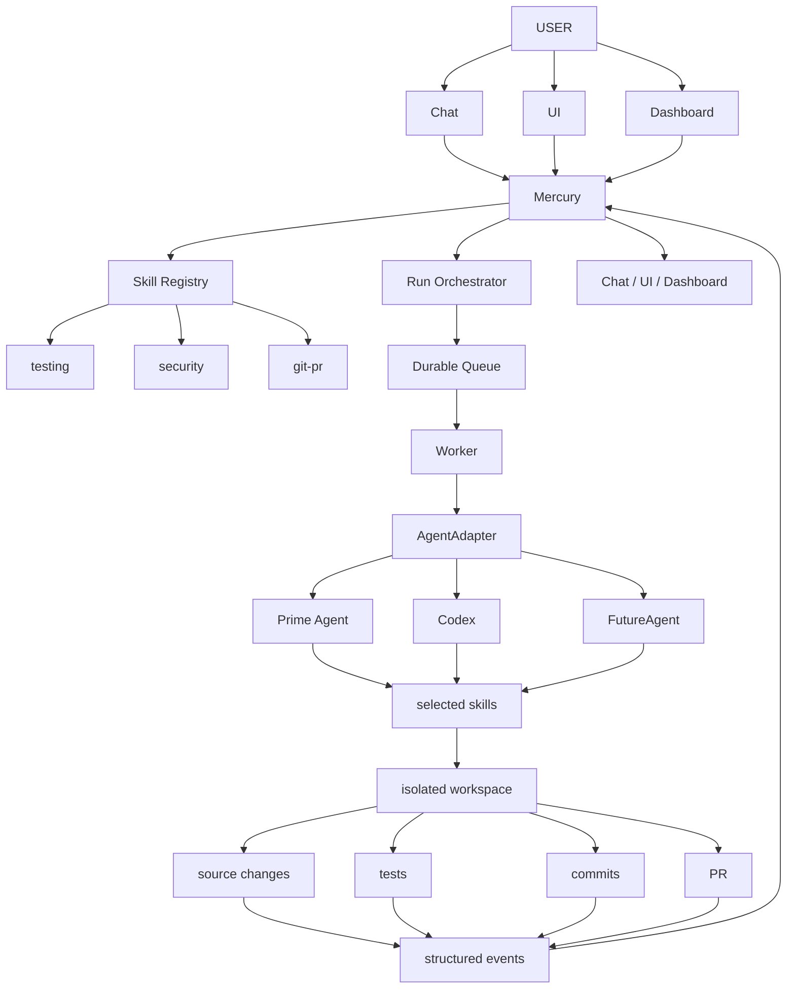

The architectural invariant is:

> **Mercury owns orchestration and durable state. Agents own execution. Skills are reusable capabilities. Workers own process lifetime. Git workspaces provide coding isolation. Structured events connect execution back to the user experience.**

