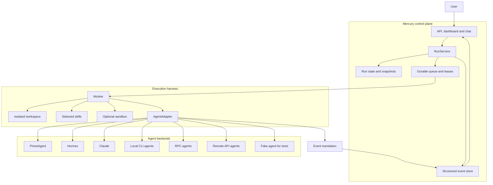

# Mercury

Mercury is a durable control plane for long-running coding agents, managing
runs, state, workspaces, events, retries, and human input independently of
browser sessions. Agents execute the coding work, while Mercury safely
orchestrates when, where, and with which tools and instructions they run.

Mercury is a working Node.js and SQLite implementation. Creating a Run without
an `agent` field uses the built-in `fake` adapter (no extra CLI). PrimeAgent,
Hermes, Claude, and declarative local/RPC/remote adapters are optional backends
behind `AgentAdapter`.

## What Mercury provides

- durable Runs whose lifetime is independent of HTTP, SSE and browser sessions;
- a separate API process and background worker;
- SQLite-backed scheduling, leases, state and event history;
- isolated Git worktrees and optional container sandboxing;
- structured progress events with resumable SSE;
- cancellation, retry and human-input flows;
- deterministic skill selection and per-Run skill records;
- a static operations dashboard;
- declarative local, remote and RPC agent adapters.

## Control plane



Mercury controls orchestration and process lifetime. Agent backends retain
responsibility for inspecting repositories, editing code, running tools and
producing results. Backends other than `fake` need their CLI (or remote API)
installed separately; `npm install` does not ship them.

## Quick start

Requires Node.js ≥ 22.18 (built-in `node:sqlite` and TypeScript type stripping).
For prerequisites and a complete first-run walkthrough, see
[`QUICKSTART.md`](QUICKSTART.md).

```bash
npm install
MERCURY_EMBEDDED_WORKER=true \
  MERCURY_API_TOKENS="tok-alice:alice" \
  npm run dev
```

The dashboard is available at `http://127.0.0.1:3000/`. Sign in with `tok-alice`
(the token, left of the colon — not the owner id `alice`). A first Run can omit
`agent` and will use `fake`.

## Commands

| Command | Purpose |
| --- | --- |
| `npm run dev` | Start the API and, when enabled, the embedded development worker |
| `npm run server` | Start the API only |
| `npm run worker` | Start the background worker only |
| `npm run migrate` | Apply database migrations (also applied automatically on start) |
| `npm run gc` | Run one workspace-retention and quota pass |
| `npm run typecheck` | Run TypeScript checks |
| `npm test` | Run the core and Fleet test suites |
| `npm run fleet` | Manage federated Mercury hosts |

## Documentation

Start with the [`documentation index`](docs/README.md), or go directly to:

- [`System overview`](docs/overview.md)
- [`API and dashboard`](docs/api.md)
- [`Configuration`](docs/configuration.md)
- [`Agent backends`](docs/agents.md)
- [`Operations`](docs/operations.md)
- [`Testing`](docs/testing.md)
- [`Current status and limitations`](docs/status.md)
- [`Deployment`](deploy/README.md)
- [`Architecture specification`](ARCHITECTURE.md)
- [`Crew design`](docs/crew/README.md)
- [`Fleet design`](docs/fleet-design.md)

## Current constraints

Mercury is intentionally single-host because its coordination store is SQLite.
PrimeAgent RPC is the supported coding-agent transport; create-Run omits `agent`
as `fake` unless `MERCURY_DEFAULT_AGENT` is set. Daemon mode is experimental and
not production-ready. Named network destinations are not currently enforced, and
stored skill snapshots are not yet the bytes materialized by the worker.

See [`docs/status.md`](docs/status.md) for the complete and current limitations.
