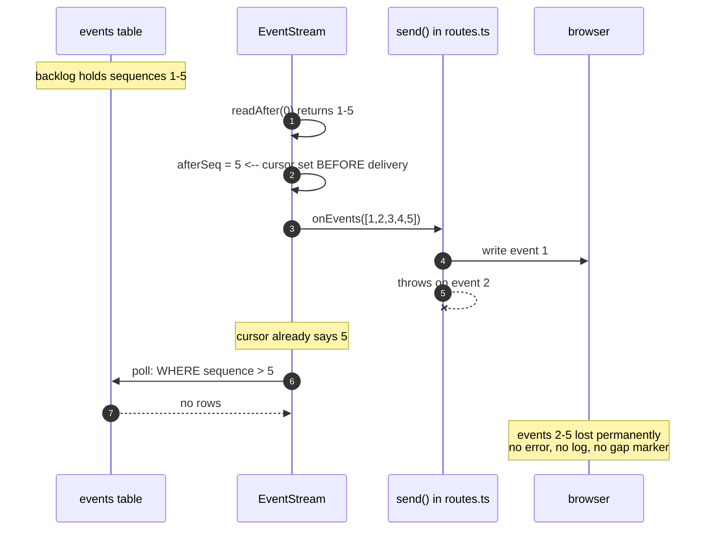
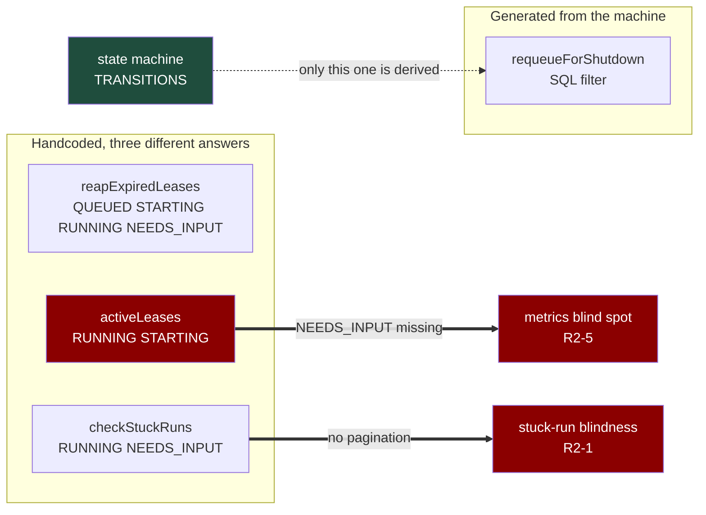

# Mercury — Architecture & Design Review · Round 2

Reviewed at commit `6e7a035` (`main`). Node v26.7.0.
Scope: all of `src/` (9,256 lines of TypeScript), `ui/` (854), `test/` (10,259), `deploy/`, and the
four documents under `docs/`, measured against [`ARCHITECTURE.md`](../ARCHITECTURE.md).

**Previous round:** [Round 1 — archived](architecture-review-round-1.md). Its 39 findings are closed
and dispositioned there; nothing below repeats them. This file is the current backlog.

---

## Verdict

Round 1 found that the specification was sound and the implementation failed to enforce it. That
assessment still holds, and the remediation largely delivered: the fixes are real, they are commented
with the reasoning that produced them, and spot-checking the hard ones (lease ownership, shutdown
ordering, transaction atomicity, event paging) found them to do what they claim.

What Round 2 found is a different class of problem. **Three closures did not hold**, and in each the
record is more confident than the code. The pattern is consistent: **the symptom was fixed and the
record claims the cause was addressed.**

- **L3** was recorded as "already fixed before being reached". It was never fixed. The cap is still in
  the source, and it is biased so that the runs most likely to be stuck are the ones never examined.
  → [R2-1](#r2-1-stuck-run-detection-never-looks-at-the-runs-most-likely-to-be-stuck)
- **L5** (constant-time admin token comparison) was fixed at one of its two call sites. The unfixed one
  is the path every API request takes. → [R2-4](#r2-4-two-credential-resolution-implementations-and-the-security-fix-reached-only-one)
- **Remediation step 9** promised a "shared adapter base for spawn / stderr / exit settlement / session
  lifetime" and is marked ✅. No base exists. Six adapters still hand-roll exit settlement and five of
  the six functions are byte-identical. The three PRs in that row fixed the three bugs, one adapter at
  a time. → [R2-12](#r2-12-the-shared-adapter-base-was-reported-delivered-and-never-built-six-copies-of-the-same-fix-remain)

Separately, **M11/L10/L4/L6/L8/L11** were all genuinely resolved, but the prose describing them was
frozen mid-remediation and contradicted the table beneath it. A reader who trusted the prose would
conclude daemon mode was unsafe to enable and the backlog was unmonitored. Neither is now true.

Beyond that, the new findings cluster in one place: **the SSE path advances its cursor before delivery
is known to have succeeded**, which is the same mistake as issue #133 in a different function, and
directly contradicts the invariant written into `docs/cross-process-event-push.md`. The mechanism is
proven below; a production trigger is not, and the finding is graded accordingly.

The most useful thing this round produced is the [status-set table](#the-status-set-has-no-owner). Four
subsystems each hardcode their own list of "live" run statuses and no two agree. That single
inconsistency generates two of the findings below and will generate more.

One finding arrived by being blocked by it. A **docs-only** PR failed CI on a test whose startup budget
was not real, whose child's stderr was piped and never read, and whose cleanup **hangs** whenever the
child has already exited — destroying the assertion that had just failed. →
[R2-13](#r2-13-the-cli-wiring-tests-startup-budget-is-not-real-its-cause-is-unread-and-its-cleanup-can-hang).
It is graded Low because it touches no production code, and it is the highest-value Low here: a suite
that fails on unrelated changes trains people to re-run CI rather than read it.

### Tracking

Every finding below is filed. None is fixed at the time of writing.

| ID | Finding | Sev | Issue |
| --- | --- | --- | --- |
| R2-1 | Stuck-run scan skips the oldest runs | High | [#137](https://github.com/aywengo/mercury/issues/137) |
| R2-2 | Cursor advances before delivery succeeds | Medium | [#138](https://github.com/aywengo/mercury/issues/138) |
| R2-3 | `poll()` swallows every error; comment lies about it | Medium | [#139](https://github.com/aywengo/mercury/issues/139) |
| R2-4 | Two credential-resolution paths, one unfixed | Medium | [#140](https://github.com/aywengo/mercury/issues/140) |
| R2-5 | `activeLeases()` omits `NEEDS_INPUT` | Medium | [#141](https://github.com/aywengo/mercury/issues/141) |
| R2-6 | Every worker re-sends every alert | Medium | [#142](https://github.com/aywengo/mercury/issues/142) |
| R2-7 | SSE handler has no error handling after headers | Medium | [#143](https://github.com/aywengo/mercury/issues/143) |
| R2-8 | Rate-limiter map unbounded, sweep O(n) | Low | [#144](https://github.com/aywengo/mercury/issues/144) |
| R2-9 | SSE writes ignore backpressure | Low | [#145](https://github.com/aywengo/mercury/issues/145) |
| R2-10 | One poll query per subscriber | Low | [#146](https://github.com/aywengo/mercury/issues/146) |
| R2-12 | Shared adapter base never built; 6 copies of one fix | Medium | [#148](https://github.com/aywengo/mercury/issues/148) |
| R2-13 | CLI-wiring test budget is fake, cause unread, cleanup can hang | Low | [#149](https://github.com/aywengo/mercury/issues/149) |
| R2-11 | `slowDown()` fires with no subscribers | Low | not filed — already Stage 0 in [cross-process-event-push.md](cross-process-event-push.md) |

**Suggested order.** R2-3 and R2-7 first: they are small, and they are what would make R2-2 visible
instead of silent. Then R2-2. R2-1 is independent and the highest severity. R2-4, R2-5 and R2-6 are
each a single-file change plus a test.

---

## Method, and what I could not do

Every finding below was read in source at `6e7a035` and, where a claim is numerical or behavioral,
**executed**. Each reproduction is inlined in
[Appendix — reproduction](#appendix--reproduction) and was run on this commit.

Two things did not go as planned, and both changed what this document is allowed to claim:

- **Parallel reviewer subagents were unavailable.** Every model the host listed failed to spawn
  (`unavailable, unauthenticated, or expired`), and the default model produces no report text at all.
  Round 1 hit the same wall and reached the same conclusion: findings must be re-verified in source by
  the author. Nothing below rests on a delegated report.
- **One of my own hypotheses was wrong and is reported as wrong.** I predicted that a client
  disconnecting mid-backlog would make `res.write` throw, crash the worker, or leak a subscriber. I
  tested it against a real HTTP server with a real socket destroyed mid-stream: no uncaught exception,
  and the subscriber was cleaned up correctly. That is why **R2-2 is graded Medium and not High** — the
  ordering defect is real and proven in isolation, but I could not produce a caller that trips it.

Where a finding rests on reading rather than execution, it says so.

### Coverage

Stated because a review that does not say what it skipped is not falsifiable.

| Area | Lines | Depth |
| --- | --- | --- |
| `src/worker/` | 989 | full read of claim/execute/drive/finalize/alerts |
| `src/adapters/` | 3,595 | duplication measured across all six; per-adapter internals not re-derived (see [Not re-examined](#not-re-examined)) |
| `src/events/` | 432 | full read; both findings executed |
| `src/api/` | 942 | full read of routes, auth, rateLimit; `server.ts` read for shutdown and trust proxy |
| `src/queue/`, `src/runs/`, `src/db/` | 940 | full read of claim/reap/lease/transition/list |
| `src/metrics/` | 382 | full read; monotonicity precondition re-verified by `grep` |
| `src/workspace/` | 581 | GC deletion paths traced to their bound — **sound**, deletes cannot escape `baseDir/worktrees/` |
| `src/skills/` | 428 | containment helpers and the `realpathNearest` walk re-checked — **sound**; the `for (;;)` terminates at the filesystem root |
| `src/sandbox/`, `src/domain/` | 639 | read for status-set consistency only |
| `ui/` | 854 | read for logic; **not typechecked** — see [Not re-examined](#not-re-examined) |
| `deploy/`, `test/` | — | read for claims made here, not reviewed as a deliverable |

---

## Findings — High

### R2-1. Stuck-run detection never looks at the runs most likely to be stuck

**Issue:** [#137](https://github.com/aywengo/mercury/issues/137)

`src/worker/worker.ts:829-831`

```ts
for (const status of ['RUNNING', 'NEEDS_INPUT'] as const) {
  const { runs } = this.deps.runs.list({ status, limit: 200 });
```

`RunStore.list` (`src/runs/runStore.ts:110`) is `ORDER BY created_at DESC, id DESC LIMIT ?` — newest
first — and returns a `nextCursor` that this caller discards. There is no cursor loop and no
`hasMore` check. So the scan covers the **200 most recently created** runs per status and silently
ignores the rest.

The bias is the whole problem. A run becomes stuck by being old and quiet. Sorting newest-first means
that once a deployment has more than 200 runs in these statuses, the runs that qualify are precisely
the ones excluded. The safety net does not degrade gracefully under load; it inverts.

**Measured.** 260 runs forced to `RUNNING` with a 10-hour-old `started_at`, then the exact call above:

```text
totalRunning:              260
examinedByStuckCheck:      200
runsNeverExamined:          60
oldestExaminedCreationRank: 60      # examined = ranks 60..259, i.e. the newest 200
nextCursorFromList:  "RETURNED but checkStuckRuns ignores it (no pagination loop)"
```

**How confirmed:** executed against the real `RunStore` on this commit.

**This is a reopened Round 1 finding.** Round 1 listed it as L3 and closed it as "already fixed before
being reached", asserting the `LIMIT 200` "was gone by the time the item was picked up". It was not
gone. The archive now records the correction.

**Fix.** Page the scan: loop on `nextCursor` until exhausted, or replace the two status queries with
one indexed query that selects `status IN (...) AND <idle predicate>` in SQL and pushes the threshold
into the `WHERE` clause. The second is better — it stops shipping 200 rows to JavaScript to discard
almost all of them, and it makes the threshold a single named value. Either way, add a test with
**more than 200** runs in which the oldest is the stuck one; a test with fewer than 200 cannot fail.

---

## Findings — Medium

### R2-2. The event cursor advances before delivery succeeds

**Issue:** [#138](https://github.com/aywengo/mercury/issues/138)

`src/events/eventStream.ts:42-43`, `:90-91`, `:144-145`

All three delivery paths set the cursor first and hand the events over second:

```ts
sub.afterSeq = event.sequence;                 // :42  append hook
sub.onEvents([event]);

sub.afterSeq = backlog[backlog.length - 1].sequence;   // :90  subscribe() backlog
onEvents(backlog);

sub.afterSeq = events[events.length - 1].sequence;     // :144 poll()
sub.onEvents(events);
```

If `onEvents` throws partway through a batch, the cursor already claims the whole batch was delivered.
`poll()` reads `WHERE sequence > afterSeq`, so the remainder is never re-read. The loss is permanent for
the life of that subscription.



**Measured — single-event push path.** Handler throws on sequence 3:

```text
appended:    [1, 2, 3, 4, 5, 6]
delivered:   [1, 4, 5, 6]
permanentlyLost: [3]
```

**Measured — batch backlog path.** Five events already in the database, handler throws on sequence 2:

```text
backlogInDb:       [1, 2, 3, 4, 5]
delivered:         [1]
permanentlyLost:   [2, 3, 4, 5]
```

One throw loses four fifths of the page. `subscribe()` also rethrows, which is what makes R2-7 reachable.

**Why this is the right thing to be worried about** is not that `onEvents` can throw — it is that this
repository already decided the rule. `docs/cross-process-event-push.md` states that push must never own
the cursor and that the cursor advances only when bytes have been handed to the client, and issue #133
was a lost event prefix caused by exactly that. The invariant is written down and this file does not
follow it.

**Blast radius, stated honestly.** The dashboard tracks its own `lastSeq` and reconnects with it
(`ui/run.js:157-165`), so a reconnect recovers lost events. But the client reconnects **only on an SSE
error**. A silent drop with the connection alive — the server sends a keepalive every 15 s, so the
socket looks healthy — leaves a permanent hole in the timeline. If the lost event is the terminal one,
`stopSse()` never fires, `loadRun()` never refreshes, and the UI stays "running" forever; that also
re-opens L6, since the server-side stream then never closes.

**What I could not show.** A caller that actually throws. I ran a real server, opened a stream against a
1,200-event backlog, and destroyed the client socket after the first chunk: no uncaught exception, and
the subscriber was removed correctly. Node returns `false` from `res.write` on a destroyed socket rather
than throwing. So this is a latent defect with a proven mechanism and no demonstrated trigger, graded
Medium on that basis rather than High.

**Fix.** Advance the cursor after `onEvents` returns, in all three places. In `subscribe()` and `poll()`
that means the caller must be re-entrant-safe against re-delivery, which it already is: `send()` writes
duplicates rather than losing them, and the UI filters on `data.sequence > lastSeq`. Prefer
at-least-once over at-most-once — a duplicated timeline row is a cosmetic bug, a missing one is a lie.

### R2-3. `poll()` swallows every error, and its comment describes behavior that does not exist

**Issue:** [#139](https://github.com/aywengo/mercury/issues/139)

`src/events/eventStream.ts:146-148`

```ts
      } catch {
        // drop failing subscription on next poll
      }
```

The `catch` body is empty. Nothing is dropped: the subscription stays in `this.subs` and is retried on
every tick, forever. The comment asserts a recovery policy that is not implemented.

This is the mechanism that would make R2-2 self-healing if the comment were true, and it is why the
ordering bug is invisible rather than loud: any throw from `send()` is discarded with no log line, on a
path where a log line is the only way anyone would ever learn.

**How confirmed:** read, plus the R2-2 single-event run — after the handler threw on sequence 3, the
same subscription went on receiving 4, 5 and 6, which is only possible if it was never dropped.

**Fix.** Either implement the comment (drop the subscription, log it, decrement `subscriptionCount`) or
delete the comment. Do not leave the two disagreeing. A `catch {}` with no log on the only path that
observes delivery failure should be treated as a bug regardless of intent.

### R2-4. Two credential-resolution implementations, and the security fix reached only one

**Issue:** [#140](https://github.com/aywengo/mercury/issues/140)

`src/api/auth.ts:38` versus `src/api/authRoutes.ts:52`

The same bearer token is resolved twice, by two functions that do not share code:

| Path | Resolves via | Admin comparison |
| --- | --- | --- |
| `POST /api/auth/login` (dashboard) | `resolveCredential()` in `authRoutes.ts:50-56` | `secretsEqual` → `timingSafeEqual` |
| **every `/api/*` request** | inline in `createAuthMiddleware`, `auth.ts:38` | `token === adminToken` |

Round 1 filed this as L5 and #124 fixed it — in `authRoutes.ts` only. The middleware that gates the
entire API still uses `===`. The comment on the fixed copy describes the vulnerability precisely:

> `===` short-circuits on the first differing byte, so a caller able to measure response timing could
> walk the admin token one byte at a time.

That sentence is true of `auth.ts:38` today, and that is the higher-traffic of the two paths.

**How confirmed:** read both files; `grep` for `timingSafeEqual` and for `=== adminToken` shows exactly
one site fixed and one not.

**Fix.** Export `resolveCredential` from one module and have both callers use it. The duplication is the
root cause — the timing comparison is just the defect it has already produced. Two implementations of
credential resolution that can drift is the finding; the `===` is the symptom.

### R2-5. `activeLeases()` is the only subsystem that does not consider `NEEDS_INPUT`

**Issue:** [#141](https://github.com/aywengo/mercury/issues/141)

`src/queue/runQueue.ts:224`



Four subsystems each hardcode which run statuses count as live. They do not agree:

| Subsystem | QUEUED | STARTING | RUNNING | NEEDS_INPUT |
| --- | :-: | :-: | :-: | :-: |
| `reapExpiredLeases` (`runQueue.ts`) | yes | yes | yes | yes |
| `requeueForShutdown` (generated from the state machine) | no | yes | yes | yes |
| `checkStuckRuns` (`worker.ts:829`) | no | no | yes | yes |
| **`activeLeases` (`runQueue.ts:224`)** | **no** | **yes** | **yes** | **no** |

A run in `NEEDS_INPUT` holds its lease — the worker is parked in `waitForInput` still owning it — and the
reaper knows that. `activeLeases` does not. Consequences, all on `/metrics`:

- `mercury_workers` and `mercury_claimed_runs` under-report. A worker whose only run is waiting for input
  reports **zero workers and zero claimed runs** while holding a live lease and a live agent process.
- `mercury_lease_seconds_remaining` ignores `NEEDS_INPUT` entirely, so the lease that is most likely to be
  close to expiry — one parked on a human who has not answered — is the one the gauge cannot see.

`test/metrics.test.ts` never mentions `NEEDS_INPUT`, so nothing pins this.

**How confirmed:** read all four status sets and tabulated them; confirmed the worker transitions to
`NEEDS_INPUT` at `worker.ts:565` without releasing the lease.

**Fix.** Add `NEEDS_INPUT` to `activeLeases`. Better, derive all four sets from one place —
`shutdownRequeueSources` already proves this is possible by generating SQL from `TRANSITIONS`, and the
comment at `runQueue.ts:93-95` explains that doing so was the entire point of issue #59. The same
argument applies here verbatim and was not carried across.

### R2-6. Every worker sends its own copy of every alert

**Issue:** [#142](https://github.com/aywengo/mercury/issues/142)

`src/worker/worker.ts:71-72`, `:785-800`, `:823-862`

Both alert paths measure a **cluster-global** quantity and dedupe with **per-process** state:

- `checkBacklog` reads `queue.queuedCount()` — the whole queue — and gates on `private backlogAlerted`,
  whose comment claims it "prevents spam". It prevents one worker from spamming. With N workers it
  produces N alerts for one backlog, because each worker owns an independent flag.
- `checkStuckRuns` lists runs with no `lease_owner` filter, so every worker examines every run in the
  cluster and POSTs its own webhook for the same stuck run.

**Multi-worker is engineered for, even though no document says to do it.** `deploy/` ships one
`mercury-worker.service` and neither `deploy/README.md` nor `ARCHITECTURE.md` mentions running more than
one. But the whole design contends for that case: leases exist because workers race, `claim()` is a
compare-and-swap against other claimers, `activeLeases()` groups by `lease_owner` in the plural, there is
a dedicated `test/multiWorker.test.ts`, and `/metrics` exposes a worker count. On a 4-worker deployment
the operator gets 4× the alerts for one incident, which is how alerting gets muted and then ignored.

That gap is itself worth noting: the alerting path was written as if single-worker while the storage
path was written as if multi-worker. The findings in this document that come from status-set divergence
([R2-5](#the-status-set-has-no-owner)) have the same shape — different subsystems, different implicit
answers to the same question.

**How confirmed:** read both methods and the flag's declaration; no ownership or leader guard exists.

**Fix.** Either scope the work to the owner (`WHERE lease_owner = ?` for stuck runs, which also makes
each worker responsible for its own) or elect one alerting worker. Scoping is cheaper and also fixes the
"worker A alerts about a run it cannot act on" confusion. Backlog depth has no owner, so that one needs a
leader or a shared dedupe row; if that is judged not worth it, fix the comment, which currently promises
a guarantee it does not provide.

### R2-7. The SSE route handler has no error handling, after it has already sent headers

**Issue:** [#143](https://github.com/aywengo/mercury/issues/143)

`src/api/routes.ts:212-292`

`/runs/:runId/stream` is the only route in the file without a `try`/`catch`. It calls
`res.writeHead(200, …)` at `:219`, then `deps.stream.subscribe(...)` at `:256` — and `subscribe()`
rethrows if the backlog handler throws, which R2-2 proves it can. The throw escapes to Express's default
handler, which attempts a 500 response on a response whose headers are already sent.

**How confirmed:** read the handler (no `try` in its body, unlike every sibling route); confirmed the
rethrow by execution in the R2-2 batch reproduction, which printed
`subscribe() rethrew: Error: res.write threw (client gone)`.

**Fix.** Wrap the post-headers section, and on error call `end()` rather than delegating to Express —
once headers are out, the only correct action is to close the stream. This also gives R2-3's log line
somewhere to live.

---

### R2-12. The shared adapter base was reported delivered and never built; six copies of the same fix remain

**Issue:** [#148](https://github.com/aywengo/mercury/issues/148)

Round 1's root cause analysis was unambiguous:

> Exit settlement is hand-rolled in five adapters with three different answers, one of them wrong. …
> This is also the strongest argument for a shared adapter base class handling spawn, stderr buffering,
> exit settlement and session lifetime. That is a **correctness** argument, not an aesthetic one: the
> same bug is reproduced five times.

Its remediation table then promised exactly that, as step 9:

> | 9 | Shared adapter base for spawn / stderr / exit settlement / session lifetime | H10, M6, M12 | ✅ #102, #103, #111 |

**No shared base exists.** `src/adapters/agentAdapter.ts` is an 11-line type re-export. The three PRs
patched the three bugs per adapter: #102 touched only `daemonAgentAdapter.ts`, #111 touched only
`daemonAgentAdapter.ts`, and #103 added `dispose()` to all six adapters individually. The row is
accurate about the bugs and wrong about the fix.

**Measured.** There are six `settleExit` functions — one per adapter — and five of them are
**byte-identical**:

```text
hermes vs local   100%      prime  vs remote  100%
hermes vs prime   100%      local  vs rpc     100%
hermes vs rpc     100%      daemon vs the rest 80%  (differs only: DaemonSession vs Session)
```

```ts
function settleExit(session: Session, exit: AgentExit): void {
  if (session.exitSettled) return;
  session.exitSettled = true;
  session.exitResolve(exit);
}
```

The same shape repeats for the rest of the contract step 9 named: `exitSettled: boolean` +
`exitResolve: (exit: AgentExit) => void` declared identically in all six; a `sessions` Map in six; a
`terminated` flag in six; a `done` flag in six.

**Why this matters now rather than eventually.** `docs/agent-adapters.md` §9 lists **six more adapters**
as planned work — Codex, ClaudeCode, Gemini, Aider, OpenHands, Devin. Each will re-implement exit
settlement, session lifetime and the terminated/done discipline from scratch, inheriting none of the six
fixes, and the next H10 will be found in whichever one gets it wrong. That is the exact mechanism round 1
described, still available.

**How confirmed:** `grep` for any shared settle/spawn/session helper across `src/` returns only the six
per-adapter copies plus the worker's unrelated `settleDespite`; pairwise `difflib` similarity over the
extracted function bodies; the file lists of #102, #103 and #111 from the GitHub API.

**Fix.** Extract one module owning exit settlement, the session map, and spawn/stderr buffering; convert
the six adapters to use it; then add a guard test asserting a new adapter cannot declare its own
`exitResolve`. The refactor is mechanical — five of six bodies are already identical — and doing it
before the seventh adapter is far cheaper than after.


### R2-13. The CLI-wiring test's startup budget is not real, its cause is unread, and its cleanup can hang

`test/multiWorker.test.ts`, the test named *"CLI wiring: /healthz/workers returns 200 when started via
cli.ts server (issue #4)"* (lines 374-412 at `6e7a035`; #150 rewrites this block, so the name is the
stable handle) — found by being **blocked by it**: it failed `test (node 24.x)` on a docs-only PR whose
identical tree passed on `node 23.6.0`, and whose previous head passed both.

```ts
for (let i = 0; i < 40; i++) {
  try {
    const res = await fetch(`http://127.0.0.1:${port}/healthz`);
    if (res.status === 200) { ok = true; break; }
  } catch {
    await sleep(250);              // sleep is INSIDE catch
  }
}
assert.ok(ok, 'server did not start');
```

**Three defects, and a fourth found while proving them.**

1. **The 10 s budget is only spent while the port is closed.** A listener answering anything other than
   200 consumes all 40 attempts with no delay. **Measured: 40 attempts in 23 ms** against a 503
   responder, instead of 10 s. The allowance looks like 10 s and usually is not.
2. **The assertion cannot report the cause.** `stdio` pipes stderr and the test never reads it.
   **Reproduced** with an invalid `MERCURY_PORT`: the child logs
   `mercury api listening  port 3000` — it silently fell back to the default — while the test polls
   3900+ and prints nothing but `server did not start`. The reason was in the pipe the whole time.
3. **The port is guessed, not acquired.** `3900 + Math.floor(Math.random() * 500)`, no bind check. The
   sibling test — *"CLI wiring: backlog alert webhook fires when configured via env (issue #5)"* —
   computes `4400 + random*500` and **never uses it**: dead code.
4. **The cleanup hangs whenever the child is already dead**, which is the interesting case:

   ```ts
   proc.kill('SIGTERM');
   await new Promise((r) => proc.once('exit', r));   // never settles for an exited child
   ```

   `exit` is not re-emitted for a dead child. **Proven by execution:** a race against a 2 s deadline
   returns `NEVER SETTLED`; the replacement returns in **0 ms**. So on the failure paths that matter —
   bad config, port in use — cleanup awaits forever, the file hits the **180 s** test timeout, and the
   assertion that had already failed is destroyed. The CI failure that led here was the *lucky* path
   where the child was still alive.

**Why CI actually failed.** 10038 ms ≈ 40 × 250 ms, so `fetch` threw every time and nothing was
listening for the full 10 s. `node src/cli.ts server` cold-starts by type-stripping the whole
application (~9,256 lines) on a runner already running the rest of the suite in parallel per-file
processes. A fixed 10 s wall on that is the flake.

**Graded Low, labelled `priority: medium`.** The distinction is deliberate: severity here is production
blast radius, and this touches no production code. The label is *urgency* — it blocked a release, and
defect 4 destroys the diagnostic exactly when a real failure needs one. A suite that fails on unrelated
changes is an architecture problem regardless, because it trains people to re-run CI rather than read it.

**Not a defect, checked before filing.** `num()` falling back to the default for a non-numeric
`MERCURY_PORT` (defect 2's mechanism) is deliberate and asserted by *"numeric env vars fall back to
defaults when non-numeric (issue #21)"* in `test/config.test.ts` — a documented fail-to-default policy, and the listening port is logged at boot.

**Fix.** Land the sleep outside `catch`, capture child output into the assertion message, acquire the
port by binding 0, and replace both `once('exit')` awaits with a `stopChild()` that returns immediately
if the child is gone and escalates SIGTERM → SIGKILL after a grace period. Shipped in #150.

---

## Findings — Low

### R2-8. Rate-limiter bucket map grows without bound and the sweep frees nothing

**Issue:** [#144](https://github.com/aywengo/mercury/issues/144)

`src/api/rateLimit.ts:30`, `:54-58`

`sweep()` deletes only buckets whose window has elapsed, and it runs only once `buckets.size >= 10_000` —
after which it runs on **every request that introduces a new key**. When key churn outruns the window,
the sweep frees nothing, the map grows without bound, and each new-key request pays an `O(size)` scan.

**Measured** — 40,000 distinct keys inside one 60 s window:

```text
cumulativeMs: { first_5k: 3, first_10k: 4, first_20k: 531, first_40k: 2492 }
ms/req first 5k   = 0.0006
ms/req 20k -> 40k = 0.0980      slowdown = 163x
```

Cost per request grows linearly in map size, so total cost is quadratic.

**The obvious attack does not work, and I checked.** I expected `MERCURY_TRUST_PROXY=1` to let a caller
mint keys via `X-Forwarded-For`. It does not: Express takes the hop counted from the **right**, so with a
real proxy appending the true client address, `req.ip` is the real address. Verified against Express with
`trust proxy = 1` — sending `X-Forwarded-For: 203.0.113.140, 198.51.100.7` yielded `req.ip =
198.51.100.7`. Triggering this therefore needs many genuine source addresses, or a `trustProxy` depth set
higher than the real hop count. Graded Low for that reason.

**Fix.** Bound the map with an LRU or a periodic timed sweep independent of the insert path, and cap the
number of distinct keys per window.

### R2-9. SSE writes ignore backpressure

**Issue:** [#145](https://github.com/aywengo/mercury/issues/145)

`src/api/routes.ts:246-253` — `send()` loops `res.write(...)` over up to 500 events and discards the
return value. A client that stops reading leaves Node buffering the socket without limit. Authenticated,
so not the worst exposure, but one browser tab on a run with a large backlog is enough to make the server
hold the whole backlog in memory. Fix: on `false`, stop and resume on `drain`, or drop the subscription.

### R2-10. `poll()` issues one query per subscriber, with no dedup by run

**Issue:** [#146](https://github.com/aywengo/mercury/issues/146)

`src/events/eventStream.ts:139-149` — each subscription gets its own `readAfter` every tick. Ten tabs on
one run is ten identical `SELECT … LIMIT 500` queries four times a second. Group subscriptions by
`runId` and read once.

### R2-11. `slowDown()` fires on every append, including with no subscribers

`src/events/eventStream.ts:45` — the call sits outside the subscriber loop, so any event on any run drops
the poller to the 2 s cadence, and the cadence is slowest exactly when the system is busiest. Already
analyzed and given a Stage 0 fix in `docs/cross-process-event-push.md`; listed here so the backlog is
complete, not as new work.

---

## The status set has no owner

Worth separating from the finding list because it generates findings rather than being one.

Four places hardcode "which statuses count as live" and three different answers are in use
(the table is in [R2-5](#r2-5-activeleases-is-the-only-subsystem-that-does-not-consider-needs_input)).
Round 1 already solved this exact shape of problem once: `requeueForShutdown` had a hardcoded status list
that happened to be correct, issue #59 called that out as correct "only by coincidence", and the fix
generates the SQL filter from `TRANSITIONS` so it cannot drift.

That solution exists, is documented, and was not applied to the three other places that need it. The
`NEEDS_INPUT` blind spot in `/metrics` is what the un-fixed copies look like.

---

## What Round 1 got right

Verified rather than assumed, because a review that only lists defects misrepresents a codebase.

- **Shutdown ordering is correct.** `cli.ts:244-257` stops claiming, then **bounded-waits on
  `activeCount()`** before closing the database, and a second signal exits immediately with the reaper as
  the documented backstop. I expected `activeCount()` to be an unobserved getter; it is awaited.
- **`releaseLease` is guarded by terminality with the reasoning written down** (`runQueue.ts:47-80`),
  including the measurement that shows why clearing a lease on an active run strands it forever.
- **`requeueLostLease` stayed deleted**, with the proof of what it did preserved at `runQueue.ts:118-131`.
- **`BEGIN IMMEDIATE`, conditional transitions, and the re-entrant `tx()`** are all in place, and the
  failure-bookkeeping writes are inside one transaction at both sites (`worker.ts:342-347`).
- **`parseLimit`** (`routes.ts:53-69`) handles absent, empty, whitespace, non-numeric, repeated and
  out-of-range values, and the comment explains why the floor is 1 rather than 0.
- **The metrics module documents its own preconditions** — why the histograms are legitimately monotonic,
  why `strftime('%s')` rather than `julianday`, why `le` is inclusive — and `grep` confirms there is still
  no `DELETE FROM` anywhere in `src/`, which is the assumption those histograms rest on.

---

## Not re-examined

- **`DaemonAgentAdapter` protocol correctness.** Assessed exhaustively against the real daemon in
  [daemon-agent-sessions.md](daemon-agent-sessions.md); that document supersedes anything that could be
  said here.
- **Multi-host / cross-process event transport.** Design-only in
  [cross-process-event-push.md](cross-process-event-push.md); no implementation exists to review.
- **`ui/` type safety.** `ui/` is outside the tsconfig program (`allowJs` off), so `npm run typecheck`
  proves nothing about 854 lines of browser JavaScript. This round read it for logic only. A standing
  gap, not a new one.

## Unverified

Claims raised during this round that the document does **not** assert:

- That any production caller can make `send()` throw. Tested against a real server and a destroyed
  socket; it did not. R2-2 is graded on the mechanism, not on a demonstrated trigger.
- Whether the rate-limiter growth is reachable on the deployment actually in use, which depends on
  `MERCURY_TRUST_PROXY` and the real proxy hop count.
- Whether alert duplication has been observed. It is derived from the code, not from an incident report.

---

## Appendix — reproduction

Three scripts, each run on `6e7a035`. They are written to be pasted into a file under `test/` or
`src/` and deleted afterwards; none of them mutate the repository.

**1. R2-1 — the stuck-run scan skips the oldest runs.**

```ts
import { openDatabase } from '../src/db/database.ts';
import { RunStore } from '../src/runs/runStore.ts';
const db = openDatabase(':memory:');
const store = new RunStore(db);
const N = 260, now = Date.now(), ids: string[] = [];
for (let i = 0; i < N; i++) {
  const id = 'run' + String(i).padStart(4, '0');
  ids.push(id);
  store.insert({
    id, ownerId: 'o', task: 't' + i,
    repository: { url: 'https://example.com/a.git', ref: 'main' }, repositories: [],
    workspaceBranch: 'b', workspacePath: '/tmp/x', agent: 'fake', status: 'RUNNING',
    attempt: 1, retryOf: null, error: null, errorKind: null,
    constraints: { maxDurationMs: 3600000, maxRetries: 0 },
    createdAt: new Date(now - (N - i) * 60000).toISOString(),
    startedAt: new Date(now - 10 * 3600e3).toISOString(), completedAt: null,
    leaseOwner: 'w1', leaseExpiresAt: new Date(now + 600000).toISOString(),
    cancellationRequestedAt: null, finalCommits: [], prUrl: null,
  });
}
// exactly what checkStuckRuns does
const { runs, nextCursor } = store.list({ status: 'RUNNING', limit: 200 });
const seen = new Set(runs.map((r) => r.id));
console.log({
  examined: runs.length,
  neverExamined: ids.filter((id) => !seen.has(id)).length,
  oldestExaminedRank: ids.findIndex((id) => seen.has(id)),   // 60 -> the 60 oldest are skipped
  nextCursorIgnored: nextCursor !== null,
});
```

**2. R2-2 — one throw loses the rest of the page.**

```ts
import { openDatabase } from '../src/db/database.ts';
import { EventStore } from '../src/events/eventStore.ts';
import { EventStream } from '../src/events/eventStream.ts';
const db = openDatabase(':memory:');
const store = new EventStore(db);
const stream = new EventStream(db, store, 20, 20);
stream.start();
for (let i = 1; i <= 5; i++) store.append('run1', 'agent.message', { n: i });
const delivered: number[] = [];
let boom = false;
try {
  stream.subscribe('run1', 0, (evs) => {
    for (const e of evs) {
      if (!boom && e.sequence === 2) { boom = true; throw new Error('write failed'); }
      delivered.push(e.sequence);
    }
  });
} catch (e) { console.log('subscribe rethrew:', String(e)); }
await new Promise((r) => setTimeout(r, 300));   // many poll ticks
stream.stop();
console.log({ delivered, lost: [1,2,3,4,5].filter((s) => !delivered.includes(s)) });
// -> delivered [1], lost [2,3,4,5]
```

**3. R2-8 — sweep cost once the map passes the threshold.**

```ts
import { createRateLimiter } from './rateLimit.ts';
const lim = createRateLimiter({ windowMs: 60_000, max: 5, group: 'auth-login' });
const req = (ip: string) => new Promise<void>((resolve) => {
  const rq: any = { ip, method: 'POST', auth: undefined };
  const rs: any = { set(){ return rs; }, status(){ return rs; }, json(){ resolve(); } };
  lim(rq, rs, () => resolve());
});
const marks: Record<string, number> = {}; const t0 = performance.now();
for (let i = 0; i < 40_000; i++) {
  await req(`10.${(i >> 16) & 255}.${(i >> 8) & 255}.${i & 255}`);
  if (i === 4_999) marks.first_5k = Math.round(performance.now() - t0);
  if (i === 19_999) marks.first_20k = Math.round(performance.now() - t0);
  if (i === 39_999) marks.first_40k = Math.round(performance.now() - t0);
}
console.log(marks);   // 3ms / 531ms / 2492ms -> 163x per-request slowdown
```

**4. R2-2 trigger test — negative result, reported as such.** Start the real app with a 1,200-event
backlog, open `/api/runs/:id/stream` on a raw `net` socket, destroy the socket after the first chunk,
wait, then read `stream.subscriptionCount`. Observed: no `uncaughtException`, and the subscriber count
returned to 0. The disconnect path is handled correctly.
