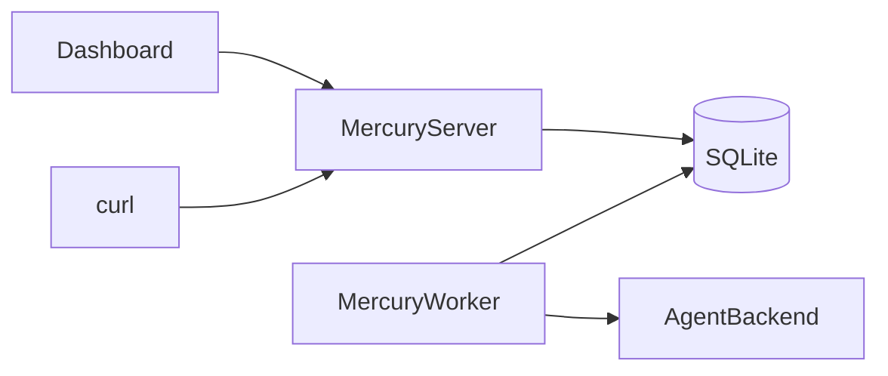
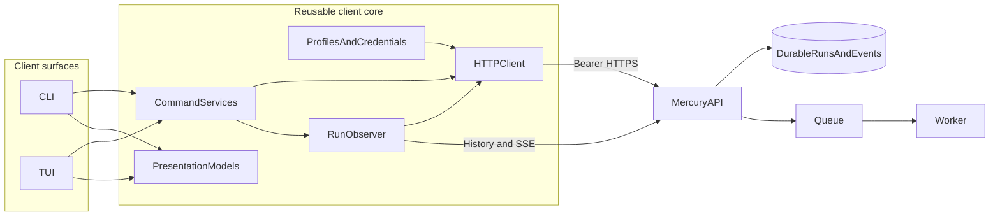
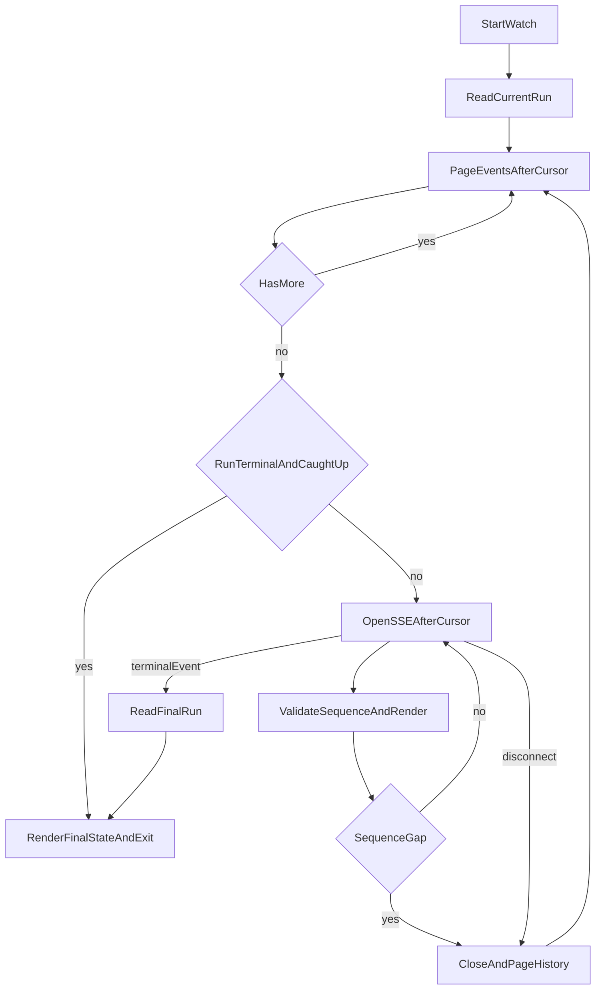
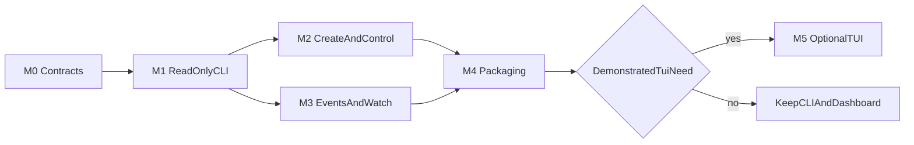

# Mercury CLI and TUI design

Status: **partly implemented.** Milestones 0 to 3 are implemented: the client
contracts, transport, configuration and credential layers; the read-only commands
`mercuryctl agents list`, `runs list` and `runs show`; the mutation commands
`runs create`, `runs input`, `runs cancel` and `runs retry` with idempotency keys
and confirmation; and the observation commands `runs events` and `runs watch` with
paging, gap recovery, bounded reconnect and terminal outcome exit codes. Milestone 4
(packaging) remains as issue #233, `config profiles` and `config current` are
advertised but not yet built, and the TUI in Milestone 5 remains gated on
demonstrated need. See §16 for per-milestone status.

Mercury already runs as long-lived services: an API server owns the HTTP and
dashboard surface, while one or more workers execute durable Runs. The existing
`src/cli.ts` starts and maintains those processes. This document designs a
different tool: a remote operator client for creating, observing and controlling
Runs.

The decision is:

> Build a scriptable CLI first. Build a TUI later, only as another presentation
> layer over the same client library and Run-observation model.

The proposed executable name is `mercuryctl`. This keeps remote Run operations
distinct from the existing `mercury server`, `mercury worker`, migration and
garbage-collection commands.

## 1. Problem

Mercury currently has two complete Run clients:

- the browser dashboard, for interactive use;
- the HTTP API, normally used from `curl` or custom scripts.

There is no first-class terminal client. Operators working over SSH, automation
authors and users who prefer terminal workflows must manually construct JSON,
authentication headers, pagination loops and resumable SSE connections.

A CLI solves that gap without changing Mercury's execution architecture. A TUI
can later provide a terminal cockpit, but starting with it would duplicate much
of the dashboard before the reusable client behavior is proven.

## 2. Goals

The client will:

1. create, list and inspect Runs;
2. follow durable event history and live progress;
3. submit input and request cancellation or retry;
4. support stable human-readable and machine-readable output;
5. recover event streams without losing events;
6. work against a remote Mercury installation using its public HTTP API;
7. keep credentials out of process arguments, logs and normal output;
8. provide reusable client and observation layers for a later TUI;
9. remain useful when the browser dashboard is unavailable.

## 3. Non-goals

The client will not:

- start or supervise the Mercury server or worker;
- import `RunService`, worker, adapter, queue or database code;
- read Mercury's SQLite database or workspace directories;
- execute an agent itself;
- replace the browser dashboard;
- federate or route across Mercury hosts;
- introduce a second event protocol;
- infer that a missing Run belongs to another owner;
- implement Crew or workflow orchestration;
- repair the experimental PrimeAgent daemon transport.

Fleet remains responsible for multi-host routing and durable child bindings.
`mercuryctl` targets one Mercury API endpoint at a time. A future Fleet client
may reuse interaction conventions, but it must not blur the two ownership
models.

## 4. Current runtime context

A production-style installation has two independent long-lived processes:



Development may embed the worker in the API process. That does not change the
client contract: Runs are created and controlled through the API, and their
lifetime never depends on the client connection.

The current `src/cli.ts` is a process entry point for:

```text
dev
server
worker
gc
migrate
redact-events
```

Those commands retain their current role. `mercuryctl` is a separate entry
point and can run on a machine that has no database, workspace or agent binary.

## 5. High-level architecture



There is one remote protocol and one source of truth:

> The child Mercury stores Run truth. The client holds only configuration,
> transient presentation state and event cursors.

The CLI and TUI may cache a cursor while observing a Run. They must not create a
second durable Run store or manufacture a terminal state when the API is
unreachable.

## 6. User-facing command model

The initial command grammar is:

```text
mercuryctl agents list

mercuryctl runs create
mercuryctl runs list
mercuryctl runs show <run-id>
mercuryctl runs events <run-id>
mercuryctl runs watch <run-id>
mercuryctl runs input <run-id>
mercuryctl runs cancel <run-id>
mercuryctl runs retry <run-id>

mercuryctl config profiles
mercuryctl config current
```

Global options include:

```text
--profile <name>
--url <base-url>
--json
--no-color
--timeout <duration>
```

There is deliberately no `--token` option. Command-line arguments are visible
to other local processes and are commonly retained in shell history.

### 6.1 Read commands

`agents list` reports registered agent ids and identifies the server's default.

`runs list` supports the server's status and limit filters. It follows opaque
`nextCursor` values when the user requests more than one page. The default
human view is a compact table; `--json` returns the unmodified logical response
shape.

`runs show` returns Run details and recorded skills. A terminal status is data,
not a command failure: showing a failed Run exits successfully.

`runs events` reads persisted history. It accepts `--after` and `--limit`.
Without `--follow`, JSON output is one response object. With `--follow`, JSON
output is newline-delimited JSON, one Mercury event per line.

`runs watch` first catches up from durable history, then follows SSE. Its human
view emphasizes status, agent messages, tools, tests, input requests and final
artifacts rather than printing the raw SSE wire format.

### 6.2 Create and control commands

`runs create` supports common fields as flags and the complete request as JSON:

```text
mercuryctl runs create --file request.json
mercuryctl runs create --file -
mercuryctl runs create --task "Fix issue 42" --repo https://example/repo.git
```

The JSON file or stdin form is canonical because it can represent repositories,
skills and constraints without an ever-growing flag grammar. Common flags are a
convenience and must map to the same request model. Mixing `--file` with request
fields is rejected rather than applying surprising merge rules.

`runs input` accepts `--file`, stdin or a simple `--value`. Stdin is preferred
for multiline input and avoids shell quoting problems.

`runs cancel` and `runs retry` show the resulting Run id and status. Retry
prints the new Run id; it never presents retry as a transition of the old Run.

Mutating commands ask for confirmation only when stdin is a terminal and the
operation is destructive or spend-bearing. `--yes` disables the prompt.
Machine-readable mode never prompts: it requires `--yes` where confirmation
would otherwise be needed.

## 7. API contract

[`api.md`](api.md) remains the source of truth. The client consumes these
existing endpoints:

- `GET /api/agents`
- `POST /api/runs`
- `GET /api/runs`
- `GET /api/runs/:runId`
- `POST /api/runs/:runId/input`
- `POST /api/runs/:runId/cancel`
- `POST /api/runs/:runId/retry`
- `GET /api/runs/:runId/events`
- `GET /api/runs/:runId/stream`

The client uses bearer authentication. Browser session endpoints are not part
of the CLI authentication flow because sessions are process-local on the
server and bearer tokens are already the supported script and CI mechanism.

### 7.1 HTTP behavior

The transport layer maps responses into typed client errors:

- `400`: invalid request; show the server message;
- `401`: missing or invalid credential;
- `404`: Run not found or not visible to this caller;
- `409`: lifecycle conflict; refresh state before suggesting a next action;
- `429`: rate limited; honor `Retry-After` when automatic retry is allowed;
- `500`: server failure; preserve the opaque public message;
- transport failure: endpoint unreachable, TLS failure or timeout.

The client must not turn a `404` into “another owner owns this Run.” Mercury
deliberately does not disclose that distinction.

Automatic retries are limited to idempotent reads and create requests carrying
the same idempotency key. Control operations are not retried automatically
unless their server contract becomes explicitly idempotent.

### 7.2 List pagination

Run list cursors are opaque. The client:

1. sends the user's status and limit;
2. displays the returned page;
3. passes `nextCursor` back unchanged when another page is requested;
4. never parses or constructs a cursor locally.

The first release does not add an owner filter because the API does not expose
one. Admin callers receive the server's current all-owner view.

### 7.3 Event pagination

Event history is ordered by per-Run sequence. The client advances from
`nextCursor`, not `lastSequence`. `lastSequence` is the Run's current maximum
and may be greater than the final event in a capped page.

The observer rejects malformed event envelopes but does not fail a complete
Run merely because an unknown future event type appears. Unknown types remain
available in JSON and get a generic human rendering.

### 7.4 History and stream reconciliation

SSE reduces latency; durable event history provides correctness.



The observer algorithm is:

1. fetch current Run state;
2. page event history after the last accepted sequence until caught up;
3. open `/stream?after=<sequence>`;
4. ignore SSE comments and the `hello` control event;
5. ignore a duplicate event whose sequence is not greater than the cursor;
6. if a sequence gap appears, close SSE and recover from event history;
7. after disconnect, page history before reconnecting;
8. reconnect with bounded exponential backoff and jitter;
9. after a terminal event, fetch final Run state and exit;
10. if the Run was already terminal and history is caught up, do not wait for
    another stream event.

The cursor advances only after an event is validated and handed to the output
sink. In a TUI, the sink updates in-memory state. In streaming JSON mode, the
sink writes one complete line before advancing.

An unreachable server results in `UNKNOWN` connectivity in the TUI or a
transport error in the CLI. It never changes the displayed Run status to
`FAILED`.

## 8. Idempotent Run creation

Every create request carries an `Idempotency-Key`.

The key rules are:

- an explicit `--idempotency-key` is accepted for scripts and cross-invocation
  retries;
- otherwise the client generates a random key before the first request;
- all transport retries within that invocation reuse the generated key;
- the generated key is shown in verbose diagnostics and included in structured
  command metadata, but not added to the Run request body;
- a user rerunning the command after an indeterminate failure must supply the
  previously reported key to guarantee reuse;
- changing task or repository intent requires a new key.

The initial implementation does not maintain a second local database of pending
creates. If crash-safe automatic reuse across separate invocations becomes
necessary, add a small permission-restricted request journal as a separate
design. Do not silently infer request identity from task text.

## 9. Configuration and credentials

### 9.1 Profiles

Profiles allow one client installation to target several Mercury endpoints
without turning the client into Fleet.

The default configuration path follows the platform configuration directory:

```text
${XDG_CONFIG_HOME:-~/.config}/mercury/config.json
```

An example non-secret configuration is:

```json
{
  "currentProfile": "local",
  "profiles": {
    "local": {
      "url": "http://127.0.0.1:3000",
      "credential": "local",
      "timeoutMs": 30000,
      "caFile": null
    },
    "lab": {
      "url": "https://mercury.example.test",
      "credential": "lab",
      "timeoutMs": 30000,
      "caFile": "/etc/ssl/certs/mercury-lab.pem"
    }
  }
}
```

Credential values live separately:

```text
${XDG_CONFIG_HOME:-~/.config}/mercury/credentials.json
```

```json
{
  "local": "tok-alice",
  "lab": "another-token"
}
```

The credentials file must be readable only by its owner. The client refuses a
group- or world-readable credentials file on platforms where permissions can
be checked. A profile stores only a credential name, never a token.

### 9.2 Precedence

Non-secret settings resolve in this order, highest first:

1. command flags;
2. client-specific environment variables;
3. selected profile;
4. safe defaults.

The proposed environment variables are:

```text
MERCURY_CLIENT_PROFILE
MERCURY_CLIENT_URL
MERCURY_CLIENT_TOKEN
MERCURY_CLIENT_TIMEOUT_MS
MERCURY_CLIENT_NO_COLOR
```

Credentials resolve from `MERCURY_CLIENT_TOKEN` first, then from the selected
profile's credential reference. There is no token flag and no interactive
token prompt in the first release.

HTTP is accepted by default only for loopback endpoints. Remote endpoints must
use HTTPS. A custom CA file is supported; disabling TLS certificate validation
is not.

## 10. Output contract

The output contract is part of the public CLI surface.

### 10.1 Streams

- stdout contains requested data;
- stderr contains diagnostics, retries, prompts and warnings;
- `--json` disables decoration and ANSI color;
- a successful non-streaming JSON command writes exactly one JSON value;
- a streaming JSON command writes newline-delimited JSON;
- no mode prints a credential;
- broken-pipe errors caused by a downstream command closing stdout are handled
  quietly.

Human output may evolve cosmetically. JSON field names and exit semantics
require compatibility review.

### 10.2 Exit codes

The proposed stable exit codes are:

```text
0   command succeeded; for watch, Run completed
2   usage or local configuration error
3   authentication failed
4   resource not found or not visible
5   lifecycle conflict
6   rate limited after the allowed wait
7   transport, TLS, timeout or server failure
8   event stream could not recover within its retry budget
10  watched Run failed
11  watched Run was cancelled
12  watched Run timed out
```

`runs show`, `runs list` and `runs events` exit `0` when the request succeeds,
regardless of the Run's status. Outcome-specific codes apply only to commands
that explicitly wait for a terminal outcome, initially `runs watch`.

Signal termination follows shell convention: an interrupted watch exits `130`
for `SIGINT` and releases sockets without changing the Run.

## 11. Low-level module design

The proposed source tree is independent of `src/`:

```text
client/
  cli.ts
  config.ts
  credentials.ts
  exitCodes.ts
  commands/
    agents.ts
    create.ts
    list.ts
    show.ts
    events.ts
    watch.ts
    input.ts
    cancel.ts
    retry.ts
  api/
    client.ts
    errors.ts
    protocol.ts
    sse.ts
  observe/
    runObserver.ts
    reducer.ts
  output/
    human.ts
    json.ts
  tui/
    app.ts
    screens/
  test/
```

The boundaries are:

- `config.ts` resolves flags, environment and profiles without making network
  requests;
- `credentials.ts` reads and validates credential storage and returns a token
  only to the HTTP transport;
- `api/protocol.ts` owns client-side wire DTOs and validation;
- `api/client.ts` owns URLs, bearer headers, JSON parsing, timeouts and error
  mapping;
- `api/sse.ts` parses SSE framing but knows nothing about terminal UI state;
- `observe/runObserver.ts` implements history/SSE reconciliation and reconnect;
- `observe/reducer.ts` projects Run plus events into a presentation model;
- command modules validate input and invoke client services;
- output modules own stdout formatting;
- `tui/` is absent until its milestone and imports the same API, observer and
  reducer modules as the CLI.

### 11.1 Coupling rule

The client must not import Mercury implementation modules from `src/`, even for
TypeScript types. It speaks the deployed HTTP protocol and should be testable
against a Mercury version built from a different checkout.

This creates a deliberate wire-type copy in `client/api/protocol.ts`. Contract
tests against the real API detect drift. Shared source imports would make drift
less visible while coupling the remote client to worker/runtime dependencies.

Allowed standard-library facilities include Node's built-in `fetch`,
`AbortController`, streams, filesystem and crypto APIs. The initial CLI should
not add a command framework or SSE dependency unless hand-written parsing
becomes measurably harder to maintain.

### 11.2 HTTP client interface

The internal API is conceptually:

```ts
interface MercuryClient {
  listAgents(signal?: AbortSignal): Promise<AgentsResponse>;
  createRun(request: CreateRunRequest, key: string, signal?: AbortSignal): Promise<CreateRunResponse>;
  listRuns(query: RunListQuery, signal?: AbortSignal): Promise<RunListResponse>;
  getRun(runId: string, signal?: AbortSignal): Promise<RunDetailResponse>;
  listEvents(runId: string, query: EventQuery, signal?: AbortSignal): Promise<EventPage>;
  streamEvents(runId: string, after: number, signal?: AbortSignal): AsyncIterable<StreamItem>;
  submitInput(runId: string, input: unknown, signal?: AbortSignal): Promise<OkResponse>;
  cancelRun(runId: string, signal?: AbortSignal): Promise<RunActionResponse>;
  retryRun(runId: string, signal?: AbortSignal): Promise<RetryRunResponse>;
}
```

Each request has a total deadline. The streaming request has separate connect
and idle behavior: SSE keepalive comments prove the connection is alive, while
the overall watch may legitimately last for hours.

### 11.3 Cancellation

Local cancellation and Run cancellation are different:

- `Ctrl-C` aborts the HTTP request or watch and leaves the Run untouched;
- `runs cancel <run-id>` calls Mercury's cancellation endpoint;
- the TUI requires an explicit action and confirmation before requesting Run
  cancellation.

Conflating these actions would make an ordinary terminal interrupt destructive.

## 12. TUI design

The TUI is a milestone, not a prerequisite for the CLI.

It has four logical screens:

1. connection/profile status;
2. Run list with status filter and periodic refresh;
3. Run details with summary, skills, events and final artifacts;
4. pending-input editor and confirmation dialogs.

Only the selected non-terminal Run holds an SSE observation loop. The Run list
uses bounded polling because Mercury exposes per-Run streams, not a global list
stream.

The TUI state model contains:

```text
activeProfile
connectionState
runsPage
selectedRun
selectedRunCursor
selectedRunEvents
pendingInput
activeOperation
lastError
```

Changing selection aborts the old observation loop and starts history-first
observation for the new Run. Reconnecting is visible as connection state; it
does not overwrite the last known Run status.

Keyboard bindings and the TUI framework are intentionally deferred until the
CLI observer is proven. Framework selection must consider Node 22 support,
accessibility, terminal resizing, testability, dependency weight and clean
shutdown. It must not change the client protocol or command services.

## 13. Security model

The client handles a credential that can create paid work and control every Run
visible to its owner.

Required controls are:

- no bearer token in argv, URLs, logs, telemetry or errors;
- permission checks on credential files;
- bearer headers added only by the transport layer;
- HTTPS for non-loopback endpoints;
- custom CA support without a skip-verification shortcut;
- bounded response bodies and request deadlines;
- redaction of authorization headers from diagnostic objects;
- no automatic submission of input from terminal escape sequences;
- no rendering of agent event text as executable terminal control sequences;
- confirmation before spend-bearing retry and destructive cancellation;
- no persistence of event bodies by default.

Run events and task text are untrusted output. Human renderers must neutralize
terminal control characters. JSON mode preserves data semantics but still must
not add authorization metadata.

## 14. Compatibility and versioning

Mercury currently has no versioned API prefix or capability document. The
client therefore:

- targets the API documented in `api.md`;
- tolerates unknown response fields and event types;
- requires known fields used for correctness, especially event sequence;
- reports missing required fields as protocol incompatibility;
- identifies itself with a non-secret `User-Agent`;
- keeps JSON output close to server response shapes;
- does not guess support for endpoints after a `404`.

Before distributing the client separately from Mercury, add and test a small
compatibility policy. A server version or capabilities endpoint may eventually
be justified, but this client design does not require one for the first
in-repository release.

## 15. Testing strategy

Normal client tests require no real agent, external network or interactive
terminal.

### 15.1 Unit tests

Cover:

- configuration precedence and profile selection;
- credential permission failures;
- URL normalization and remote HTTP rejection;
- status-to-error and error-to-exit-code mapping;
- cursor progression and duplicate suppression;
- sequence-gap recovery;
- SSE framing split across arbitrary chunks;
- comments, `hello`, multiline data and malformed frames;
- terminal outcome exit mapping;
- terminal-control sanitization;
- deterministic human and JSON rendering.

### 15.2 HTTP contract tests

Run the client against Mercury's existing test API to cover:

- owner-scoped list and details;
- default-agent discovery;
- create with idempotency key;
- event page truncation using `nextCursor`;
- history-to-SSE handoff without loss;
- input, cancel and retry state conflicts;
- `401`, indistinguishable `404`, `409`, `429` and opaque `500`;
- already-terminal watch;
- reconnect after the stream is dropped.

### 15.3 Subprocess tests

Spawn the actual CLI and a fake or test Mercury server. Assert:

- stdout and stderr separation;
- table output and one-value JSON output;
- NDJSON streaming;
- stable exit codes;
- `Ctrl-C` does not cancel the Run;
- no token appears in argv-derived diagnostics or captured output;
- prompts occur only in interactive human mode;
- broken pipes exit quietly;
- help and invalid usage do not require network access.

Use asynchronous subprocesses for tests that communicate with an in-process
HTTP server. A synchronous child would block the server's event loop.

### 15.4 Coupling test

Add a source-level guard that rejects imports from:

```text
src/
fleet/
```

The client can be deployed independently and must not accidentally acquire
database, worker or Fleet dependencies.

## 16. Delivery roadmap

Each milestone is independently reviewable and leaves the prior surface usable.
Do not begin the TUI by bypassing unfinished client layers.

### Milestone 0: contracts and test harness -- **done** (issue #229, PR #234)

Deliverables:

- freeze command names, configuration precedence, output rules and exit codes;
- add client wire DTOs and runtime validation;
- add fake HTTP/SSE fixtures and the coupling test;
- add local help output with no network dependency.

Acceptance criteria:

- protocol fixtures cover every currently consumed endpoint;
- SSE parser tests pass for arbitrary chunk boundaries;
- credentials cannot be supplied through argv;
- no client module imports `src/` or `fleet/`.

Verification:

```text
npm run typecheck
focused client tests
```

Deferred:

- live commands;
- profiles written by the CLI;
- TUI framework selection.

### Milestone 1: read-only CLI -- **done** (issue #230)

Deliverables:

- `mercuryctl agents list`;
- `mercuryctl runs list`;
- `mercuryctl runs show`;
- profile and environment loading;
- human tables and one-value JSON output;
- an in-repository npm entry point.

Acceptance criteria:

- the CLI works against a separately running Mercury server;
- pagination never constructs or parses server cursors;
- failed Runs can be shown with exit code `0`;
- auth, not-found and transport failures use documented exit codes;
- tokens never appear in output.

Verification:

```text
focused client subprocess tests
npm run typecheck
npm test
```

Deferred:

- event streaming;
- distributable packaging.

Mutations were **not** deferred: the contract suite was mutation-tested, and two
survivors changed the implementation. Dropping `sanitizeForTerminal` from the
repository field kept every test green, so that field gained its own test; and a
first attempt at mutating cursor handling only altered a footer string, which
proved nothing, so it was rewritten to remove the cursor from the outgoing query.
That second case is the general one -- a mutation that does not change behaviour
cannot detect anything, and a green suite after such a mutation is not evidence.

#### Corrections found after the first Milestone 1 commit

Independent review of the first Milestone 1 commit found one defect, and chasing
it exposed three more. All four are recorded here because each is a way this
design can be implemented plausibly and wrongly.

**The request deadline was an idle timeout, not a total one.** §11.2 requires a
total deadline, and the code comment claimed one while calling only
`req.setTimeout`, which measures time since the last byte. A server that sends a
valid JSON prefix and then one byte every 200ms resets it forever. Reproduced
against a stub: with a 1s timeout the client waited 25 seconds and was still
waiting. The response-size bound does not cover this, because a slow drip stays
under the limit indefinitely. The wall-clock bound is now armed explicitly, and
`client/test/transport.test.ts` keeps a slow-drip server as a permanent fixture.
The idle handler was then **removed** rather than kept: at the same duration as
the total deadline it can never fire first, mutation testing confirmed deleting it
changes no result, and code that cannot be observed cannot be trusted later.

**A regression test must fail, not stall.** With the deadline removed, the new
test hung the suite for 400 seconds instead of failing. Awaiting a rejection that
never arrives is indistinguishable from a slow run, so the test now races the
request against a hard cap and asserts the cap did not win.

**The sanitiser let `\\r` through.** It excluded CR alongside `\\n` as layout,
but a terminal returns the cursor to column 0 on CR, so a Run task of
`legit work\\rOK - all tests pass` displays only the attacker's suffix. `\\n`
advances a line; `\\r` overwrites one.

**The oversized-response test was itself wrong.** Its server incremented a byte
counter only when `write()` returned `true`, but `write()` returns `false` to
signal backpressure *after* queueing the data -- so the counter never advanced and
the handler streamed without end. The test was therefore proving "an endless stream
trips the bound", which still passed when the bound was raised to 1GB, and the
mutation survived. It now sends a fixed 20MB and ends.

**The published package would have shipped a broken `mercuryctl`.** `bin` named
`client/bin.ts` while `files` remained an allowlist naming only `src/` and friends.
npm always includes files that `bin` names, so the tarball contained `client/bin.ts`
and no other client source -- an installed command that fails on its first import.
Nothing in the suite caught it because nothing runs `npm install`. `client/` is now
in `files`, and `client/test/packaging.test.ts` asserts that every `bin` target's
*directory* is published. Naming only the entry point is deliberately not accepted
as coverage, since that is the exact state that shipped.

Two review findings were smaller but real: `--status` was passed to the client as
`as never`, which type-checked only by silencing the compiler -- and since the server
silently ignores an unrecognised status, a divergence between `RUN_STATUSES` and the
protocol type would have produced an unfiltered list rather than an error; and
`writeJson` was imported into `agents.ts` and never used.

One mutation deliberately survives: deleting the `mercury` bin entry keeps the
packaging guard green, because a target that does not exist needs no coverage. That
is the guard behaving correctly, not a hole in it.

### Milestone 2: create and control -- **done** (issue #231)

Deliverables:

- `runs create`, `input`, `cancel` and `retry`;
- JSON file/stdin request support;
- generated and explicit idempotency keys;
- interactive confirmation and `--yes`;
- structured conflict and rate-limit handling.

Acceptance criteria:

- every create carries an idempotency key;
- an automatic create retry reuses the same key;
- retry reports a new Run id and `retryOf`;
- noninteractive mutations never block on a prompt;
- lifecycle conflicts do not get reported as transport failures.

Verification:

```text
idempotency and lifecycle contract tests
credential-leak subprocess tests
npm run typecheck
npm test
```

Deferred:

- cross-invocation pending-create journal;
- automatic retries for control operations.

#### Notes from implementing Milestone 2

**A definite rejection must not be reported as an uncertain one.** The first
implementation wrapped every exhausted create in `CreateUncertainError`, which
told the operator "the Run may or may not have been created, rerun with this key"
even when the server had answered 400 and said it was not created. Only an
indeterminate outcome earns the key advice; validation, auth and conflict errors
now propagate unchanged.

**The idempotency criterion was initially tested against a hostile socket, and
that was the wrong instrument.** Proving "an automatic retry reuses the same key"
is a statement about a decision in `createRunIdempotent`, so it is now tested
against a scripted client that fails on demand: deterministic, and it fails in
milliseconds. Whether a socket reset counts as indeterminate at all is a separate
question, covered by the transport suite.

**`spawnSync` in a test blocks the test process's own event loop.** Three
symptoms, one cause: in-process stub servers could never answer the CLI (tests
timed out at 30s as though the client were broken), and the drain that keeps the
real server's stdout pipe from filling could not run, so the server wedged and a
later unrelated test died with `fetch failed`. Tests that host a server in-process
must spawn asynchronously.

**Weak mutations produce false confidence twice in one session.** Adding
`runs create` to the confirmation table appeared to survive testing, and adding a
`confirm()` call to the dispatcher also appeared to survive -- each alone is inert,
because the table gates the call and the call consults the table. Only the
combination breaks the property, and it fails 18 tests. A mutation that cannot
change behaviour cannot detect anything; concluding "this property is untested"
from an inert mutation is its own error.

**Two tests were wrong and the code was right.** Both asserted that `runs input`
succeeds on a `QUEUED` Run; the server requires `NEEDS_INPUT` and answers 409. The
tests now assert the conflict, which is one of this milestone's acceptance
criteria. Reaching `NEEDS_INPUT` in a test sets the status directly in the
database, because no adapter except the real PrimeAgent one produces it -- that
proves the client handles the status, and does not prove the worker ever reaches
it.

### Milestone 3: events and watch -- **done** (issue #232)

Deliverables:

- `runs events`;
- `runs watch`;
- event paging, SSE parsing and Run observer;
- duplicate suppression, gap recovery and bounded reconnect;
- NDJSON event output and terminal outcome exit codes.

Acceptance criteria:

- a forced disconnect loses no persisted event;
- a capped event page advances from `nextCursor`;
- an already-terminal Run exits without waiting;
- `Ctrl-C` stops only the client;
- failed, cancelled and timed-out Runs have distinct watch exit codes.

Verification:

```text
SSE fragmentation and reconnect tests
history-to-stream integration tests
long-running watch cancellation test
npm run typecheck
npm test
```

Deferred:

- global Run-list streaming;
- local event persistence.

**Paging must resume from `nextCursor`, never `lastSequence`.** `GET
/api/runs/:id/events` returns both, and the server comments that `lastSequence` is
not a safe resume point when a page is truncated. Resuming from the maximum sequence
on a truncated page silently skips the events between the last returned event and
that maximum -- data that was persisted and never shown. The observer takes its next
`after` from `nextCursor` only, and a test pins the difference.

**A fake that lies about paging makes correct code look broken.** The first scripted
store indexed a list of pages by call count, so it could answer `hasMore: false`
while events remained; the observer then paged once and looked like it was dropping
events. The fixture was rewritten to model an actual store -- one flat list, paged by
`after`/`limit`, with `hasMore` computed exactly as the server computes it. Three
tests that "failed" were fixture bugs, not product bugs.

**Gap recovery is unreachable unless the fixture can change state mid-observation.**
With a terminal status the observer finishes right after the initial history drain and
never enters the streaming loop; with a permanently running status it exhausts the
reconnect budget. Both are correct behaviour, and neither exercises the gap path. The
store now publishes the missing sequences when the stream is opened, so the stream can
run ahead of history the way the real in-memory fan-out does.

**Ctrl-C hung, and the cause was a comment.** The SSE iterator's wake-up path handled
a queued frame and a completed stream, and for the failure case it carried the comment
"rejections surface below" while resolving nothing. A consumer parked in `next()` when
the socket died was never woken, so an interrupt closed the socket and left the process
running. The iterator now holds both settle functions and rejects on failure. A bare
`req.destroy()` also had to become `req.destroy(error)`: destroy-without-error emits
`close` but neither `end` nor `error`, so nothing wakes the reader.

**An interrupt is not a transport failure.** The abort now surfaces as a distinct
`AbortError` that the observer maps to exit 130. Routing it through `TransportError`
would have reported a network fault that never happened, and the exit code would have
been wrong for scripts that distinguish "I stopped watching" from "Mercury is down".

**Five tests were written against a milestone that had not happened yet.** They used
`runs watch` as the example of an unimplemented command, and implementing it turned
each into an assertion about endpoint configuration -- green, and testing nothing
intended. They now derive a stub command from the same `IMPLEMENTED` set the
dispatcher consults, and a guard test fails if that set ever becomes fully
implemented so the derivation cannot become vacuous.

**Two cursors are not one cursor, and a vacuous test hid the bug.** The observer's
history loop advanced a single `cursor` both as the value it requested next and as the
value it had delivered. `emit()` moves the delivered cursor to the last event shown,
which on a full page equals `page.nextCursor`, so the loop's anti-loop guard
`page.nextCursor <= cursor` was true after every page and paging stopped after one page
regardless of `hasMore`. A Run with more history than one page showed only its first
page before following the stream. The loop now keeps a separate `requested` cursor and
applies the anti-loop guard to it.

**The test that should have caught it was not testing paging.** It was named "a capped
page advances from `nextCursor`", but the scripted store sized pages from the caller's
`limit`, and the observer asks for 200 -- so all five events came back in one page and
nothing was ever capped. Mutating `nextCursor` to `lastSequence` survived, which is how
this was found: the fixture now caps at `min(caller limit, store page size)` the way a
real server caps at its own maximum, and the same mutation fails. A test whose name
asserts a property its fixture does not produce is worse than no test, because it reads
as coverage.

**A fresh Run already has six events.** Creating one writes `run.created`,
`run.queued` and one `skill.selected` per candidate skill, so a test that seeded two
events and asserted a page length of two was wrong about the server. The assertion now
names the seeded event types instead of a total the server owns.

### Milestone 4: packaging and operational hardening

Deliverables:

- installable `mercuryctl` executable or deployment artifact;
- profile inspection and setup commands;
- shell completion;
- version output and compatibility policy;
- operator documentation and copy-paste examples;
- bounded retry, timeout and terminal-sanitization review.

Acceptance criteria:

- the client installs without server or worker runtime configuration;
- help and completion work offline;
- a remote HTTPS profile with a custom CA works;
- packaging contains no credential or local profile;
- release verification exercises a separately running server.

Verification:

```text
clean-install smoke test
supported Node version tests
security-focused output review
npm run typecheck
npm test
```

Deferred:

- package-registry publication unless there is an operational need;
- multi-host routing.

### Milestone 5: optional TUI

Entry gate:

- Milestones 0 through 4 are stable in real terminal use;
- event observation and reducer APIs require no TUI-specific changes;
- users demonstrate a need beyond the browser dashboard and `runs watch`.

Deliverables:

- framework decision record;
- profile/connection, Run-list, Run-detail and input screens;
- polling list plus selected-Run observation;
- cancel, retry and input controls with confirmation;
- terminal resize, reconnect and clean-shutdown handling.

Acceptance criteria:

- no TUI code calls HTTP outside the shared client;
- no TUI code implements a second SSE reconciliation path;
- disconnect state is distinct from Run status;
- changing selection closes the old stream;
- every control remains owner-scoped by the server;
- the CLI remains fully functional without TUI dependencies where packaging
  permits separation.

Verification:

```text
reducer and screen-state tests
pseudo-terminal interaction tests
resize and disconnect tests
npm run typecheck
npm test
```

Deferred:

- replacing the browser dashboard;
- Fleet-wide views;
- workflow/DAG interfaces.

## 17. Milestone dependencies



Milestones 2 and 3 can proceed in parallel after the read-only client establishes
configuration, transport and output conventions. Packaging follows both because
the first useful distributable should support the complete Run lifecycle.

## 18. Definition of done

The CLI design is implemented when an operator can:

1. configure one Mercury endpoint without exposing a token in argv;
2. discover agents and inspect Runs;
3. create a Run idempotently;
4. close and reopen the client without affecting the Run;
5. recover complete event history and follow live events;
6. distinguish client connectivity from Run outcome;
7. answer input, cancel and retry with clear state-conflict behavior;
8. consume stable JSON or NDJSON from automation;
9. rely on documented exit codes;
10. install the client without installing an agent backend.

The TUI is done only if it meets those same guarantees through the shared
client core. A visually complete TUI with a second or lossy event path does not
meet this design.

## 19. Open decisions at implementation time

The architecture does not depend on these choices, so they are intentionally
deferred to the milestone that has evidence to decide them:

- whether the packaged executable is an npm `bin`, a bundled JavaScript
  artifact or both;
- whether a small command parser dependency is justified after Milestone 1;
- which TUI framework best satisfies the Milestone 5 gate;
- whether real usage warrants crash-safe pending-create journaling;
- whether Mercury should later expose an explicit API capabilities endpoint.

Changing any of these does not permit changing the core boundaries: HTTP/SSE is
the protocol, Mercury stores Run truth, the CLI ships first, and the TUI reuses
the client core.
