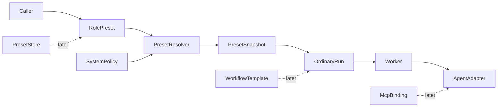

# Crew design

Crew is the umbrella name for reusable execution configuration in Mercury. The
first product is deliberately smaller than the name suggests: a user chooses a
**Role Preset** and Mercury creates one ordinary Run with a resolved instruction,
skill set, agent preference and constraints.

Status: **design only.** None of the types, APIs or storage described in this
directory are implemented unless a section explicitly says otherwise.

This directory supersedes the original
[`docs/crew-design.md`](../crew-design.md), which is retained as a historical
proposal.

## 1. The user problem

Today a caller chooses an agent and either chooses skills or relies on automatic
selection. Repeating a stable role such as `reviewer`, `system-architect` or
`kubernetes-sre` requires the caller to remember the same choices every time.

A Role Preset answers one question:

> What durable, reviewable configuration should Mercury resolve when a user says
> "run this task as the Kafka reviewer"?

The answer may include an instruction, global skill references, an agent
preference and constraint defaults. Later products may add per-run MCP bindings,
Git-backed distribution and multi-run workflows. Those are separate milestones
because they introduce different trust and lifecycle boundaries.

## 2. Stable terminology

These terms are normative across the Crew documents:

- **Role Preset** — configuration for one role applied to one Run. Its stable
  identifier is `presetId`.
- **Resolved Preset** — the effective, immutable bytes and metadata produced by
  merging a Role Preset with caller input and system policy.
- **Preset Snapshot** — the Resolved Preset persisted on a Run. Workers execute
  this snapshot; they do not re-read a mutable registry.
- **MCP Binding** — a per-run, adapter-translated set of MCP servers and tool
  policy. It is not an arbitrary agent argument list.
- **Preset Store** — distribution and authoring for Role Presets: builtin
  content, a Git mirror and owner-scoped drafts.
- **Workflow Template** — a bounded sequence of ordinary Runs with explicit
  handoff and gate rules.
- **Crew** — the umbrella product name only. APIs and schemas use the precise
  terms above.

The word `crew` must not identify both a single preset and a collection. The
first API uses `preset`, not `crew`. If a later UI presents several roles as a
crew, that collection is a Workflow Template or a separately defined catalog;
it is never inferred from a Role Preset.

## 3. Product boundaries

The products ship in this order:

1. **Role Presets** — the useful core for instruction-only roles.
2. **Per-run MCP** — a capability and security project for SRE roles.
3. **Preset Store** — Git synchronization, drafts, upload and publishing.
4. **Workflows** — bounded multi-run orchestration.

See [`roadmap.md`](roadmap.md) for dependencies, estimates and acceptance
criteria.

## 4. Mercury and Fleet responsibilities

Mercury owns preset resolution because it owns Run creation, snapshots,
workspaces, adapters and policy enforcement. A preset never contains
PrimeAgent-specific execution logic; adapters translate structured resolved
inputs into backend-specific flags or protocol messages.

Fleet remains a federation and placement layer:

- Fleet chooses a Mercury host using locality, capacity, labels and advertised
  capabilities.
- Mercury resolves the preset and executes the Run.
- Fleet may pass a `preset` field through its existing opaque requested payload.
- Fleet does not coordinate Workflow Template stages.
- Fleet cannot route an MCP-dependent preset safely until Mercury exposes richer
  agent and host capabilities than the current bare `/api/agents` names.

This preserves the coupling rule in
[`docs/fleet-design.md`](../fleet-design.md): Fleet speaks HTTP and does not
import Mercury internals.

## 5. Existing invariants Crew must preserve

Crew extends the Run model; it does not replace it.

1. A Run remains the durable unit of work.
2. Run lifecycle transitions still go through `RunStore.transition`.
3. Retry creates a new Run and must copy the parent snapshot when the caller
   asks to retry the same configuration.
4. Events remain monotonic and run-scoped. Store synchronization and validation
   failures without a Run are logs, metrics or system audit records, not Run
   events.
5. Workers own process lifetime and workspace materialization.
6. Agent-specific translation remains under `src/adapters/`.
7. Trust is assigned from provenance. A manifest cannot grant itself privilege.
8. Secrets never enter a Run record, event, retained workspace or browser
   response.
9. Unsupported required capabilities fail closed.
10. A caller that omits `preset` gets exactly the current behavior.

## 6. Current implementation facts

The designs in this directory use the current repository as their baseline:

- `RunService.create()` resolves agents and skills and inserts Run events in one
  transaction.
- `run_skills` stores complete skill snapshots, but the worker currently
  re-resolves those skills from the live registry before materializing them.
  That gap must be fixed before Role Presets claim reproducible execution.
- `resolveContained()` and `writeSkills()` already reject traversal and symlink
  escapes. Upload ingestion still needs equivalent read-side and archive
  protections.
- SQLite transactions already use `BEGIN IMMEDIATE`.
- The schema currently has five migrations; Crew changes start after v5.
- Claude has a process-wide `MERCURY_CLAUDE_MCP_CONFIG`. Mercury has no generic
  per-run MCP model.
- `allowedNetworks: []` selects container network `none`, while any non-empty
  list currently selects unrestricted bridge networking. Network names are not
  enforced allowlists.
- The daemon adapter is not verified against a real PrimeAgent daemon. Crew must
  not make daemon support an MVP dependency.

These are design constraints, not incidental implementation details.

## 7. Design principles

### Resolve once, execute the snapshot

Resolution happens during Run creation. The transaction stores the exact
instruction, effective manifest, resolved skill snapshots, provenance and
content hash. A queued worker later materializes only those stored bytes.

Changing a builtin file, Git mirror or draft after creation must not change what
an existing Run executes.

### Structured capabilities, not arbitrary arguments

A Role Preset may request a model or MCP requirement through structured fields.
It may not append arbitrary command-line arguments. Each adapter advertises and
translates supported capabilities. Required unsupported behavior rejects Run
creation or startup with an actionable error.

### Narrow trust before broad features

Builtin instruction-only presets require no new network or upload surface.
Per-run MCP, user uploads and Git publishing each open a distinct trust boundary
and therefore ship behind their own acceptance criteria.

### Honest enforcement

A field named as a ceiling or allowlist must be enforced. Until Mercury can
restrict egress by destination, the design describes network access as
`none` or `bridge`, not as a hostname allowlist. `budgetTokens` and
`budgetCost` remain recorded-only until adapters report usage.

## 8. Document map

- [`role-presets.md`](role-presets.md) — MVP schema, resolution, snapshots,
  persistence, API, UI and adapter contract.
- [`mcp-security.md`](mcp-security.md) — per-run MCP capability, secret and
  network boundaries.
- [`preset-store.md`](preset-store.md) — Git mirror, owner drafts, uploads and
  publishing.
- [`workflows.md`](workflows.md) — later multi-run workflow semantics.
- [`roadmap.md`](roadmap.md) — dependency order, deliverables and acceptance
  criteria.

## 9. Non-goals for the Role Preset MVP

The first release does not provide:

- MCP servers or secret injection;
- user uploads, drafts or publishing;
- Git synchronization;
- arbitrary agent arguments;
- model cost enforcement;
- graphs, loops, gates or child Runs;
- shared mutable workspaces;
- a general workflow engine;
- a new Fleet scheduler.

Those omissions are what make the MVP small enough to validate the central user
value before opening the high-risk surfaces.
