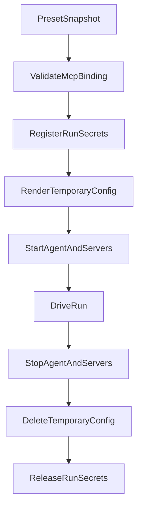

# Per-run MCP security

MCP is a separate Crew milestone because it changes what an agent can reach,
which credentials it can use and which processes Mercury must supervise. It is
not part of the Role Preset MVP.

Status: **design only.** Claude currently supports one process-wide
`MERCURY_CLAUDE_MCP_CONFIG`; Mercury does not have generic per-run MCP.

Related: [`role-presets.md`](role-presets.md),
[`preset-store.md`](preset-store.md), [`ARCHITECTURE.md`](../../ARCHITECTURE.md)
§24.

## 1. Security objective

An MCP-enabled Run must receive only the servers, tools, network access and
secrets that its resolved policy permits. If Mercury cannot enforce a required
part of that policy, the Run does not start.

MCP configuration is not merely prompt content. It can:

- start executables;
- reach internal or public services;
- carry cloud and cluster credentials;
- mutate production systems;
- return secrets through agent-visible tool results.

Consequently, “the preset requested it” is never sufficient authorization.

## 2. Current limitations

The implementation baseline matters:

- `ClaudeCodeAdapter` accepts a static `mcpConfig` configured when the process
  starts. It is not selected per Run.
- `AgentAdapter` does not advertise MCP capabilities.
- the redactor is created once at process startup and has no run-scoped secret
  registration;
- sandbox environment forwarding deliberately refuses `MERCURY_*`, source
  control, Kubernetes and broad cloud credentials;
- `allowedNetworks: []` produces container network `none`;
- any non-empty `allowedNetworks` produces Docker/Podman `bridge`, with no
  destination filtering;
- the default sandbox image does not contain the agent or MCP server binaries;
- the daemon adapter cannot be assumed to support sandboxed MCP.

This design does not relabel those limitations as enforcement.

## 3. Threat model

The protected assets are:

- Mercury administration and API credentials;
- source-control credentials;
- cloud, cluster and service credentials;
- repositories and retained workspaces;
- internal network services and metadata endpoints;
- model budget;
- durable Run events and logs.

Threat actors include:

- an owner uploading a malicious draft;
- a compromised trusted preset repository;
- a prompt-injected repository or task;
- a malicious or vulnerable MCP server;
- an agent invoking allowed tools with dangerous arguments;
- concurrent Runs attempting to reuse another Run's temporary configuration.

Controls must remain effective even when instruction text is hostile.

## 4. Normalized MCP model

Presets reference named MCP policies. They do not contain adapter-specific
Claude, Gemini or PrimeAgent configuration.

```ts
interface McpBinding {
  schemaVersion: 1;
  servers: McpServerBinding[];
}

interface McpServerBinding {
  id: string;
  transport: 'stdio' | 'http';
  commandRef?: string;          // stdio: operator-defined command identity
  endpointRef?: string;         // http: operator-defined endpoint identity
  args?: string[];
  secrets?: Record<string, SecretRef>;
  allowedTools: string[];       // absent or empty means deny all
  access: 'read' | 'write';
}

interface SecretRef {
  provider: 'environment' | 'file' | 'secret-manager';
  name: string;
}
```

`commandRef` and `endpointRef` resolve through operator-owned allowlists. A
preset does not choose an arbitrary executable or URL.

`access` is an admission policy, not proof that a tool is read-only. Every
allowed tool still requires a reviewed mapping. Write access is outside the
first MCP release.

## 5. Adapter capabilities

Adapters advertise structured capabilities:

```ts
interface McpAdapterCapability {
  mode: 'none' | 'per-run';
  transports: Array<'stdio' | 'http'>;
  toolAllowlist: 'enforced' | 'unsupported';
  configDelivery: 'file' | 'protocol';
}
```

The worker passes the normalized binding to the selected adapter. The adapter:

1. validates that it can express every required transport and tool restriction;
2. renders backend-specific configuration;
3. points the agent at a per-run file or sends configuration through its
   protocol;
4. applies equivalent configuration to `start()` and `resume()`;
5. deletes temporary resolved configuration after process termination.

An adapter does not expose a generic flag name in the preset schema. That would
move backend-specific knowledge into Mercury's orchestration input and allow a
preset to bypass policy with arbitrary arguments.

## 6. Secret references

Secret references are names, never values. Resolution occurs in the worker
immediately before the relevant process starts.

### 6.1 Admission policy

The worker resolves a reference only when all are true:

- the provider is enabled by operator configuration;
- the name is allowlisted for the selected `commandRef` or `endpointRef`;
- the preset trust tier may use that reference;
- the value exists;
- the Run is using the required sandbox and network policy.

These names are always denied, regardless of configuration:

- `MERCURY_*`;
- Fleet credentials;
- source-control administration credentials;
- database paths and encryption keys;
- alert/webhook credentials;
- broad environment-family wildcards such as `AWS_*`, `KUBE*` or `GITHUB_*`.

Operators grant exact names to an exact MCP identity. The example
`${env:MERCURY_K8S_TOKEN}` from the historical design is intentionally invalid.

### 6.2 Delivery

Unresolved placeholders may appear in the retained workspace for audit.
Resolved values may not.

The worker renders resolved configuration into a newly created per-run
directory outside the workspace:

```text
runtime/
  <runId>/
    mcp.json     mode 0600
```

The directory is owned by the worker account and removed in `finally` after the
agent and MCP processes stop. When sandboxed, only the exact file is mounted
read-only. It is not mounted into unrelated Runs.

A file available to the agent's operating-system user is not secret from that
agent. Where an adapter launches MCP servers itself and necessarily reads the
config, the security boundary is least privilege and egress control, not file
obscurity. Documentation and UI must not claim otherwise.

## 7. Run-scoped redaction

Resolved MCP secret values must be registered before any process receives them.
The current process-static `Redactor` is insufficient.

Introduce a run-scoped secret registry conceptually equivalent to:

```ts
interface RunSecretRegistry {
  register(runId: string, values: string[]): Disposable;
  redact(runId: string, value: unknown): unknown;
}
```

The EventStore write choke point redacts with both:

1. the process-wide patterns and operator-declared literals;
2. exact secret values registered for that `runId`.

The logger for an executing Run applies the same combined set. Registration is
reference-counted or token-based so cleanup for one component cannot remove a
secret still needed by another component.

Run-scoped values are removed after:

- the agent and supervised MCP servers have terminated;
- final events and logs have been written;
- temporary configuration has been deleted.

Redaction remains mitigation, not isolation. A malicious agent can transform a
secret before emitting it. The primary controls are not exposing unnecessary
secrets and restricting network/tool access.

## 8. Stdio server execution

The first MCP release permits only operator-registered stdio servers:

```ts
interface McpCommandPolicy {
  id: string;
  executable: string;
  allowedArgs: Record<string, ArgRule>;
  allowedSecretRefs: string[];
  image?: string;
}
```

Rules:

- no shell;
- argv arrays only;
- reject NUL and newline;
- cap argument count and byte length;
- flags must be declared by the command policy;
- absolute host paths are denied unless an operator policy grants the exact
  read-only path;
- no path supplied by a draft can escape its materialized root;
- the executable must be available in the sandbox image;
- Mercury must know whether the adapter or worker owns the MCP process.

If the adapter owns the process, process termination is part of the adapter
contract. If Mercury owns it, the worker supervises it explicitly and stops it
before releasing the Run lease. Ownership may not be left implicit.

Untrusted drafts cannot introduce `commandRef`; they may only reference
operator-published policies explicitly permitted for untrusted use.

## 9. HTTP servers and egress

HTTP MCP remains disabled until Mercury can enforce destinations.

Enabling it requires:

- HTTPS by default;
- an operator-owned endpoint identity resolving to fixed hosts and ports;
- DNS rebinding protection;
- denial of loopback, link-local, metadata and private ranges unless explicitly
  granted;
- destination enforcement through an egress proxy, container network policy or
  equivalent boundary;
- certificate validation;
- redirect validation against the same policy;
- request and response size/time limits.

Docker bridge networking alone satisfies none of these destination controls.
Until the controls exist, the honest supported network modes are:

- `none` — no network;
- `bridge` — unrestricted container egress, allowed only by explicit trusted
  operator policy.

Role Presets must not use names such as `cluster-api` as though Mercury enforces
them.

## 10. Tool authorization

`allowedTools` is deny-by-default. Enforcement must occur in a component that
the instruction cannot override:

- use an adapter's native enforced allowlist when verified;
- otherwise put a policy proxy between the agent and MCP server;
- reject the binding when neither exists.

Tool names alone may be too coarse. A `kubectl`-style server that exposes one
generic command tool needs argument-level policy or a read-only credential that
cannot mutate resources.

The first release is read-only:

- credentials have read-only upstream permissions;
- tool allowlists include inspection operations only;
- mutation tools are denied even for trusted presets;
- the UI labels the policy as read-only and shows the effective tools.

Write-capable MCP requires a separate approval and audit design.

## 11. Trust tiers

Trust comes from provenance:

- **builtin** — reviewed in the Mercury repository;
- **trusted** — resolved from a protected, reviewed preset-store commit;
- **untrusted** — an owner's unpublished draft.

Minimum policy:

- every MCP Run requires a functioning sandbox;
- untrusted drafts cannot define executables, endpoints, raw arguments or secret
  names;
- trusted presets can reference operator allowlists but cannot extend them;
- builtin presets have no implicit access to Mercury administration secrets;
- no tier can disable the EventStore or logger redactor;
- overlay shadowing never changes a shared preset for another owner.

## 12. Operability gate

Before advertising an MCP-capable preset, health diagnostics must establish:

- a supported RPC/local adapter is selected;
- the adapter reports per-run MCP and enforced tool filtering;
- the container runtime is available;
- the configured image contains the agent and allowed MCP binaries;
- the worker service can access the runtime socket;
- required secret references exist without exposing their values;
- the requested network mode is enforceable.

Daemon mode is excluded until its real protocol and sandbox behavior are
verified.

An unavailable prerequisite produces an actionable validation or startup error,
not a silent fallback to an unsandboxed or tool-unrestricted Run.

## 13. Lifecycle



Every exit path, including cancellation, timeout, lease loss, adapter startup
failure and worker shutdown, runs the cleanup sequence. A worker that loses its
lease stops local processes but does not mutate Run state it no longer owns.

## 14. Events and audit

Run events expose identities and counts, never resolved values:

- `mcp.configured` — server ids, transports, tool counts and unresolved
  reference count;
- `mcp.started` — server ids successfully started;
- `mcp.failed` — policy-safe error category;
- `mcp.stopped` — server ids and reason.

Full command lines, URLs containing credentials, temporary paths and secret
names are not browser payloads. Operator logs may include allowlist identities
but still pass through redaction.

## 15. Required tests

MCP cannot ship without tests proving:

1. a missing required capability refuses to start;
2. empty `allowedTools` permits no tools;
3. an untrusted draft cannot add a command, endpoint or secret;
4. denied environment names, including `MERCURY_ADMIN_TOKEN`, never resolve;
5. resolved values do not enter snapshots, workspaces, events or API responses;
6. a mock agent echoing an exact token is redacted;
7. transformed-secret limitations are documented, not asserted away;
8. `start()` and `resume()` receive equivalent MCP configuration;
9. cancellation and startup failure remove temporary files and processes;
10. HTTP transport remains rejected until destination enforcement is available;
11. a requested sandbox fails closed when runtime or image requirements are
    unmet;
12. concurrent Runs cannot read or unregister one another's secrets.
