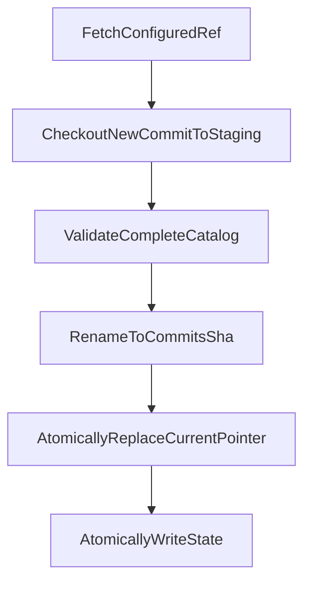
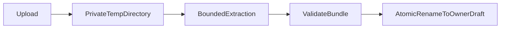

# Preset Store

The Preset Store distributes reviewed Role Presets and supports owner-scoped
drafts. It ships after builtin Role Presets and per-run MCP because upload and
publishing introduce new filesystem, supply-chain and authorization boundaries.

Status: **design only.**

Related: [`role-presets.md`](role-presets.md),
[`mcp-security.md`](mcp-security.md), [`roadmap.md`](roadmap.md).

## 1. Sources and precedence

There are three sources:

1. **owner draft** — unpublished content visible only to its owner;
2. **mirror** — reviewed content from the configured Git repository;
3. **builtin** — content shipped with Mercury.

Resolution is owner-aware:

```text
draft(ownerId, presetId) > mirror(presetId) > builtin(presetId)
```

A draft from owner A never appears in owner B's list and never shadows shared
content for owner B. Admin listing may inspect drafts for operations, but admin
visibility does not change resolution precedence for another owner.

Filesystem layout:

```text
preset-store/
  builtin/
    <presetId>/
  mirror/
    commits/
      <gitCommit>/
        presets/
    current
    state.json
  drafts/
    <ownerStorageKey>/
      <presetId>/
  staging/
```

`ownerStorageKey` is an opaque server-generated identifier, not raw user input.

Trust is derived from the source:

- builtin → `builtin`;
- mirror → `trusted`;
- draft → `untrusted`.

A `trust` field in uploaded content is rejected as unknown. It cannot influence
the resolved tier.

## 2. Git repository layout

The shared repository contains one current definition per preset id:

```text
preset-repository/
  presets/
    reviewer/
      preset.json
      INSTRUCTION.md
    kubernetes-sre/
      preset.json
      INSTRUCTION.md
      mcp.json
```

The `version` field is a reviewed release label, not a historical lookup
mechanism. Mutable branch content may contain only one current definition per
id. Mercury identifies executable content by source commit and content hash.

If product requirements later demand selecting old versions, the store must add
an immutable version layout or tag/index contract. A shallow checkout of one
branch cannot satisfy historical version resolution.

## 3. Atomic mirror synchronization

The API and worker normally run as separate processes. One worker is the sync
leader, but single-writer behavior alone does not protect concurrent readers
from an in-place `git reset --hard`.

The mirror uses immutable commit directories:



Detailed sequence:

1. acquire a process-safe sync lease;
2. fetch the configured ref with credentials supplied outside the URL;
3. resolve the commit SHA;
4. check out into a new directory under `staging/`;
5. reject submodules, unexpected symlinks and files outside the catalog;
6. validate every preset and the catalog limits;
7. fsync files where the deployment requires crash durability;
8. rename the staging directory to `mirror/commits/<sha>`;
9. atomically replace `mirror/current`;
10. atomically replace `state.json`;
11. release the lease;
12. garbage-collect old immutable commits only when no in-flight resolution
    references them.

Readers capture the current SHA once and read exclusively from that immutable
directory. A Run snapshot records the same SHA.

A failed fetch, checkout or validation leaves the last good pointer unchanged.
It updates logs, metrics and health state but does not take down builtin or last
good mirrored presets.

## 4. Git process safety

Every Git command is bounded. The sync implementation must set:

- a finite process timeout;
- `GIT_TERMINAL_PROMPT=0`;
- non-interactive credential behavior;
- bounded stdout/stderr capture;
- an argv array with no shell;
- an explicit remote/ref allowlist from operator configuration.

Tokens are supplied through a read-only credential helper or process
environment. They are never embedded in a remote URL, snapshot, state file,
workspace, event or log.

The existing `WorkspaceManager` Git calls do not consistently set timeouts.
Their style may be reused only after adding the missing bounds; Crew must not
copy the unbounded behavior into synchronization.

## 5. Registry view

`PresetRegistry` resolves against an immutable source view:

```ts
interface PresetSourceView {
  ownerId: string;
  builtinRoot: string;
  mirrorRoot?: string;
  mirrorCommit?: string;
  draftRoot?: string;
}
```

The registry:

- lists visible definitions with source and trust;
- resolves one preset and all referenced files;
- returns structured invalid entries for diagnostics;
- isolates a malformed preset from unrelated definitions;
- hashes canonical file content;
- reports shadowing without exposing another owner's draft;
- never returns mutable absolute source paths in a Run snapshot.

Registry reads apply the same path, symlink, size and count validation as write
paths. Validation-only behavior and execution behavior must not drift.

## 6. Draft writes

Draft creation is validate-then-publish:



The final draft directory is replaced atomically. The API never edits the live
draft in place. A concurrent Run either resolves the complete previous draft or
the complete new draft.

Per-owner quotas limit:

- number of drafts;
- compressed request bytes;
- expanded bytes;
- files per bundle;
- bytes per file;
- total instruction bytes;
- validation frequency.

Quota checks occur before extraction where possible and during streaming
extraction. A compressed-size check alone does not stop archive bombs.

## 7. Archive and folder ingestion

The safest initial authoring API accepts an explicit JSON file map:

```json
{
  "files": {
    "preset.json": "{ ... }",
    "INSTRUCTION.md": "# Reviewer"
  }
}
```

Folder and ZIP upload may ship later. If supported, extraction must:

- use a private temporary directory;
- reject absolute paths and every `..` segment;
- apply lexical and realpath containment to each member;
- reject symlinks, hard links, device nodes and named pipes;
- reject duplicate normalized paths;
- cap member count, expanded bytes and path length while streaming;
- refuse encrypted or unsupported members;
- validate UTF-8 for text files;
- avoid preserving archive ownership or executable bits;
- validate again before atomic rename;
- delete temporary content on every exit path.

The existing `resolveContained()` implementation protects destination writes.
Archive ingestion also needs read-side checks so a source symlink cannot alter
the files included in a hash.

## 8. API

Read endpoints from the Role Preset MVP remain:

```text
GET /api/presets
GET /api/presets/:presetId
```

Store endpoints:

```text
POST   /api/presets/validate
PUT    /api/presets/:presetId/draft
DELETE /api/presets/:presetId/draft
POST   /api/presets/:presetId/publish
POST   /api/presets/sync
GET    /api/presets/sync
```

Authorization:

- any authenticated owner may validate and manage their own drafts;
- a foreign draft is `404`, not `403`;
- publish and forced sync require admin policy;
- builtin and mirror entries cannot be changed through draft delete;
- request bodies cannot choose `ownerId`, trust tier or destination path.

Validation returns field/file findings with stable rules:

```json
{
  "valid": false,
  "findings": [
    {
      "level": "error",
      "path": "preset.json:agent.args",
      "rule": "unknown-field",
      "message": "Role Presets do not accept arbitrary agent arguments."
    }
  ]
}
```

Rate limiting is owner- and source-IP-aware. The current limiter is
process-local, so horizontally scaled API deployment requires a shared limiter
before upload is exposed as a high-volume public surface.

## 9. Publishing

Publishing turns an owner's validated draft into a reviewable change. It never
promotes the draft directly to trusted.

Sequence:

1. load the owner's current draft and compute its content hash;
2. revalidate it under publish policy;
3. create or update a branch named from a server-normalized preset id/version;
4. write exactly the validated file set;
5. include the content hash in commit metadata or PR body;
6. open a pull request;
7. store an audit record containing owner, source hash, repository, branch and
   PR URL;
8. return the existing result on idempotent retry.

The publish request includes the expected draft hash. If the draft changed
after the user reviewed it, publishing returns a conflict instead of publishing
different bytes.

Remote branch divergence, existing PRs and partial API failure have explicit
recovery paths. Mercury does not force-push a branch it no longer owns.

The publish token is scoped to the preset repository and required paths. It is
not available to agent Runs or MCP servers.

## 10. Provenance and integrity

Every resolved snapshot includes:

- source kind;
- source commit for mirror content;
- repository identifier without credentials;
- relative source path;
- manifest version;
- content hash;
- resolution timestamp;
- effective trust tier.

For mirror content, changing bytes without changing `version` is allowed only
as a new source commit and therefore produces a different hash. CI should
normally reject that practice for released versions, but Mercury's
reproducibility relies on commit plus hash rather than social convention.

Optional commit-signature or branch-protection verification can strengthen the
trusted tier. Until implemented, `trusted` means “read from the operator
configured reviewed repository,” not cryptographic proof of review.

## 11. Logs, metrics and health

Synchronization and validation failures without a Run are system diagnostics:

- structured logs with source, commit and safe error category;
- sync success/failure counters;
- last-good commit and age gauges;
- valid/invalid preset counts by source;
- draft quota and rejection metrics;
- `/healthz/presets` with last attempt, last success and rejected count.

They are not inserted into the Run EventStore, which requires a real `runId`.

The health endpoint never returns token values, owner draft contents, absolute
paths or raw Git stderr.

## 12. Required tests

The Preset Store cannot ship without tests proving:

1. owner A's draft is invisible to and cannot shadow content for owner B;
2. a mirror swap presents either the old or new complete commit to readers;
3. sync failure retains the last good commit;
4. invalid content in one preset does not hide valid presets;
5. path traversal, source symlinks and destination symlinks are rejected;
6. archive bombs, duplicate paths, hard links and over-limit bundles fail
   before publication;
7. drafts are atomically replaced;
8. trust is assigned from source and cannot be raised by content;
9. publish uses the reviewed draft hash and rejects a changed draft;
10. Git authentication cannot prompt or leak into URLs and logs;
11. Git commands terminate at configured timeouts;
12. an in-flight Run remains executable after mirror or draft replacement
    because it uses its database snapshot.
