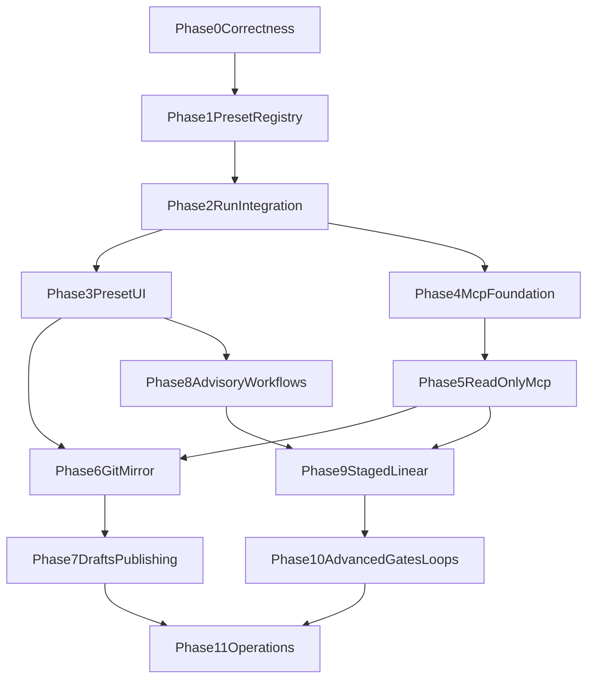

# Crew roadmap

This roadmap ships Crew as four separate products:

```text
Role Presets -> per-run MCP -> Preset Store -> Workflow Templates
```

Status: **design only.** Estimates are engineer-days for one engineer familiar
with Mercury. Every phase is independently reviewable and must keep
`npm run typecheck` and `npm test` green.

Related: [`README.md`](README.md),
[`role-presets.md`](role-presets.md),
[`mcp-security.md`](mcp-security.md),
[`preset-store.md`](preset-store.md),
[`workflows.md`](workflows.md).

## 1. Dependency map



Role Presets through Phase 3 are the recommended MVP. Later phases proceed only
when their product-specific decision gate is met.

## 2. What is already complete

The historical Crew proposal listed work that has since landed:

- path and symlink containment exists in
  `src/skills/skillRegistry.ts::resolveContained`;
- `src/worker/worker.ts::writeSkills` applies containment on writes;
- SQLite transactions use `BEGIN IMMEDIATE`;
- `budgetTokens` and `budgetCost` are named and documented as recorded-only;
- sandboxed Runs fail closed when requested constraints cannot be provided.

Do not reimplement these. Extend or extract them only where a Crew phase needs a
shared boundary.

The following are not complete:

- workers do not materialize stored skill snapshot bytes;
- workspace Git commands are not consistently bounded;
- adapters do not advertise structured per-run capabilities;
- generic per-run MCP and run-scoped secret redaction do not exist;
- named `allowedNetworks` entries do not restrict destinations;
- preset registries, snapshots, APIs and UI do not exist.

## 3. Release milestones

### Milestone A — Role Presets

Phases 0–3. Users can browse builtin roles and create an ordinary durable Run
from one. No MCP, upload, Git sync or workflow.

### Milestone B — Read-only SRE roles

Phases 4–5. Selected adapters can use reviewed read-only MCP policies with
run-scoped secrets and enforceable network/tool boundaries.

### Milestone C — Preset library

Phases 6–7. Reviewed presets synchronize from Git; users can author private
drafts and submit them for review.

### Milestone D — Workflows

Phases 8–10. Advisory plans arrive first. Linear staged groups follow only
after commit handoff and gate evidence are proven.

## 4. Phase 0 — correctness prerequisites

Estimate: **2–3 days**. Blocking for Role Presets.

### Scope

- Change worker skill materialization to use `run_skills.snapshot_json` bytes
  returned by `RunService.getSkills()`, not live registry resolution.
- Make retry copy the parent's skill snapshots when retrying unchanged
  configuration.
- Add bounded execution and non-interactive behavior to Git clone, fetch,
  worktree and revision commands in `WorkspaceManager`.
- Define a shared adapter capability shape without yet adding MCP.
- Refresh source-level documentation that still claims the old snapshot or
  transaction behavior.

### Likely files

- `src/worker/worker.ts`
- `src/runs/runService.ts`
- `src/skills/skillRegistry.ts`
- `src/workspace/workspaceManager.ts`
- `src/domain/types.ts`
- `test/skills.test.ts`
- `test/worker.test.ts`
- `test/workspace.test.ts` or a focused new test file

### Acceptance

1. Mutating or deleting a skill after Run creation does not change the bytes
   materialized for that Run.
2. Retry uses the parent's exact skill snapshot and hash.
3. A deliberately hanging Git fixture reaches a bounded failure.
4. Git cannot open an interactive credential prompt.
5. Existing Runs and adapters behave unchanged.

### Deferred

Role Preset schema, API and UI.

## 5. Phase 1 — builtin preset registry

Estimate: **3–4 days**. Depends on Phase 0.

### Scope

- Add the minimal `RolePresetManifest` and `ResolvedRolePreset` types from
  [`role-presets.md`](role-presets.md).
- Add structured validation findings.
- Add a builtin filesystem registry with per-preset error isolation.
- Reuse current canonical hashing and containment behavior.
- Seed `reviewer`, `system-architect`, `linux` and instruction-only `kafka`
  presets.

### Likely files

- `src/presets/types.ts`
- `src/presets/validatePreset.ts`
- `src/presets/presetRegistry.ts`
- `presets/<id>/preset.json`
- `presets/<id>/INSTRUCTION.md`
- `test/presetRegistry.test.ts`
- `test/presetValidation.test.ts`

### Acceptance

1. Valid builtin presets list in deterministic order.
2. One malformed preset does not hide unrelated valid presets.
3. Id, path, size, referenced-skill and required-agent errors have stable
   finding codes.
4. Trust is assigned as `builtin`; manifest content cannot set it.
5. No source path or hash depends on host locale.

### Deferred

Run integration, MCP, Git mirror, user drafts and workflows.

## 6. Phase 2 — Run resolution and snapshots

Estimate: **3–5 days**. Depends on Phase 1.

### Scope

- Resolve a requested preset in `RunService.create()`.
- Implement explicit agent/model/skill/constraint precedence.
- Add migration v6 for `run_presets`.
- Store preset and skill snapshots in the Run creation transaction.
- Materialize the preset from snapshot bytes in the worker.
- Extend `.mercury-context.json`.
- Add structured adapter instruction/model capabilities.
- Apply equivalent context on adapter start and resume.
- Add `preset.selected` and `preset.materialized` Run events.
- Copy snapshots on retry.

### Likely files

- `src/presets/resolvePreset.ts`
- `src/runs/runService.ts`
- `src/db/database.ts`
- `src/domain/types.ts`
- `src/worker/worker.ts`
- `src/adapters/*`
- `test/presetResolution.test.ts`
- `test/worker.test.ts`
- adapter-specific tests

### Acceptance

1. `POST /api/runs` with a builtin preset completes end to end with the fake
   adapter.
2. Preset selection, Run insertion, snapshots and selection events are atomic.
3. Caller/default/required precedence is covered by focused tests.
4. Source mutation after creation cannot change workspace content.
5. Retry preserves exact preset and skill snapshots.
6. Required unsupported capabilities fail with actionable validation.
7. A Run without `preset` follows the previous code path.

### Deferred

Preset browser APIs, editing, MCP and workflows.

## 7. Phase 3 — read API and dashboard

Estimate: **3–4 days**. Depends on Phase 2. Completes Milestone A.

### Scope

- Add owner-authenticated list and detail endpoints for visible builtin presets.
- Extend Run create/detail payloads with optional preset data.
- Add the Roles dashboard page and role selection in Run creation.
- Show resolved identity, instruction, skills, constraints and content hash.
- Add role and preset dimensions to bounded logs/metrics.

### Likely files

- `src/api/presetRoutes.ts`
- `src/api/server.ts`
- `src/api/routes.ts`
- `ui/index.html`
- `ui/index.js`
- `ui/styles.css`
- `test/presetApi.test.ts`
- `test/ui.test.ts`

### Acceptance

1. Authenticated users can browse and inspect builtin roles.
2. “Run task as this role” creates a Run with the selected preset.
3. Run details show the resolved snapshot identity.
4. Invalid or disabled preset ids return safe domain errors.
5. Existing API clients that omit `preset` continue to work.

### Decision gate

Observe whether users repeatedly select roles and whether instruction-only
presets improve task outcomes. If not, stop before MCP and Store complexity.

## 8. Phase 4 — per-run MCP foundation

Estimate: **5–8 days**. Depends on Phase 2.

### Scope

- Add normalized MCP bindings and adapter capability advertisement.
- Add operator-owned command/endpoint/secret policy registries.
- Add run-scoped exact-value redaction.
- Define process ownership and cleanup for stdio servers.
- Render `0600` per-run temporary configuration outside retained workspaces.
- Require equivalent MCP behavior on adapter start and resume.
- Add health checks for runtime, image and adapter compatibility.

### Likely files

- `src/mcp/types.ts`
- `src/mcp/policyRegistry.ts`
- `src/mcp/renderConfig.ts`
- `src/domain/redact.ts`
- `src/events/eventStore.ts`
- `src/logger.ts`
- `src/worker/worker.ts`
- `src/adapters/*`
- `src/config.ts`
- focused MCP/redaction tests

### Acceptance

1. Required unsupported MCP behavior fails closed.
2. `MERCURY_*` and other administration credentials can never resolve as MCP
   secrets.
3. Exact per-run secret values are redacted from events and logs.
4. Temporary files and processes are cleaned on every terminal and failure
   path.
5. Concurrent Runs cannot observe or unregister each other's secrets.
6. No HTTP MCP or unrestricted bridge access is enabled by this phase.

### Deferred

Actual SRE policies, HTTP transport and user-provided MCP definitions.

## 9. Phase 5 — reviewed read-only MCP

Estimate: **4–6 days**. Depends on Phase 4. Completes Milestone B.

### Scope

- Implement operator-registered stdio policies for selected adapters.
- Enforce deny-by-default tools and argument rules.
- Build and verify the required sandbox image.
- Add read-only Kubernetes/Kafka/cloud diagnostic presets only where upstream
  credentials enforce read access.
- Implement real destination policy before enabling any HTTP MCP.

### Acceptance

1. A supported SRE preset can run with only its declared tools and secrets.
2. An unsupported server, tool, flag, path or secret reference is rejected.
3. The upstream credential cannot mutate resources.
4. The sandbox image and worker service configuration pass a deployment smoke
   test.
5. Echoed secrets are redacted from durable output.
6. HTTP MCP stays disabled unless all destination-enforcement tests pass.

### Decision gate

Require a concrete SRE use case and an operator-owned MCP server policy. Do not
build generic upload-driven MCP first.

## 10. Phase 6 — read-only Git mirror

Estimate: **4–6 days**. Depends on Phases 3 and 5 when mirrored presets may use
MCP.

### Scope

- Add bounded, non-interactive Git sync.
- Check out and validate immutable commit directories.
- Atomically replace the current commit pointer.
- Resolve Runs against one captured commit.
- Keep the last good mirror on failure.
- Add sync health, metrics and administrative forced sync.

### Likely files

- `src/presets/presetSync.ts`
- `src/presets/presetRegistry.ts`
- `src/config.ts`
- `src/cli.ts`
- `src/api/presetRoutes.ts`
- sync and concurrency tests

### Acceptance

1. Concurrent readers observe either the complete old or complete new commit.
2. Invalid or failed sync leaves the last good mirror active.
3. Run provenance and bytes refer to the same commit.
4. Credentials do not appear in remotes, logs, state or snapshots.
5. Sync leadership prevents competing writers without blocking readers.

### Deferred

User drafts, archives and publishing.

## 11. Phase 7 — owner drafts and publishing

Estimate: **5–8 days**. Depends on Phase 6. Completes Milestone C.

### Scope

- Add owner-namespaced, atomically replaced drafts.
- Add validation and conservative quotas.
- Start with explicit file-map uploads.
- Add safe folder/ZIP handling only if required.
- Add “try draft” behavior with `untrusted` policy.
- Publish the expected validated hash to a branch and pull request.
- Add idempotent recovery and audit records.

### Acceptance

1. One owner's draft is invisible to and cannot shadow content for another.
2. Draft trust cannot be escalated by manifest fields.
3. Traversal, links, archive bombs and duplicate normalized paths fail.
4. A Run executes its snapshot after its draft is replaced or deleted.
5. Publishing refuses a draft whose hash changed after review.
6. Publish retry does not create duplicate branches or pull requests.
7. Untrusted drafts cannot define commands, endpoints or secret names.

### Decision gate

Require evidence that repository-only authoring is a user bottleneck. Publishing
is optional if normal Git pull requests already provide sufficient workflow.

## 12. Phase 8 — advisory Workflow Templates

Estimate: **2–3 days**. Depends on Phase 3.

### Scope

- Add a separate Workflow Template schema and registry.
- Render a bounded ordered plan into one ordinary Run.
- Display planned and agent-reported steps without claiming enforcement.
- Keep workflow APIs distinct from preset APIs.

### Acceptance

1. Rendering is deterministic and snapshot-backed.
2. Step bounds are visible in the prompt and UI.
3. Events remain agent-reported.
4. No child Runs, group tables or coordinator exist.

### Decision gate

Proceed to staged execution only when separate context/model/tool boundaries
produce clear value over one well-instructed Run.

## 13. Phase 9 — linear staged workflows

Estimate: **8–12 days**. Depends on Phases 5 and 8.

### Scope

- Add workflow group, stage and group-event persistence.
- Add coordinator leases and deterministic stage idempotency.
- Start each stage from the previous stage's final clean commit.
- Add bounded handoff records.
- Implement fail-stop, cancellation and stage retry.
- Add group API, SSE and dashboard.
- Support only the `run-completed` gate.

### Acceptance

1. A reviewer stage inspects the implementer stage's exact final commit.
2. Dirty worktrees fail handoff rather than losing changes.
3. Duplicate coordination creates one Run per stage.
4. Crash recovery cannot orphan or duplicate a paid Run.
5. Cancellation racing with advancement leaves no untracked active stage.
6. Retry reruns only the failed stage from its original input snapshot.
7. Group and Run events remain distinct and owner-scoped.

### Deferred

Parallel DAGs, loops, automatic summarization and subjective approval gates.

## 14. Phase 10 — advanced gates and bounded loops

Estimate: **5–8 days**. Depends on Phase 9. Completes Milestone D.

### Scope

- Standardize cross-adapter test evidence.
- Add `tests-pass` and manual approval gates.
- Add bounded sequential loops with explicit maximum iterations.
- Define carry-forward truncation and optional observable summarization Runs.

### Acceptance

1. Gates use durable evidence, not claims in agent prose.
2. Manual approvals are authorized, timed out and audited.
3. Every loop has a static hard bound.
4. Coordinator restart preserves gate and loop position.
5. A failed gate cannot be bypassed by changing a live template.

## 15. Phase 11 — operations and hardening

Estimate: **2–4 days**, plus deployment-specific work. Depends on whichever
milestones are selected.

### Scope

- Preset and workflow schema linting in CI.
- Health endpoints and bounded-cardinality metrics.
- Sync, invalid-content and stuck-group alerts.
- Backup and retention policy for snapshots, drafts and group records.
- Deployment documentation for sandbox image, runtime socket, secret providers
  and Git credentials.
- Fleet capability advertisement design, without moving coordination to Fleet.

### Acceptance

1. Operators can distinguish invalid content, stale sync, missing capability and
   stuck workflow symptoms.
2. Recovery procedures name expected outcomes and preserve last good state.
3. Secrets and owner content are absent from health and metrics.
4. Backup/restore preserves Run and workflow snapshot provenance.

## 16. Delivery rules

Every implementation phase follows these rules:

- one cohesive issue and pull request at a time;
- regression tests prove each fixed or introduced invariant;
- no unrelated refactoring;
- source behavior wins over stale documentation;
- bounded commands, including tests and Git;
- no merge without explicit user approval;
- update these documents when a design decision changes;
- do not claim a deferred control is implemented.

## 17. Stop points

The roadmap deliberately supports stopping after any milestone:

- after Milestone A, Mercury has useful reusable roles;
- after Milestone B, it has controlled diagnostic tools;
- after Milestone C, teams can distribute and author roles;
- after Milestone D, it has bounded multi-run workflows.

Failure to justify a later milestone does not weaken the value or correctness of
the earlier one.
