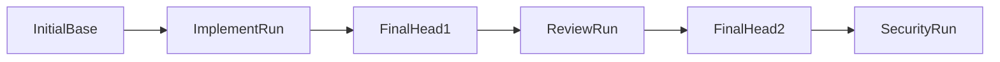

# Workflow Templates

Workflow Templates are a later product for bounded multi-stage work such as
`implement → review → security review`. They are not Role Presets and are not
part of the first Crew release.

Status: **design only.**

Related: [`role-presets.md`](role-presets.md),
[`roadmap.md`](roadmap.md), [`docs/fleet-design.md`](../fleet-design.md).

## 1. Why this is separate

A Role Preset changes the inputs to one Run. A Workflow Template creates and
coordinates several Runs. That introduces:

- group lifecycle and persistence;
- stage idempotency and ownership;
- repository-state handoff;
- gate evaluation;
- cancellation races;
- retry semantics across stages;
- a separate dashboard and event stream.

Calling both concepts `crew` hides this difference. APIs and schemas therefore
use `workflow`.

## 2. Scope

The first staged implementation supports:

- a linear sequence of stages;
- one Role Preset per stage;
- one active stage at a time;
- a bounded, explicit handoff;
- fail-stop behavior;
- group cancellation;
- objective built-in gates;
- exactly-once stage creation under duplicate coordinator delivery.

It does not support:

- arbitrary DAGs or parallel branches;
- timers or scheduled waits;
- cross-Mercury stages;
- agent-to-agent messaging;
- shared mutable workspaces;
- unbounded loops;
- automatic conflict resolution;
- moving an active Run between Fleet hosts.

Loops are a later extension after the linear coordinator is proven.

## 3. Modes

### 3.1 Advisory

An advisory template renders an ordered, bounded plan into one ordinary Run.
One agent performs every step. Progress uses existing agent-reported
`step.started`, `step.completed` and `step.failed` events.

Mercury does not enforce step order or gates in advisory mode. The UI labels
the plan “agent-reported.” Advisory mode is prompt guidance, not durable
multi-run orchestration.

### 3.2 Staged

A staged template creates one ordinary Run per stage. A coordinator advances
the group only after the active stage reaches a terminal state and its gate and
handoff pass.

Staged mode does not add Run states, but it does introduce an explicit workflow
group state machine. “No Run state changes” must not be confused with “no new
state machine.”

## 4. Template schema

```ts
interface WorkflowTemplate {
  schemaVersion: 1;
  id: string;
  version: string;
  description: string;
  mode: 'advisory' | 'staged';
  stages: WorkflowStage[];
  maxStages: number;
}

interface WorkflowStage {
  id: string;
  preset: {
    id: string;
    version?: string;
  };
  task: string;
  repositoryInput?: 'initial' | 'previous-head';
  gate?: WorkflowGate;
  carryForward?: Array<'summary' | 'commits' | 'findings' | 'tests'>;
}

type WorkflowGate =
  | { type: 'run-completed' }
  | { type: 'tests-pass'; requiredSuites?: string[] }
  | { type: 'manual-approval' };
```

Hard limits:

- at most 16 stages in the first staged release;
- unique stage ids;
- task template at most 16 KiB;
- carry-forward payload at most 64 KiB per stage;
- no recursive workflow references;
- every referenced Role Preset must resolve at group creation;
- `maxStages` must equal or exceed the expanded linear stage count and may not
  exceed the system cap.

`agent-declared` and `review-approved` are intentionally absent. An agent saying
that its own work is approved is not an independent gate.

## 5. Snapshot semantics

Creating a workflow group resolves and snapshots:

- the Workflow Template;
- every referenced Role Preset;
- every referenced skill;
- the initial repository and base commit;
- effective constraints for every stage.

Later changes to templates or presets cannot change an existing group.

Each stage Run stores its own preset and skill snapshots as normal. The group
also stores the workflow snapshot so it can recover after coordinator restart
without consulting a live registry.

## 6. Repository handoff

The default for stage N+1 is `previous-head`, not the workflow's original base.
Otherwise a reviewer would inspect the code that existed before the implementer
ran.



For Git worktrees:

1. stage N starts from the recorded input commit;
2. the worker records its final `HEAD`;
3. a mutating successful stage must leave a clean worktree;
4. final `HEAD` must be the input commit or its descendant;
5. stage N+1 creates a new isolated worktree from that final commit;
6. stage branches and commits remain retained until the group is terminal.

A stage that exits successfully with uncommitted changes fails handoff with
`dirty-worktree`. Mercury does not silently omit those changes or manufacture a
commit under the agent's identity.

Read-only stages may leave `HEAD` unchanged. A stage can explicitly use
`repositoryInput: initial` for an independent comparison, but the default is
the preceding successful stage.

Copy-mode workspaces cannot provide commit-addressed handoff and are excluded
from staged workflows until a content-addressed snapshot mechanism exists.

## 7. Carry-forward data

Repository state carries code. `carryForward` carries bounded context:

```ts
interface StageHandoff {
  fromStageId: string;
  fromRunId: string;
  inputCommit: string;
  finalCommit: string;
  summary?: string;
  commits?: string[];
  findings?: Finding[];
  tests?: TestResult[];
}
```

The coordinator derives handoff fields from persisted Run records and
structured events. It never copies raw event history or raw stdout into the
next prompt.

Rules:

- cap every string and collection;
- truncate with an explicit marker and recorded original size;
- redact through the normal Run write boundary;
- include source Run and stage ids;
- do not use an LLM summarization call as an invisible correctness dependency;
- store the exact handoff snapshot used by the next stage.

An optional summarizer can be added later as its own Run with observable cost
and failure behavior.

## 8. Gates

Gate evaluators consume durable evidence:

- `run-completed` passes only when the stage Run is `COMPLETED`;
- `tests-pass` requires normalized successful test events for every configured
  suite;
- `manual-approval` creates a group-level pending approval visible in the UI.

If adapters cannot produce the normalized evidence a required gate needs, the
workflow is rejected before execution. A text claim such as “tests passed” in
an agent message is not evidence for `tests-pass`.

Gate evaluation stores:

- evaluator type and version;
- input event sequences;
- pass/fail result;
- safe explanation;
- evaluation timestamp.

The first staged release should support only `run-completed`. `tests-pass`
ships after the event contract is consistent across supported adapters.
`manual-approval` ships after group-level authorization and timeout semantics
are defined.

## 9. Group lifecycle

```text
QUEUED
  -> RUNNING
  -> COMPLETED
  -> FAILED
  -> CANCELLING
  -> CANCELLED
```

Allowed transitions:

- `QUEUED -> RUNNING` when stage 0 is created;
- `QUEUED -> CANCELLED` before a stage starts;
- `RUNNING -> RUNNING` when one stage completes and the next starts;
- `RUNNING -> COMPLETED` when the final gate passes;
- `RUNNING -> FAILED` when a stage, gate or handoff fails;
- `RUNNING -> CANCELLING` when cancellation is requested;
- `CANCELLING -> CANCELLED` when the active stage is terminal;
- `CANCELLING -> FAILED` only for an unrecoverable orchestration failure.

Terminal group states are `COMPLETED`, `FAILED` and `CANCELLED`. A group never
reports `COMPLETED` while an active stage remains non-terminal.

Human input requested by an agent remains a Run concern. A later
`manual-approval` gate is a distinct group concern and must not reuse an
unrelated stage's `NEEDS_INPUT` state.

## 10. Persistence

```sql
CREATE TABLE workflow_groups (
  id                    TEXT PRIMARY KEY,
  owner_id              TEXT NOT NULL,
  workflow_id           TEXT NOT NULL,
  workflow_version      TEXT NOT NULL,
  workflow_hash         TEXT NOT NULL,
  snapshot_json         TEXT NOT NULL,
  status                TEXT NOT NULL,
  active_stage_index    INTEGER,
  initial_base_commit   TEXT NOT NULL,
  idempotency_key       TEXT,
  created_at            TEXT NOT NULL,
  completed_at          TEXT,
  UNIQUE(owner_id, idempotency_key)
);

CREATE TABLE workflow_stages (
  group_id          TEXT NOT NULL,
  stage_index       INTEGER NOT NULL,
  stage_id          TEXT NOT NULL,
  run_id             TEXT,
  input_commit       TEXT,
  final_commit       TEXT,
  status             TEXT NOT NULL,
  handoff_json       TEXT,
  gate_json          TEXT,
  PRIMARY KEY(group_id, stage_index),
  UNIQUE(run_id)
);

CREATE TABLE workflow_events (
  id              TEXT PRIMARY KEY,
  group_id        TEXT NOT NULL,
  sequence        INTEGER NOT NULL,
  type            TEXT NOT NULL,
  timestamp       TEXT NOT NULL,
  payload_json    TEXT NOT NULL,
  UNIQUE(group_id, sequence)
);
```

Workflow events use their own group sequence. Store sync events do not belong
here, and workflow events are not inserted into the Run EventStore with a fake
Run id.

## 11. Coordinator ownership

Multiple workers may run coordinator timers. Advancing a group must therefore
be a database claim, not an in-memory observation.

For each advance:

1. begin an immediate transaction;
2. verify group status and active stage;
3. claim the group with an expiring coordinator lease;
4. evaluate the terminal stage and gate;
5. insert the next stage row using `(group_id, stage_index)` uniqueness;
6. create or bind exactly one Run using a deterministic idempotency key;
7. update active stage and append workflow events atomically where possible;
8. release or renew the coordinator lease.

The Run creation boundary needs a recoverable pending binding, analogous to
Fleet dispatch: a crash after creating the Run but before recording its id must
not create a second paid Run. A deterministic idempotency key derived from
group and stage resolves that ambiguity.

The unique stage index prevents duplicate rows; it does not by itself solve
lease ownership, cancellation or “Run created but response lost.”

## 12. Failure behavior

- Stage `FAILED`, `CANCELLED` or `TIMED_OUT` stops the group.
- Failed gate or dirty handoff stops the group with a distinct safe reason.
- Infrastructure auto-retry follows the stage Run's normal retry policy but
  keeps the same stage binding.
- The coordinator never advances from a stage whose final state is unknown.
- A temporary database or worker outage leaves the group recoverable from its
  snapshots and stage rows.
- A missing retained workspace does not erase committed handoff state, but may
  prevent later inspection and is surfaced operationally.

## 13. Cancellation and retry

Group cancellation is transactionally ordered against stage creation:

1. set group status to `CANCELLING`;
2. prevent insertion of any next stage;
3. cancel the active Run through the normal owner-scoped service;
4. wait for its terminal state;
5. mark the group `CANCELLED`.

If cancellation wins the transaction, no next stage can be created. If stage
creation committed first, that new Run is the active Run and must be cancelled.

Retry is explicit:

- **retry stage** creates a new Run from the failed stage's input commit and
  snapshots, linked with `retryOf`;
- successful earlier stages are not rerun;
- **restart workflow** creates a new group from the original workflow snapshot;
- **run latest workflow** creates a new group after resolving current sources.

A completed group is immutable.

## 14. API and UI

Separate endpoints avoid overloading Role Presets:

```text
GET  /api/workflows
GET  /api/workflows/:workflowId
POST /api/workflows/:workflowId/runs
GET  /api/workflow-runs/:groupId
GET  /api/workflow-runs/:groupId/events
GET  /api/workflow-runs/:groupId/stream
POST /api/workflow-runs/:groupId/cancel
POST /api/workflow-runs/:groupId/stages/:stageIndex/retry
```

The dashboard shows:

- group status and immutable workflow identity;
- each stage's preset, Run link, input/final commit and status;
- gate evidence;
- active cancellation/input state;
- handoff summaries and truncation;
- explicit distinction between advisory and enforced staged mode.

All reads and controls use the same owner/admin scoping as Runs. Foreign groups
return `404`.

## 15. Fleet boundary

Fleet currently binds one Fleet Run to one child Mercury Run and explicitly is
not a workflow engine. Initial Workflow Templates therefore run entirely on one
Mercury instance and are submitted directly to that instance.

Fleet support requires a later protocol:

- host capability advertisement for workflows and required presets;
- binding a Fleet workflow id to a child group id;
- group status and event endpoints;
- stage Run links without treating them as independently routed work;
- no relocation after group creation.

The coordinator does not belong in Fleet.

## 16. Required tests

Staged workflows cannot ship without tests proving:

1. stage N+1 starts from stage N's final commit;
2. a dirty mutating stage fails handoff;
3. source changes after group creation do not change snapshots;
4. duplicate coordinator delivery creates one stage Run;
5. a crash between Run creation and binding recovers the same Run;
6. stage failure, cancellation and timeout stop advancement;
7. cancellation racing with advancement leaves no live untracked Run;
8. gate evaluation uses durable normalized evidence;
9. carry-forward is bounded, redacted and attributable;
10. retrying a stage does not rerun earlier successful stages;
11. restarting a group creates a new group;
12. owner scoping returns `404` for foreign groups;
13. coordinator leases recover after worker failure;
14. advisory mode never claims Mercury-enforced ordering.
