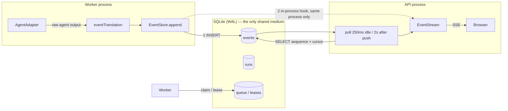
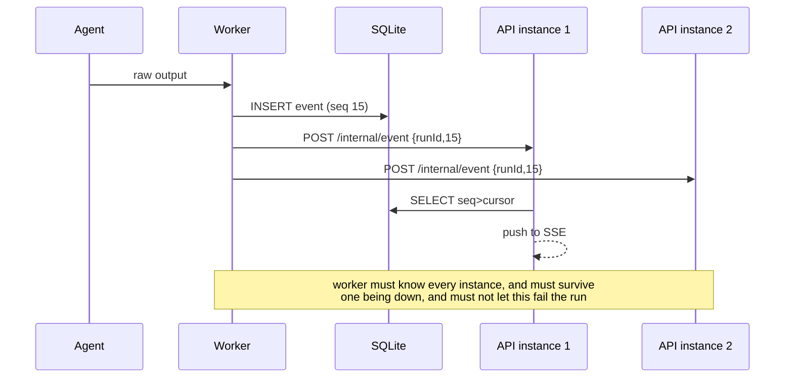
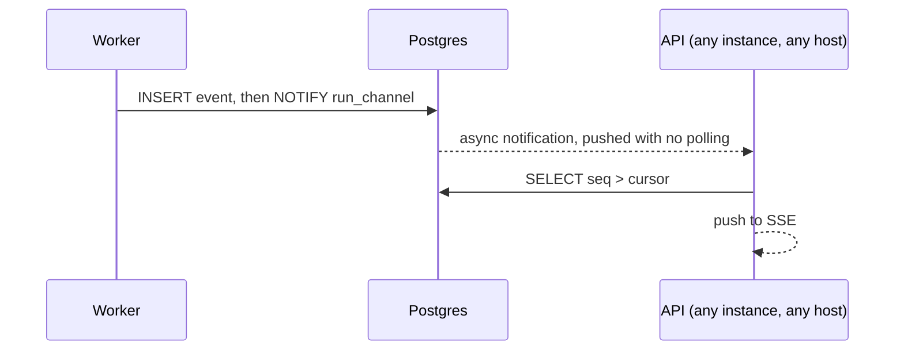
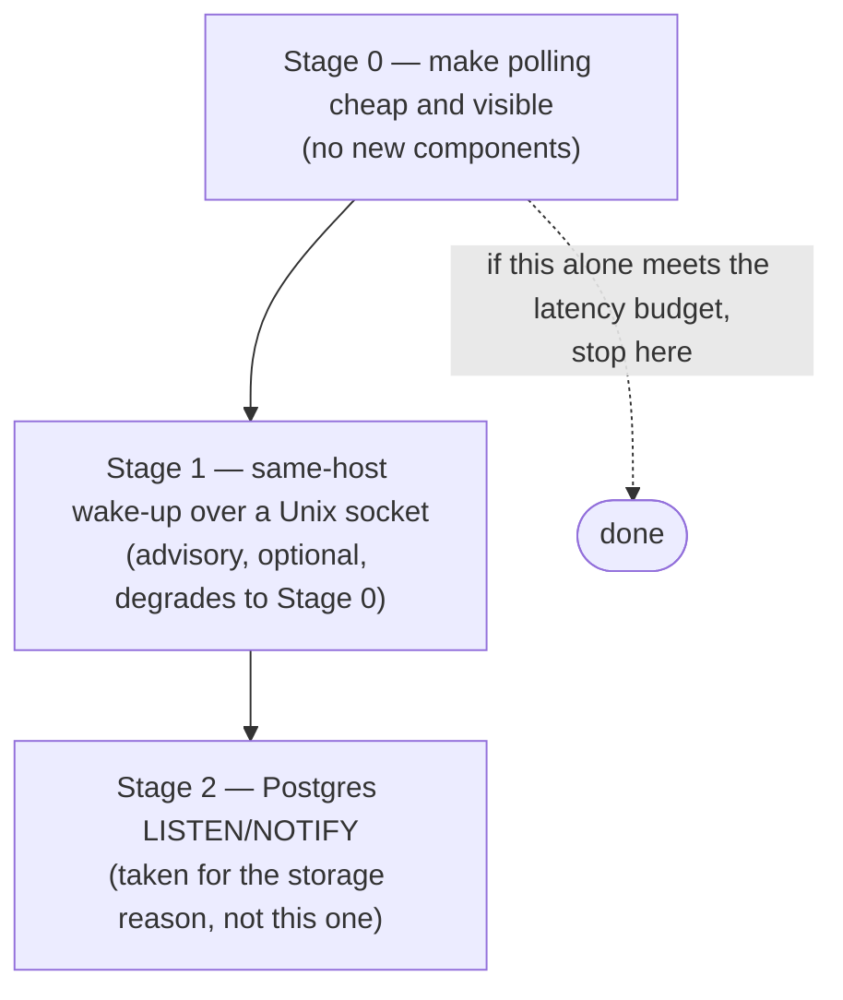
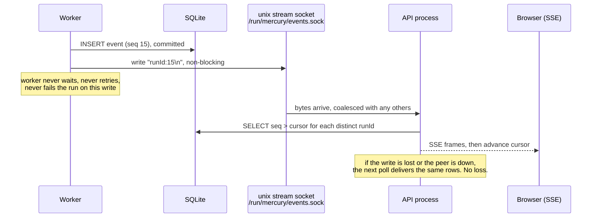
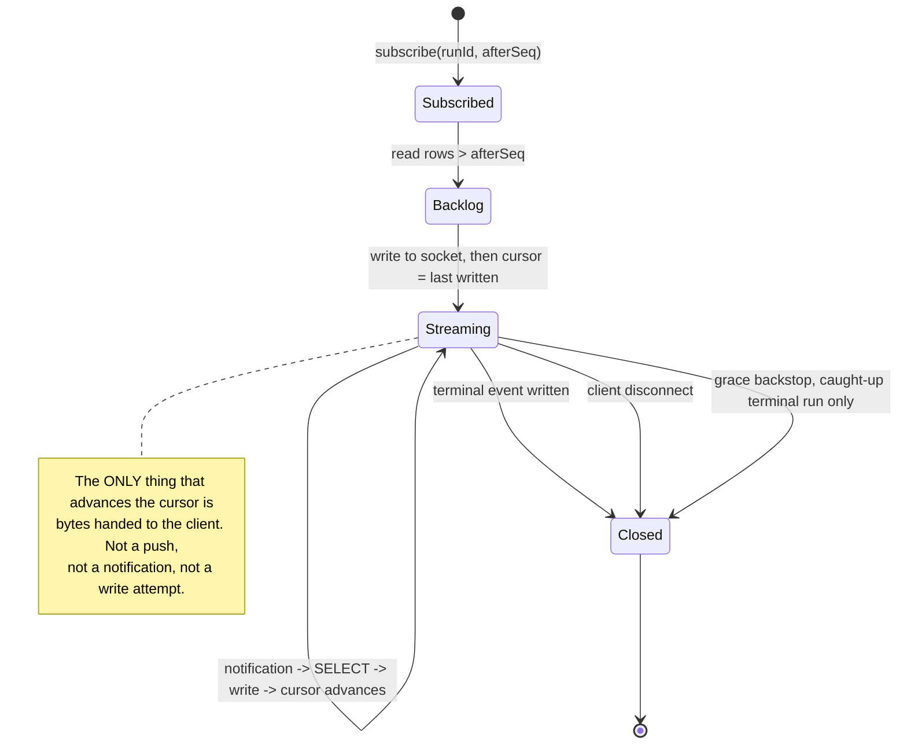

# Cross-process event push — design

**Status:** proposal. **Scope:** design only; no implementation is included.
**Related:** [`architecture-review.md`](architecture-review.md) (M16); issue #133, closed by PR #134 and
on `main` as of `f9bb44d`; README "Recommended next steps" item 11.

---

## 1. Summary

Mercury fans run events out to browsers over SSE. When the API and the worker are separate
processes — the production topology — the process holding the browser connection is **not** the
process appending the events. Today that gap is bridged by polling SQLite.

The short version of this document:

1. **Polling is correct and must stay.** It is the only mechanism that cannot lose an event, because
   the database is the source of truth. Issue #133 is the proof: the one time a push path and the
   poll path disagreed about a cursor, clients permanently lost events.
2. **Push is a latency optimisation and must remain advisory.** Any design where a lost notification
   means a lost event is wrong by construction.
3. **The stated goal — multi-host scale — is blocked on storage, not on push.** Mercury's only shared
   medium is a single-file SQLite database. No event transport fixes that. Designing a push layer
   first would be solving the second problem and pretending the first is not there.
4. **Recommendation: a staged path.** Stage 0 keeps polling and makes it cheap and observable.
   Stage 1 adds same-host cross-process wake-up over a Unix socket, which removes the 250 ms–2 s
   latency without adding any new correctness surface. Stage 2 adds Postgres `LISTEN/NOTIFY` only
   when Postgres is adopted for the storage reason, where the notification comes nearly for free.
   A worker→server HTTP callback — the approach currently named in the README — is analysed and
   **not recommended**: it is the most coupling for the least correctness benefit.

---

## 2. Goals and non-goals

### Goals

- **G1 — Bounded event latency across processes.** A browser should see an event shortly after it is
  committed, not on the next poll tick. Today the worst case is the slow cadence: 2 s.
- **G2 — No event loss, ever.** Delivery must not depend on a notification arriving. This is the
  property #133 broke.
- **G3 — Ordering per run.** Events for one run must reach a client in sequence order, with no gaps
  and no duplicates.
- **G4 — No new correctness surface.** A push channel that can be dropped, duplicated, reordered, or
  delayed must still produce a correct stream.
- **G5 — Honest scale story.** Say plainly what actually limits multi-host deployment.

### Non-goals

- **Not** replacing SQLite. That is a separate, larger decision with its own document.
- **Not** a general message bus for Mercury. This is about one stream: run events to SSE clients.
- **Not** cross-host delivery guarantees for the notification channel. Notifications are advisory.
- **Not** changing the event schema, sequence semantics, or the state machine.
- **Not** exactly-once delivery. See §9 — at-least-once with client-side dedupe by `sequence` is the
  honest target, and the existing cursor already gives it.

---

## 3. The problem, precisely

### 3.1 What happens today

`EventStore.append()` writes the event row and, inside the same call, fires an in-process hook.
`EventStream` registers that hook and pushes straight to matching SSE responses. If the appending
process is a *different* process, the hook never fires there, and the only thing that will ever
deliver the event is `poll()`.

`poll()` runs on an adaptive cadence: 250 ms when idle, switching to **2 s** after a push, on the
reasoning that the poller exists only to catch other processes' appends.

That reasoning is sound in isolation and wrong in combination, and the code makes it worse than the
comment suggests. In `EventStream.start()` the slow-down is called **outside** the subscriber loop:

```js
this.detachHook = this.store.onAppend((runId, event) => {
  for (const sub of [...this.subs]) {
    if (sub.runId !== runId) continue;      // may match nothing at all
    ...
  }
  this.slowDown();                          // unconditional, global
});
```

and the fast cadence only returns when a poll finds **nothing**:

```js
if (!anyNew && this.timer) { /* back to fastMs */ }
```

Put those together against the production topology. The API process is not a passive reader —
`RunService` appends `run.created`, `run.queued` and `skill.selected` on every `POST /api/runs`, and
`run.cancelling` / `run.cancelled` on every cancel. So:

- **Creating a run in the API process drops every open SSE stream in that process to the 2 s cadence**
  — including streams for unrelated runs, and including when the append matched no subscriber at all.
- **The slow cadence persists exactly while cross-process events are flowing**, because `anyNew` is
  true, which is the condition that suppresses the return to fast.

The result is that cross-process delivery is slowest precisely when the system is busiest, which is
the opposite of what an adaptive cadence is for. This is a real, measurable defect in the current
fallback, and it is why Stage 0 is worth doing on its own merits rather than only as a warm-up for
push.

### 3.2 What issue #133 proved

A client subscribing mid-run received sequences 14–18 and never 1–13, on a stream opened with
`?after=0`. The cause was not the transport. It was that two delivery paths — the push hook and the
poller — maintained a shared cursor, and the push path advanced it past rows the poller had not yet
read.

The lesson generalises directly to this design, and it is the most important input in this document:

> **A push path that advances shared read state can lose data that the poll path would have
> recovered. Push must never own the cursor.**

Any design below is required to satisfy that constraint, including the rejected ones.

### 3.3 What "multi-host scale" actually requires

Today every component coordinates through one SQLite file:

- the queue and leases (`src/queue/runQueue.ts`)
- run state (`src/runs/runStore.ts`)
- events (`src/events/eventStore.ts`)
- idempotency keys, sessions-adjacent tables

The worker has **no knowledge of any server process**. Its only outbound HTTP is the optional alert
webhook. There is no server registry, no worker→server address, no shared cache.

So the notification problem and the storage problem are the same problem: the database is the only
thing they share. Two hosts cannot safely share a single SQLite file over a network filesystem —
SQLite's locking assumes a POSIX local filesystem, and WAL mode in particular is documented as unsafe
on shared storage. Adding a push channel does not change that, and would leave a system that looks
horizontally scaled while still being unable to run two hosts.

---

## 4. Current architecture (as built)



The dotted hook is the whole problem: it is **in-process only**. In the production topology
(`npm run server` and `npm run worker` as separate systemd units) it never fires in the API process,
so every event travels by the poll edge.

### 4.1 Timings as built

| Constant | Value | Where |
| --- | --- | --- |
| `FAST_MS` | 250 ms | `src/events/eventStream.ts` — idle poll cadence |
| `SLOW_MS` | 2 000 ms | `src/events/eventStream.ts` — cadence after any push |
| `STREAM_CLOSE_GRACE_MS` | 2 000 ms | `src/api/routes.ts` — backstop for a terminal run that is already caught up |
| `BUSY_TIMEOUT_MS` | 5 000 ms | `src/db/database.ts` |

Worst-case cross-process latency is therefore ~2 s, and it is worst exactly when the system is
busiest.

### 4.2 What is already right

Worth stating so a redesign does not quietly discard it:

- Events are **persisted before** any notification is attempted.
- Per-run `sequence` is monotonic and assigned by a single writer under `tx()`.
- Clients reconnect with `?after=<sequence>`, so a dropped connection is recoverable from the DB.
- `subscribe()` delivers the first backlog page synchronously rather than on a poll tick. This landed
  in #133 / PR #134 and is on `main` as of `f9bb44d`; it is listed here because it is load-bearing for
  every stage below, and a reader checking an older checkout will not find it.
- Streams on terminal runs are closed server-side, so idle sockets do not accumulate.

---

## 5. Design principles

These are constraints, not aspirations. Each is traceable to a defect.

**P1 — The database is the source of truth for delivery.** A client's view must be reconstructible
from `events` alone, with every notification channel disabled.

**P2 — Push is advisory.** Losing every notification must degrade latency only, never correctness.
If a design needs notification acks, retries, or a dead-letter queue, it has made push load-bearing
and is the wrong design.

**P3 — Push never owns the cursor.** The cursor advances only when bytes are handed to the client.
(#133.)

**P4 — Notifications carry no payload that must be trusted.** A notification says "run X has rows
beyond sequence N". The client-visible data still comes from the `SELECT`. This makes duplicate and
out-of-order notifications harmless by construction and removes the need for a schema on the wire.

**P5 — Per-run ordering is preserved by sequence, not by transport order.** The transport may deliver
notifications in any order.

**P6 — No new trust boundary is crossed unauthenticated.** Any inbound wake-up endpoint is internal
and authenticated like `/api`, never public like `/healthz`.

**P7 — The failure mode of the notification channel must be observable.** If push silently stops
working, operators see it; otherwise the system silently reverts to 2 s latency and nobody notices
until a dashboard looks broken.

---

## 6. Options considered

### Option A — Worker → server HTTP callback *(the approach currently in the README)*

The worker, after appending, POSTs `{runId, sequence}` to every API instance.



**Why not.** It is the most expensive option in coupling and the weakest in payoff:

- **Instance discovery.** The worker must be configured with every API base URL. That is new
  configuration, new failure surface, and it must be kept in sync with an autoscaling group.
- **Fan-out cost.** Every event becomes N HTTP requests, where N is the number of API instances —
  even though typically zero or one of them has a subscriber for that run.
- **It cannot be allowed to fail the run.** A slow or downed API must not stall the worker, so the
  callback must be fire-and-forget with a bounded queue — at which point it is a lossy advisory
  channel, which is fine by P2 but means all this machinery buys only latency.
- **Its transport costs more than the work it triggers.** Measured on one host (node 26, sequential
  round trips, loopback, keep-alive; absolute numbers are machine-dependent, the ratios are the
  point):

  | Operation | Per notification |
  | --- | --- |
  | HTTP POST over TCP loopback | ~62 µs |
  | Unix stream socket write + echo | ~1.4 µs |
  | The poll read it wakes (`sequence > ?`, empty page) | ~1.7 µs |
  | The same read returning a full 500-row page | ~235 µs |

  So the HTTP notification is about **43× the cost of a Unix socket notification**, and roughly
  **36× the cost of the database read it exists to trigger**. In the common case — a wake-up that
  finds nothing new, or a handful of rows — Option A spends most of its budget on the notification
  rather than on delivering anything. At 2 000 notifications that is ~124 ms of worker time over HTTP
  against ~3 ms over a socket, and that cost is paid by every API instance whether or not it has a
  subscriber for the run.

  It does not follow that browser-visible latency differs by 43×: once a full page is being delivered,
  the 235 µs read dominates both transports. The honest claim is narrower and still fatal — Option A
  adds a large, per-instance, always-paid overhead to buy a wake-up that the read itself is cheaper
  than.
- **New inbound surface** on the API that must be authenticated, rate-limited, and excluded from
  public exposure — a category of mistake this codebase has already had to fix once (`/metrics`
  auth posture, session cookie `Secure`).

It is retained as a **fallback for the multi-host case** in §8.4, where there is no shared local
socket — but only after Postgres has arrived, at which point Option C is almost always better.

### Option B — Keep polling, make it cheap and observable

Tune the adaptive cadence so a busy server does not slow down its cross-process polling, add covering
indexes, and expose poll lag as metrics.

**Pro:** no new moving parts, no new trust boundary, cannot lose events, one day of work.
**Con:** latency floor stays in the hundreds of milliseconds; poll load grows with subscriber count.

This is not a cop-out — it is the correct **stage 0**, and it is a prerequisite for everything else
because it supplies the observability (P7) needed to tell whether later stages are working.

### Option C — Postgres `LISTEN / NOTIFY`

If Mercury moves to Postgres for the storage reason (§7), `LISTEN`/`NOTIFY` gives cross-process,
cross-host wake-up with no new infrastructure and no registry:



**Pro:** push and truth are the same system, so there is no cursor disagreement to manage; notifications
are automatically delivered to every listening instance; no discovery; works across hosts.
**Con:** requires the Postgres migration, which is a much larger project than this document.

### Option D — Redis / NATS pub-sub

**Pro:** purpose-built, scales, decouples producers and consumers.
**Con:** a second stateful system to operate for a project whose deployment target is a single PC
with systemd. It brings connection management, auth, and an outage mode that must degrade to polling
anyway. Rejected for the same reason Mercury does not already use Redis for sessions: the operational
cost is not paid for by the current scale.

### Comparison

| | A: HTTP callback | B: better polling | C: PG NOTIFY | D: Redis/NATS |
| --- | --- | --- | --- | --- |
| New infra | none | none | Postgres | broker |
| New inbound surface | **yes** | no | no | no |
| Instance discovery | **worker must know all** | none | none | none |
| Cross-host | yes | yes | yes | yes |
| Loss risk | none (advisory) | none | none | none |
| Latency | ~ms | ~100 ms–2 s | ~ms | ~ms |
| Cursor hazard | **yes, if payload trusted** | no | no | **yes, if payload trusted** |
| Ops burden | medium | none | high (but paid by storage) | high |
| Fits single-PC deploy | poorly | **yes** | no | no |

---

## 7. The prerequisite: storage, stated plainly

Multi-host deployment is blocked before transport is reached:

| Shared thing | Today | Two hosts, same SQLite file |
| --- | --- | --- |
| Queue + leases | `runs` table | Requires POSIX locking; WAL on NFS is unsupported |
| Events | `events` table | Same |
| Run state | `runs` table | Same |
| SSE subscriber set | process memory | Fine — per-host is correct here |
| Sessions | process memory (`src/api/sessions.ts:30`) | Known limitation, flagged in the source comment |
| Rate limits | process memory (`src/api/rateLimit.ts:33`) | Known limitation; per-host limits are not global limits |

The last two are documented as scaling blockers. The first three are the harder ones, and they are
storage, not transport.

This is not an opinion about Mercury; it is a documented property of WAL, quoted from SQLite itself
([wal.html](https://www.sqlite.org/wal.html)):

> All processes using a database must be on the same host computer; WAL does not work over a network
> filesystem.

and, giving the reason:

> This is why the write-ahead log implementation will not work on a network filesystem.

The first sentence is the multi-host blocker stated in SQLite's own words: WAL requires every process
touching the database to be on one host. Mercury's worker and API are exactly such processes, so the
current topology is single-host by storage constraint, not by choice — and no event transport changes
that. ([atomiccommit.html](https://www.sqlite.org/atomiccommit.html) goes further and advises avoiding
SQLite on network filesystems at all, because locking is subtly broken on some implementations even
when it appears to work.)

**Consequence for this design:** the transport work should be sequenced so that it is *useful before*
Postgres and *not wasted by* Postgres. That is what the staging below achieves. Do not build the
multi-host transport first; it would be a load-bearing component of a system that still cannot run
two hosts.

---

## 8. Recommended design



### 8.1 Stage 0 — cheap, observable polling *(do this first regardless)*

1. **Stop slowing down when busy** (see §3.1 for the verified mechanism). Three separable changes:
   call `slowDown()` only when the append actually served at least one subscriber; make the cadence
   per-subscription rather than one timer for the whole process; and do not let the slow cadence be
   the steady state while events are actively flowing, since that is the case it currently settles
   into. A per-subscription timer also removes the cross-run interference, where one run's traffic
   sets another run's latency.
2. **Poll only runs someone is watching.** The poller already iterates subscriptions, so this is
   mostly about not paying for runs with no subscribers — which it already does — and about making
   the query cheap.
3. **Cover the read — already covered, and measured.** The poll query is
   `SELECT * FROM events WHERE run_id = ? AND sequence > ? ORDER BY sequence ASC LIMIT 500`. Against a
   migrated database with 5 000 events, `EXPLAIN QUERY PLAN` gives:

   ```text
   SEARCH events USING INDEX idx_events_run_seq (run_id=? AND sequence>?)
   ```

   A single range search, no `USE TEMP B-TREE FOR ORDER BY` — the index supplies the order as well as
   the filter. Note it is the explicit `idx_events_run_seq ON events(run_id, sequence)`, not the
   `UNIQUE (run_id, sequence)` autoindex, that the planner picks. So Stage 0 needs no new index here;
   what it needs is a guard test pinning this plan, the way `test/metrics.test.ts` already pins the
   `/metrics` index plan.
4. **Expose lag.** Two counters on `/metrics`: `mercury_event_poll_lag_seconds` (age of the newest
   row the poller just delivered) and `mercury_event_poll_iterations_total`. Without these, a silent
   regression to 2 s latency is invisible — which is P7.

*Cost: small. Risk: none. Benefit: removes the pathological busy-is-slow behaviour and gives the
telemetry the later stages need.*

### 8.2 Stage 1 — same-host wake-up over a Unix socket *(recommended push design)*

The worker and API run as two systemd units on one host. A Unix domain socket gives them a
zero-config, filesystem-permissioned, loopback-only channel.

**It has to be a stream socket, not a datagram one.** Node's `dgram` accepts only `udp4` and `udp6`;
there is no `AF_UNIX` datagram support in the standard library, so the obvious "fire-and-forget
datagram" shape is not available without adding a native dependency. That is worth stating because
datagram is the natural first instinct for an advisory channel, and discovering the gap during
implementation would invite a worse fallback — UDP over loopback, which reopens the TCP-surface
argument in §11.

Stream is not a downgrade here, and §10's last row is the reason: the handler drains **by cursor**, not
by notified payload, so message boundaries carry no meaning. Newline-delimited run ids, read in
whatever chunks arrive, coalesced freely. What a stream does add is a connection to manage, so the
worker connects lazily, drops writes on error, and never blocks on a missing peer.

That premise is not an assumption about some future deployment; it is what `deploy/` installs today.
`mercury.service` (`node src/cli.ts server`) and `mercury-worker.service` (`node src/cli.ts worker`)
both declare `User=mercury`, `WorkingDirectory=/opt/mercury` and
`EnvironmentFile=/etc/mercury/mercury.env`. So the two processes are on one host, run as one user, and
resolve the same `MERCURY_DB` — which is simultaneously why Stage 1 is easy and why §7 is hard. The
same shared file that makes a local socket unnecessary to secure is the file that cannot be shared
across hosts.



Why this shape:

- **Satisfies P2 trivially.** The write is fire-and-forget. There is no ack path to get wrong, because
  there is deliberately no ack path at all. A stream socket makes this slightly less free than a
  datagram would have been — a write can fail on a closed peer — so the rule is explicit: swallow the
  error, count it, carry on.
- **Satisfies P3/P4.** The line carries only an identifier; the cursor advances after the `SELECT`
  feeds the client. A lost, duplicated, or reordered notification changes nothing except timing, and
  because the reader drains by cursor, several ids arriving in one chunk is a feature rather than a
  framing problem.
- **No discovery.** The socket path is a config value both units already have (`MERCURY_*`), and
  systemd can `ListenStream`/socket-activate or simply create it at API start.
- **Permissions are free.** File mode on the socket plus its directory is the access control; nothing
  is exposed on a TCP port, so there is no new network trust boundary at all.
- **Degrades cleanly.** If the socket is missing or full, the worker logs a counter and carries on.

**Required guard:** the worker's write must be non-blocking and must never sit on the run's critical
path. A full socket buffer is a dropped notification, not a stalled agent. The existing alert-webhook
code is the cautionary pattern — it is fire-and-forget, but it is worth being explicit that the same
rule applies here and is enforced by test.

**Fan-out note:** the API process filters locally — it ignores notifications for runs with no
subscriber. The worker does not need to know who is watching, which is exactly the coupling that made
Option A expensive.

### 8.3 Stage 2 — Postgres `LISTEN / NOTIFY`

Adopted when Postgres is adopted, for the storage reason. `NOTIFY` on a channel per run (or one
channel plus a run id in the payload, since the `NOTIFY` payload must be shorter than 8000
bytes in the default configuration) replaces the Unix socket with no change to the
surrounding logic, because that logic already treats notifications as advisory and re-reads
from the database.

This is why the staging is not wasted work: Stage 1's handler contract — *notification arrives, read
from DB, deliver, then advance cursor* — is exactly Stage 2's handler.

### 8.4 If multi-host is needed before Postgres

Then, and only then, Option A becomes defensible: worker POSTs `{runId, sequence}` to each API
instance over an internal interface, with a short timeout, no retry, and a drop counter. It must be
accompanied by:

- a dedicated internal listener or mTLS, never the public API port
- a bounded send queue with an explicit drop policy
- a metric for dropped notifications, so P7 holds

The design should prefer fixing storage to building this.

---

## 9. Delivery semantics and the cursor contract



- **Guarantee: at-least-once per connection, ordered by `sequence`, no gaps.** Duplicate frames are
  possible if a notification races a poll; clients already receive `sequence` in every frame and can
  ignore a repeat. Claiming exactly-once would require the transport to be authoritative, which P1
  forbids.
- **Reconnect is unchanged:** `?after=<last sequence the client saw>`. Recovery is a database read, so
  it works whether or not any notification channel is alive.
- **Backlog first, then live.** `subscribe()` reads persisted rows and delivers them before
  registering (on `main` since `f9bb44d`). Any notification arriving during that window is harmless,
  because the cursor is already past those rows.
- **Terminal close stays.** A terminal event ends the stream; the grace backstop covers a reconnect
  that starts past the terminal event.

---

## 10. Failure modes

| Failure | Effect | Why it is survivable |
| --- | --- | --- |
| Notification lost / socket missing | Latency reverts to poll cadence | P1: the poller reads the same rows |
| Notification duplicated | Extra `SELECT` returning nothing | Cursor is already past |
| Notification reordered | Out-of-order wake-up | Rows are read `ORDER BY sequence` |
| Notification forged (same-host peer) | A `SELECT` for a run id | Payload carries no data; the DB is still the source. Socket mode is the access control |
| Worker blocks on notify | **Agent stalls — unacceptable** | Must be non-blocking with a drop counter; enforced by test |
| Notification channel silently dead | Invisible 2 s latency | P7: lag metric + alert |
| API restarts mid-stream | Clients reconnect with `?after=` | Recovery is a DB read |
| Very chatty run (thousands of events) | Notification storm | Coalesce: one wake-up per run per tick is sufficient, since the handler drains by cursor, not by payload |

The last row matters: because the handler reads *by cursor* rather than *by notified sequence*, a
storm collapses naturally. A design that fetched exactly the notified sequence would not.

---

## 11. Security

- **No new network listener in Stage 1.** File mode on the socket is the access control, and it is
  sufficient without any group setup: both units already run as `User=mercury`, so `0600` on a socket
  owned by that user admits exactly the worker and the API and nothing else. Nothing is added to the
  TCP surface, so nothing new can be misconfigured as public — which is the actual point, given that
  this codebase has already had to fix a public-by-default surface once.
- **Stage 2** uses the existing Postgres connection and its TLS/auth.
- **Option A / §8.4** would require a new inbound endpoint. If built, it must be authenticated like
  `/api` (not public like `/healthz`), bound to an internal interface, and rate-limited. `/metrics`
  set the precedent for why "it is only internal telemetry" is not a reason to skip the gate.
- **Notifications carry no secrets and no event content**, so a compromised same-host peer cannot use
  the channel to inject data into a client stream — only to cause extra reads.

---

## 12. Observability

| Metric | Type | Why |
| --- | --- | --- |
| `mercury_event_poll_iterations_total` | counter | proves the fallback is alive |
| `mercury_event_poll_lag_seconds` | gauge | age of newest row delivered by the last poll; the direct measure of G1 |
| `mercury_event_wakeups_total{source="socket\|notify\|http"}` | counter | how often push actually fires |
| `mercury_event_wakeup_drops_total` | counter | notifications lost; must be non-zero-tolerated but alert-worthy if it climbs |
| `mercury_sse_streams_active` | gauge | subscriber set size; catches a leak like the one #133 nearly introduced |

`EventStream.subscriptionCount` covers the last of these. It is on `main` since `f9bb44d`, added with
the leak regression test for #133, because a stream that fails to unsubscribe is otherwise invisible
from outside the process. It is a getter over the live subscriber set rather than a metric, so wiring
it through to `/metrics` is the remaining step.

---

## 13. Database changes

**None for Stages 0–1.** This is a deliberate feature of the design: events are already durable and
already sequenced, so a wake-up channel needs no schema.

Stage 2 (Postgres) brings its own migration and is out of scope here.

---

## 14. Rollout

1. Land Stage 0. Measure `mercury_event_poll_lag_seconds` in a real deployment. **If the latency
   budget is already met, stop.** This is a genuine expected outcome and the cheapest one.
2. Land Stage 1 behind `MERCURY_EVENT_WAKEUP_SOCKET` (unset = disabled). With it unset, behaviour is
   byte-identical to Stage 0, so it is safe to ship dark.
3. Enable on one host; confirm `mercury_event_wakeups_total` climbs and lag falls.
4. Keep the poller running unconditionally. There is no configuration in which polling is disabled —
   that is the point of P1, and it is what makes rollout reversible.

---

## 15. Testing strategy

The lesson of #133 is that **timing-dependent tests hide exactly this class of bug**: the regression
passed in the full suite and failed in isolation. Requirements:

- **Deterministic, not timing-based.** A test that can pass because a poll happened to win is not a
  test. Prefer driving the handler with the poller disabled, so the only delivery path is the one
  under test.
- **Assert contiguity, not presence.** "The stream contains `run.started`" passed while sequences
  1–13 were being dropped. Assert the delivered set is `1..N`, in order, with no gap.
- **Notification-loss test.** Drop every notification and assert the stream is still complete, merely
  slower. This is the direct proof of P2 and should be a permanent test.
- **Duplicate and reordered notification test.** Feed nonsense wake-ups; assert no gap and no
  duplicate frame.
- **Non-blocking test.** Point the worker at a socket with a full/absent reader and assert the run
  still completes within a deadline — the failure mode in §10 that would stall an agent.
- **Real multi-process test.** Review finding M16 notes the current "cross-process" test is an
  in-process SQL insert. Spawn a real worker child process and assert an API-side subscriber sees its
  events. Without this, the cross-process path is untested by definition.
- **`EXPLAIN QUERY PLAN` guard** for the poll read, matching the pattern already used for the
  `/metrics` index.

---

## 16. Open questions

1. **What is the actual latency budget?** If "under 1 s" is acceptable, Stage 0 finishes the problem
   and Stages 1–2 are unnecessary. This should be answered with measurement before code.
2. **Per-run channels or one channel plus run id?** Matters only for Stage 2; the `NOTIFY` payload
   must stay under 8000 bytes in the default configuration, and per-run channels consume a channel
   slot per listener.
3. **Should the API coalesce wake-ups per run per tick?** Almost certainly yes (§10, last row), but it
   interacts with how quickly a very chatty run should reach a browser.
4. **Does the dashboard need per-event latency, or is aggregate lag enough?** Determines whether lag is
   a metric or an event field.
5. **Is Postgres on the roadmap for its own reasons?** If yes, Stage 1 should be scoped as a
   deliberately temporary, small component — or skipped.

---

## Appendix — what this design deliberately does not do

- **Does not make push authoritative.** The single most tempting mistake, and the one that produced
  #133.
- **Does not add a broker.** A single-PC systemd deployment should not operate Redis or NATS.
- **Does not build the worker→server HTTP callback** the README currently names, and explains why in
  §6 Option A.
- **Does not pretend multi-host is one feature away.** §7 states the storage blocker.
- **Does not remove the poller, ever.** It is the correctness mechanism; push is the courtesy.
