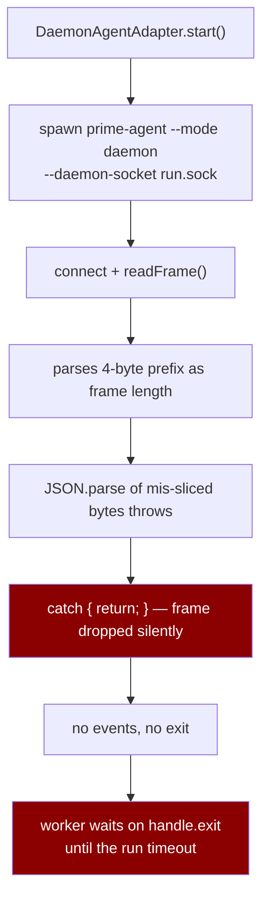
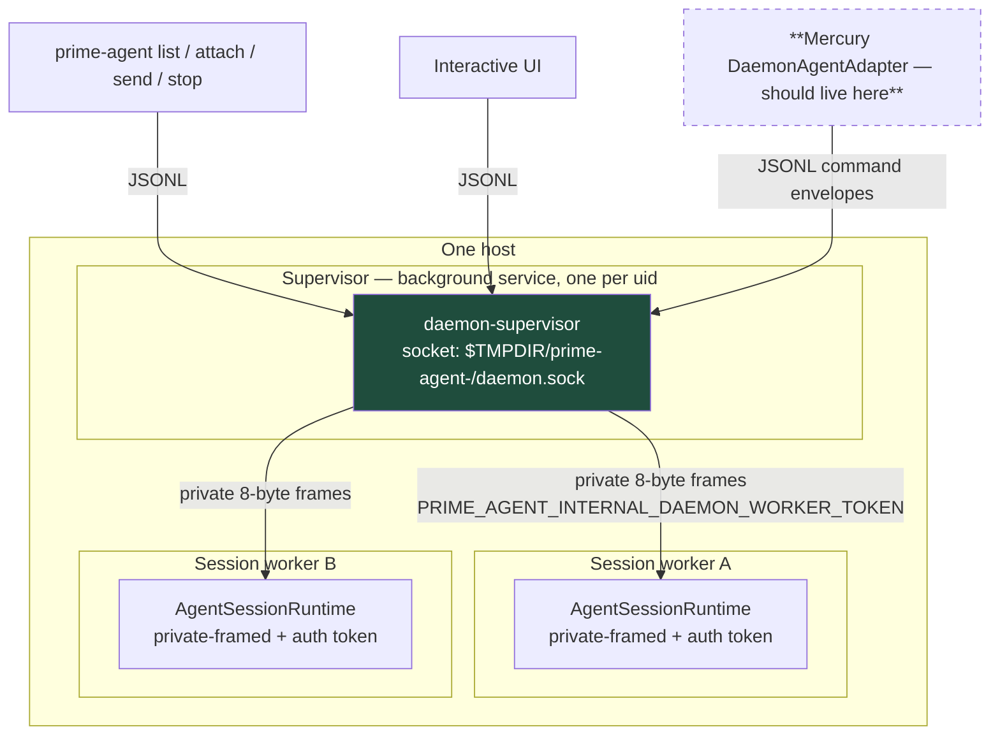
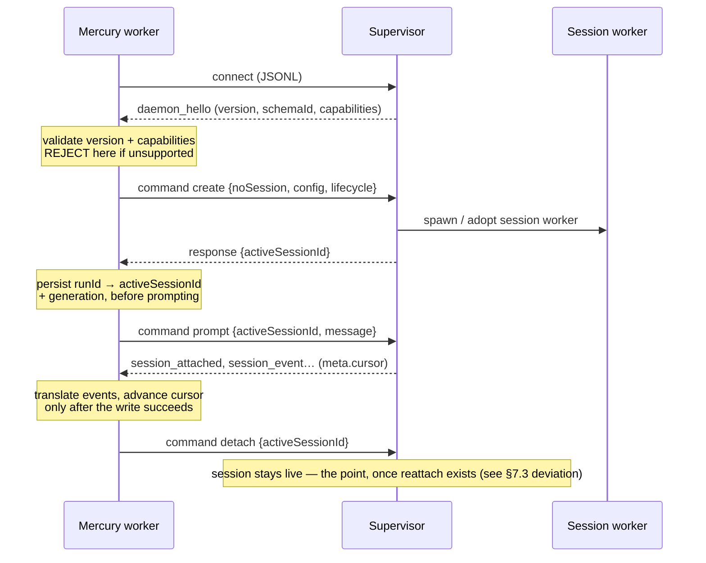

# Daemon-based agent sessions — design

**Status:** proposal, with the current implementation assessed as **non-functional against the real
daemon**. **Scope:** design plus verification; no implementation is included.
**Verified against:** PrimeAgent 0.8.1, daemon protocol `prime-agent.daemon` version 7, schema
`protocol-7-schema-22-4d515169dc6b`.
**Related:** [`agent-adapters.md`](agent-adapters.md) (Pattern B), issues #55 and #68,
README "Recommended next steps" item 8.

---

## 1. Summary

Mercury already ships `DaemonAgentAdapter` behind `MERCURY_AGENT_MODE=daemon`, with RPC remaining the
default. README item 8 and `ARCHITECTURE.md` §9 both close with the same caveat: *"verify against the
real daemon before relying on it."*

**This document is that verification. It fails.**

`DaemonAgentAdapter` cannot communicate with a real PrimeAgent daemon. The two sides disagree on the
wire framing, on the command envelope, on session identity, and on which socket to talk to. Every one
of the twelve daemon tests passes, because the test fixture implements the protocol the adapter
*assumes* rather than the one the daemon *speaks*.

| # | Adapter assumes | Real daemon (verified) |
| --- | --- | --- |
| 1 | 4-byte big-endian length prefix per frame | **8-byte** prefix: `[u32 headerLen][u32 payloadLen][header][payload]`, and only on the *internal* transport |
| 2 | Public client transport is framed | Public transport is **JSONL** in both directions |
| 3 | Sends bare `{"type":"prompt","message":…}` | Requires an **envelope**: `{type:"command", id, protocol:{name,version}, clientId, command:{…}}` |
| 4 | `prompt` needs only a message | `prompt` requires **`activeSessionId`**, obtained from a prior `create` |
| 5 | Spawns its own `prime-agent --mode daemon --daemon-socket <path>` | That invocation yields a **session-worker** socket requiring an internal auth token; `prime-agent status` reports it as `stale` |
| 6 | Ignores the hello frame | Hello carries **protocol version, schema revision, and 21 server capabilities** that gate commands |

The framing mismatch alone is terminal and silent: the adapter reads the 4-byte *header length* as a
frame length, mis-slices the buffer, fails `JSON.parse`, and **discards the frame in a `catch` that
returns silently**.



That chain was not reasoned out — it was executed. Feeding a frame built exactly the way
`private-framing.js` builds one into the adapter's own drain loop (`daemonAgentAdapter.ts:178-200`)
gives:

```text
real frame on the wire: 331 bytes
  u32@0 (headerLen)  = 75
  u32@4 (payloadLen) = 248

after adapter drain of the real hello:
  frames parsed          : 0
  frames silently dropped: 1
  starved (waiting for more bytes): true
  bytes still buffered   : 252
```

Zero frames parsed, one discarded without a word, and the reader then sits waiting for more bytes
because the next 4 bytes it reads as a length are the start of a JSON object. Nothing throws, nothing
is logged, no event ever arrives, and `handle.exit` never settles.

**Recommendation.** Do not enable `MERCURY_AGENT_MODE=daemon` in any environment where a run matters
until §7 lands. Fix it in the order given there: transport first, then envelope, then session
identity, then the socket it connects to. Add a contract test that runs against the real binary
(§11) — that single test would have caught all six mismatches, and its absence is the actual root
cause.

**Why this is worth fixing rather than deleting.** The daemon model removes the cost that RPC mode
pays on every run: a resident supervisor owns live sessions, so a run can attach, detach, and resume
without restarting an agent loop, and `event_sequence` gives a server-assigned cursor that maps
directly onto Mercury's own per-run sequence model. That is a genuinely better substrate for long
runs. It is also the only mode that offers `reattach`, which is what makes worker restart recoverable
rather than fatal.

---

## 2. Goals and non-goals

### Goals

- **G1 — Verify before relying.** Every protocol claim in this document is measured against the real
  binary or read from its shipped implementation, with the method in §3. No claim is inferred from
  the adapter's comments.
- **G2 — Keep RPC as the default.** `MERCURY_AGENT_MODE=daemon` stays opt-in. A mode that cannot
  reach a daemon must not be able to take down a deployment.
- **G3 — Make the failure loud.** Today a protocol mismatch looks like a hung run. A mode that is
  misconfigured or unsupported must fail fast, at `start()`, with a message naming the mismatch.
- **G4 — Negotiate, never assume.** Protocol version, schema revision, and capabilities come from the
  hello and are checked, not assumed.
- **G5 — Use the daemon's session identity, not Mercury's.** `activeSessionId` is the daemon's;
  `runId` is Mercury's. Persist the mapping; do not conflate them.

### Non-goals

- **Not** implementing the adapter here. This is design plus verification.
- **Not** removing RPC mode. It is the default and the only verified-working path.
- **Not** using the internal worker transport. It requires `PRIME_AGENT_INTERNAL_DAEMON_WORKER_TOKEN`
  and is not a public API; reaching for it would couple Mercury to an internal that can change without
  notice.
- **Not** multi-host daemon federation. The supervisor socket is a local filesystem socket.

---

## 3. How this was verified

The adapter's header comment cites a contract document, `daemon.md`:

> Its public contract (daemon.md) keeps the RPC JSONL framing for commands/events; the daemon adds a
> 4-byte big-endian length prefix per frame and a `daemon_hello` handshake frame on connect.

**`daemon.md` does not exist** — not in this repository, and not anywhere in the installed
`prime-agent@0.8.1` package. The first clause of that sentence is contradicted by measurement, and the
document that would have settled it is absent. That is how a wrong protocol survived twelve green
tests.

Verification therefore used two independent sources, which agreed:

1. **Live observation.** Started a real daemon, connected a raw socket, and dumped bytes.
2. **The shipped implementation.** Read `dist/modes/daemon/*.js` and
   `dist/modes/session-worker/private-framing.js` from the installed package.

Observed on the wire, first 24 bytes from a freshly connected socket:

```text
0000004b 000003a1 7b226b696e64223a226f7574626f756e 6422 3a22 …
└─ u32 = 75 ─┘└─ u32 = 929 ─┘└──────── header JSON (75 B) ────────┘
```

```jsonc
// header (75 bytes)
{ "kind": "outbound", "outboundType": "daemon_hello", "payloadEncoding": "jsonl" }
// payload (929 bytes)
{ "type": "daemon_hello", "protocol": { "name": "prime-agent.daemon", "version": 7 },
  "schemaId": "protocol-7-schema-22-4d515169dc6b", "appVersion": "0.8.1",
  "supervisorGeneration": "756f67e4-…", "supervisorPid": 8260,
  "serverCapabilities": [ "attach_snapshot", "event_sequence", "extension_ui", … ] }
```

Two 32-bit lengths followed by two payloads is **one** frame with an 8-byte prefix, not two frames with
4-byte prefixes. `private-framing.js` confirms it directly:

```js
const FRAME_PREFIX_BYTES = 8;
frame.writeUInt32BE(headerBuffer.length, 0);
frame.writeUInt32BE(payloadBuffer.length, 4);
```

The decisive test was against the **real background service** rather than a socket Mercury spawns
itself. Connecting to the supervisor socket and sending one JSONL line:

```jsonc
{"type":"command","id":"l1","protocol":{"name":"prime-agent.daemon","version":7},
 "clientId":"mercury-design-probe","command":{"id":"l1","type":"list"}}
```

returned, as a plain newline-delimited JSON line:

```jsonc
{"id":"l1","type":"response","command":"list","success":true,"data":{"sessions":[ … ]}}
```

Read-only commands only (`list`, `get_state`). No session was created, prompted, or killed during this
verification, and both probe daemons were stopped afterwards — `prime-agent status` shows only the
real service and no `stale` entries.

### 3.1 Re-verification against 0.9.1

The measurements above were taken against `prime-agent@0.8.1`. Before writing code, they were repeated
against the version actually installed now, **0.9.1**:

| | 0.8.1 | 0.9.1 |
| --- | --- | --- |
| `protocol.version` | 7 | 7 |
| `schemaRevision` | 22 | **25** |
| `schemaId` | `protocol-7-schema-22-4d515169dc6b` | `protocol-7-schema-25-585ef1102921` |
| transport | JSONL both ways | JSONL both ways |
| capabilities | 23 | 23 |

The protocol version held while the schema revision moved three times. That is the argument for
negotiating rather than pinning, stated in the abstract in §7.2 and confirmed by the vendor doing it to
us: **a Mercury build that had hard-coded `schemaRevision` would already be wrong today**, and nothing in
§4 would have caught it. Mercury therefore reads `protocol.version`, takes
`min(hello.version, MERCURY_DAEMON_PROTOCOL_VERSION)` for its own envelope, and never looks at
`schemaId`.

Three further facts came out of the re-verification, none of which §4 recorded:

1. **How the internal transport gets onto a public socket.** `--mode daemon` chooses its transport from
   the environment: with a clean environment it is the public JSONL supervisor, and it becomes the
   private-framed worker only when `PRIME_AGENT_INTERNAL_DAEMON_WORKER` is present in the inherited
   environment. That variable is set in the environment of any process started *by* a PrimeAgent session
   — which is exactly where a Mercury worker runs when Mercury itself is driving a run. A daemon spawned
   from inside a run would therefore come up speaking the wrong protocol, and would keep doing so after
   Mercury exited. This is the mechanism behind §7.5's rule, not just a hypothesis about it.
2. **`attach` is what subscribes a connection to events.** A `prompt` on a session nobody has attached to
   is accepted and answered, and produces no events on that connection. The old adapter sent `prompt`
   only, so even with correct framing it would have received a single response and then waited forever
   for events that were never addressed to it.
3. **The socket path is length-limited.** `sockaddr_un` on macOS allows 104 bytes including the NUL.
   The adapter's original plan of `<workspace>/.mercury-sessions/daemon.sock` exceeds that in any
   reasonably deep checkout, and `connect()` fails with `EINVAL` — which surfaces as a socket that
   cannot be reached rather than as a path problem. Length is now validated before connecting.

Verification stayed read-only against the live supervisor: the handshake plus `list`. No session was
created, prompted, or killed. The contract test in §11 repeats exactly that.

### 3.2 What only a real run could show

Read-only verification is not enough, and §11's contract test as written is not enough either. Running
the adapter end to end against a live supervisor — `create`, `attach`, `prompt`, a real model turn —
turned up three things that no fixture, and no read-only probe, could have:

1. **Events arrive as `session_event`, not `event`.** The line is
   `{type:"session_event", activeSessionId, event, meta:{id, protocol, sequence, cursor, emittedAt}}`,
   and the ordering information lives in `meta`. The adapter classified `type:"event"` and read
   `sequence` from the top level, so against a real supervisor **every event was unrecognised and
   dropped**: the run completed, the exit was clean, and Mercury received an empty timeline. The fixture
   had been sending `{type:"event"}` with top-level fields, because that is what the adapter expected.
   Other real line types: `session_status`, `session_closed` (with a `reason`), `heartbeats_changed`.
2. **The supervisor binds a session to the `clientId` that created it, and does not clear that binding
   when the session is killed.** A second `create` under the same clientId returns the *dead* session's
   `activeSessionId`, and the `attach` that follows fails `Unknown active session` — permanently, for
   that run. A stable `mercury:run:<runId>` id is therefore a bug, not a feature: it breaks every retry
   and every run that was ever cancelled.
3. **Detaching on success strands a worker.** Detach is the protocol-correct way to leave a session for
   reuse, but reuse needs reattach, which does not exist yet. Leaving the session live therefore leaks
   a supervisor worker after every successful run.

All three are fixed. The end-to-end check is now: create → attach → prompt → the model's reply arrives
as `agent.message` → `agent.end` → exit `completed` → **no session left on the supervisor and no process
left behind**. That last part matters: the first version passed the first five steps and failed the last
two.

The lesson generalises beyond this adapter. A fixture written from the adapter's own behaviour can only
confirm the adapter's own beliefs, and a read-only contract test can confirm the handshake while every
payload is wrong. The checks that found these three bugs were: running the real thing once, and reading
the supervisor's own handlers for the commands being sent.

---

## 4. What the real daemon actually is

The adapter's mental model — "one daemon process per run, on a socket we choose" — is not the shape of
the thing. PrimeAgent runs a **supervisor** as a background service, and the supervisor spawns a
**session worker** per live session. The two links use different transports.



The transport is chosen per connection by the daemon itself, from a single expression:

```js
transport: this.options.worker ? "private-framed" : "jsonl"
```

So the choice is not the client's. A connection is private-framed **only** when the daemon was started
as a worker, and that path additionally demands `worker_auth` with an internal token. Everything else —
the CLI subcommands, the interactive UI, and Mercury — is a JSONL client of the supervisor.

### 4.1 Why `--daemon-socket` is a trap

`DaemonAgentAdapter` passes `--daemon-socket <workspace>/.mercury-sessions/daemon.sock` and spawns a
daemon per run. Measured consequences:

- The socket it gets demands worker authentication. A correctly framed `create` returns
  `"Worker authentication failed"`.
- `prime-agent status` classifies such a socket as **`stale`**, distinct from the real service marked
  `current`.
- It forfeits the entire reason to use a daemon: a per-run daemon owns no sessions across runs, so
  there is nothing to attach to, no `reattach`, and no resident session. It is RPC mode with extra
  steps and a socket.

The correct target is the supervisor socket the service already owns, discovered rather than created.

### 4.2 The verified command contract

Commands are JSONL envelopes; the payload `command` is one of 103 tagged types. The lifecycle Mercury
needs:

| Command | Required fields | Notes |
| --- | --- | --- |
| `create` | `noSession` or `sessionPath`, optional `config`, `lifecycle` | Returns a session summary in `data`; its `activeSessionId` is the handle |
| `attach` | `activeSessionId`, client metadata | Attaches this client to a live session |
| `reattach` | `activeSessionId`, `targetActiveSessionId` | Recovery after a client restart |
| `prompt` | **`activeSessionId`**, `message` | The field the adapter omits |
| `abort` | **`activeSessionId`** | The field the adapter omits |
| `extension_ui_response` | **`activeSessionId`**, `requestId`, `response` | The field the adapter omits |
| `kill` | `activeSessionId` | Tear the session down |
| `detach` | optional `activeSessionId` | Leave the session running — the point of the daemon |

Outbound events carry `meta` when the `event_sequence` capability is in play:

```ts
interface DaemonEventCursor { generation: string; sequence: number }
interface DaemonEventMeta {
  id: string; protocol: { name; version }; activeSessionId?: string;
  sequence?: number; cursor?: DaemonEventCursor; emittedAt: string; replayed?: boolean;
}
```

`generation` matters more than it looks. A sequence number is only meaningful within a generation;
after the supervisor or worker is replaced, the counter's identity changes and `generation` is how a
client notices. That is the same class of bug as issue #133 in this repository — a cursor treated as
valid across a boundary where it is not — and Mercury's per-run `sequence` has no generation term, so
§7.4 has to decide what to do about that rather than inherit the assumption.

---

## 5. Why twelve tests pass

Ran directly, not inferred from CI: `node --test test/daemonAgentAdapter.test.ts` reports
**12 tests, 12 pass, 0 fail** — including `daemon: happy path — prompt, events, completion`, which
passes against a mock while the same code path cannot complete against the real daemon.

The fixture and the adapter were written against the same misunderstanding, so they agree with each
other and disagree with the daemon. Agreement between an implementation and its own mock is not
evidence.

```mermaid
flowchart LR
    subgraph FICTION["Test universe — self-consistent"]
      AD["DaemonAgentAdapter<br/>4-byte framing<br/>bare commands<br/>no activeSessionId"]
      MK["mock-prime-agent-daemon.mjs<br/>4-byte framing<br/>bare commands<br/>no session id"]
      AD <-->|"12 tests pass"| MK
    end
    subgraph REAL["Production universe"]
      DA["prime-agent daemon<br/>JSONL envelopes<br/>activeSessionId required"]
    end
    AD -.->|"cannot communicate"| DA
    style FICTION stroke-dasharray: 6 4,fill:#3a1f1f
    style REAL fill:#1f3a4d,color:#fff
```



The fixture states its own assumption in a comment, which is the tell:

```js
// Mock prime-agent daemon for tests. Speaks the daemon framing:
//   4-byte big-endian length prefix + JSON payload per frame.
```

Its `HELLO` object even carries the correct `protocol: { name: "prime-agent.daemon", version: 7 }`, so
the version was known and the framing still was not.

Two of the twelve tests — #55 (terminate must settle the exit) and #68 (coalesced frames must not be
dropped) — are real, well-constructed regression tests for genuine adapter bugs. They remain valuable.
They are simply testing the innards of an adapter that cannot reach its peer, and neither test could
have detected the protocol mismatch because both drive the mock.

**The gap is not "one test is missing."** It is that no test in the suite has ever touched the real
binary. §11 makes that test exist.

### 5.1 What happened to those tests

The fixture was rewritten from the captured real protocol rather than patched, and the adapter's tests
were rewritten against it. They now number 24 rather than 12, and — the part the old suite could not do
— **they fail when the adapter is wrong**. Ten independent mutations of the adapter and its protocol
module were applied one at a time; each was caught by at least one test:

| Mutation | Caught by |
| --- | --- |
| send the bare command instead of the envelope | wire-format test (13 failures) |
| skip `attach` before `prompt` | ordering and event-delivery tests (7 failures) |
| detach after destroying the socket | completion test (3 failures) |
| remove internal-transport detection | framed-hello test |
| remove the socket-path length check | over-long-path test |
| remove the sandbox refusal | isolation test |
| drop the daemon's error code from the message | refused-command test |
| remove the session-identity callback | ordering test |
| accept any protocol version | version test |
| skip the capability check | missing-capability test |

One test in the first draft of the new suite was itself wrong and was caught by its own assertion: it
checked that the session identity was recorded before `prompt` by reading the transcript *after*
`start()` returned, by which time `prompt` had always been sent. It would have passed either way. The
assertion now samples the transcript inside the callback.

---

## 6. What is worth keeping

Not everything in the adapter is wrong, and a rewrite should carry these forward:

- **`settleExit` discipline.** Guarding on `exitSettled` alone and never on `done` is correct, and the
  comment explains exactly why (#55). This is the best-reasoned part of the file.
- **Coalesced-frame handling.** Seeding the reader with `rest` and draining immediately (#68) is the
  right shape and is needed by the JSONL reader too — a single `data` event can carry several lines.
- **Sandbox wrapping.** `wrapForSandbox` and its `workspacePath` fallback are transport-independent.
- **Context file.** `.mercury-context.json` is how the agent learns its task, and stays.
- **The exit-settlement ordering** in `terminate()` — settle before destroying the socket — is correct
  and survives any transport change.

---

## 7. Proposed design

Four defects, in dependency order. Each is independently shippable and each leaves RPC mode untouched.

### 7.1 Transport — speak JSONL to the supervisor

Replace the 4-byte framing with newline-delimited JSON in both directions, reusing the repository's
existing JSONL reader discipline rather than inventing one: split on `\n` only, never on the extra
Unicode separators that `readline` accepts, because those are legal inside JSON strings. Buffer across
`data` events and process **all** complete lines per event, which preserves the #68 fix.

Reject the private-framed path explicitly. If a hello arrives framed, that means we connected to a
worker socket; fail with a message saying so rather than silently mis-parsing.

### 7.2 Envelope — wrap every command

```jsonc
{ "type": "command", "id": "<per-connection counter>",
  "protocol": { "name": "prime-agent.daemon", "version": 7 },
  "clientId": "mercury:run:<runId>",
  "command": { "id": "<same>", "type": "prompt", "activeSessionId": "…", "message": "…" } }
```

`protocol.version` must be `min(hello.protocol.version, MERCURY_SUPPORTED_VERSION)`, not a literal 7.

Responses come in exactly two shapes, and both must be handled:

```jsonc
{ "id": "c1", "type": "response", "command": "create", "success": true,  "data": { … } }
{ "id": "c1", "type": "response", "command": "create", "success": false,
  "error": "…", "errorInfo": { "code": "session_already_active", … } }
```

The adapter currently discards every one of them with `if (msg.type === "response") return;`. That is
why nothing in the failure table in §8 can be reported today: the daemon does answer, sometimes with a
precise `errorInfo.code`, and the adapter throws the answer away. Correlate on `id`, and surface
`success: false` as a run failure carrying the daemon's own error text.

**Fail fast (G3).** If the hello's `protocol.name` is not `prime-agent.daemon`, or its version is
outside the supported range, or a required capability is absent, `start()` must reject with a message
naming the observed and expected values. Today the equivalent mismatch produces a silent drop and a
run that times out minutes later.

### 7.3 Session identity — `create` before `prompt`



Persist `activeSessionId` and the observed `generation` on the run **before** sending the first prompt.
If the worker dies mid-run, `reattach` is only possible if the identity survived; storing it after the
prompt leaves a window in which the recovery path cannot work.

`terminate()` should send `kill`, and normal completion should send `detach`. The current adapter sends
`abort` and then destroys the socket, which conflates "stop this turn" with "destroy this session".

**Deviation, added after implementing:** shipped behaviour is `kill` on normal completion, not `detach`.
Detach is only correct when something can come back and reattach, and nothing can until reattach and
session persistence exist (§12 item 1); leaving the session live stranded a supervisor worker after every
successful run. `keepSessionsAlive: true` restores the behaviour described above. See §3.2 item 3.

### 7.4 Cursors across generations

Mercury's per-run `sequence` is assigned by `EventStore` and is authoritative for Mercury. The daemon's
`meta.cursor` is authoritative for the daemon. Keep them separate: translate daemon events into Mercury
events as today, and store the daemon cursor alongside the run as recovery metadata. On `reattach`,
replay from the stored cursor and treat `replayed: true` as a signal to dedupe by daemon event `id`,
not by Mercury sequence.

If `cursor.generation` differs from the stored generation, replay is not available — the counter's
identity changed. Then fall back to a snapshot (`attach_snapshot` capability) rather than assuming
continuity. Assuming it is precisely the #133 failure mode in a new costume.

### 7.5 Discovery, not creation

Stop spawning a daemon per run. Resolve the supervisor socket in this order:

1. `MERCURY_DAEMON_SOCKET`, if set — the operator knows best, and this is what makes the mode testable.
2. The path `prime-agent status` reports as `current` (parse it, or read the default
   `$TMPDIR/prime-agent-<uid>/daemon.sock`).
3. Otherwise **fail `start()`** with an actionable message.

Never fall back to spawning. Spawning is what produced the `stale` socket in §4.1 and it silently
defeats the purpose of the mode. If no supervisor is reachable, the correct behavior is a clear error,
or — if `MERCURY_AGENT_MODE_FALLBACK=rpc` is set — an explicit, logged downgrade to RPC.

---

## 8. Failure modes

| Failure | Today | Required behavior |
| --- | --- | --- |
| Protocol version unsupported | Silent frame drop, run times out | Reject at `start()`, naming observed vs supported |
| Required capability absent | Command silently unanswered | Reject at `start()`, naming the capability |
| No supervisor reachable | Spawns a worker socket that needs internal auth | Fail, or logged explicit fallback to RPC |
| Supervisor restarts mid-run | Socket close → SIGPIPE-style failure | Detect via `supervisorGeneration`; `reattach` or mark run failed with cause |
| Generation changes | Not modelled | Snapshot instead of replay (§7.4) |
| `daemon_closing` received | Unhandled | Treat as a graceful signal: stop prompting, `detach`, let the run be requeued |
| Command rejected | Response discarded | Surface as a run failure with the daemon's error text |
| Session dies while worker is idle | Exit already settled, run may look complete | `session_closed` must be reconciled against run state |

The common thread in the "Today" column is that every one of these currently degrades into a hang or a
silent no-op. That is the direct consequence of discarding responses and swallowing parse errors.

---

## 9. Security

- **The supervisor socket is `srw-------`, owned by the user.** It grants control over live agent
  sessions in that user's context — `prompt`, `kill`, `execute_bash`, `import_jsonl`. It is not a
  network service and must not become one. Mercury already binds `127.0.0.1` by default; the daemon
  socket must stay a local filesystem path with the daemon's own permissions.
- **Do not use the internal worker transport.** It is gated by
  `PRIME_AGENT_INTERNAL_DAEMON_WORKER_TOKEN` and named `PRIME_AGENT_INTERNAL_*` precisely because it is
  not a supported boundary. Using it would put Mercury's runs on an interface free to change.
- **`supervisorOwnerToken` is visible in the hello.** It is a fencing token for update handoff, not a
  credential for Mercury. Do not log it; do not store it on the run.
- **Multi-tenancy is unresolved.** One supervisor per uid means every run of every Mercury owner under
  that uid shares one daemon. `create` accepts `config` and `lifecycle`, and the protocol has
  client-owned sessions, but per-owner isolation of sessions is not something this design can assume.
  Until it is settled, daemon mode is only safe where one uid means one trust domain — see §12.
- **Redaction still applies.** Daemon events flow through the same translator and must pass through the
  existing redactor before persistence.

---

## 10. Rollout

1. Land the contract test from §11 **first**, marked skipped when no daemon is present, and let it fail
   against the current adapter. That makes the defect visible in CI instead of in production.
2. Land §7.1–§7.2. The adapter can now complete a handshake and get real responses.
3. Land §7.3–§7.4. Sessions become addressable and recoverable.
4. Land §7.5. The adapter stops creating daemons.
5. Exercise daemon mode in a staging deployment with disposable runs before any run that matters uses
   it. RPC remains the default throughout; nothing here changes the default.

Each step is behind the existing `MERCURY_AGENT_MODE=daemon` gate, so the default path is byte-identical
until an operator opts in.

### 10.1 Status

Steps 1–4 landed in one PR rather than four, which is acceptable here only because the gate means no
existing deployment changes behaviour. Step 5 was **not** done as written: there is no staging deployment
in this environment. What was done instead is disposable runs against a live local supervisor — a trivial
prompt in a throwaway workspace, then asserting the reply arrived, the exit was clean, and no session or
worker remained. That exercises the protocol end to end; it does not exercise a real deployment under
load, a supervisor restart mid-run, or concurrent Runs sharing one supervisor. Treat those as untested
before pointing anything important at daemon mode.

---

## 11. Testing strategy

- **A real-daemon contract test.** Spawn the actual `prime-agent` binary, or connect to a supervisor
  started by the test harness, and assert: hello parses; version and capabilities are validated;
  `create` yields an `activeSessionId`; `prompt` with that id produces events; `detach` leaves the
  session live; `kill` ends it. This is the test whose absence caused everything in §1. Skip it when the
  binary is absent, and **say so loudly** — a silently skipped test is how this happened before.
- **A framing golden test — no daemon required.** Encode a hello the way `private-framing.js` does,
  feed it to the adapter's reader, and assert it parses. This is the single cheapest test that catches
  mismatch #1, and unlike the contract test it runs in CI on a machine with no `prime-agent` installed,
  which matters because the contract test is exactly the one that gets skipped. Only the two leading
  `u32`s matter, so the fixture can use any header and payload; the assertion is that the reader yields
  the payload rather than swallowing the frame.
- **A fixture-fidelity guard.** The mock must be derived from the real protocol, not maintained by
  hand. Minimum viable version: assert the mock's framing constants and hello shape match a recorded
  transcript from the real daemon, so the two cannot drift apart silently.
- **Negative protocol tests.** Unsupported version, missing capability, framed hello on a JSONL client,
  command rejected — each must produce a fast, specific error rather than a timeout. Each of these is a
  mutation of a real mismatch observed in §1.
- **Reattach test.** Kill the worker process mid-run, start a new one, `reattach`, and assert the run
  resumes with no gap and no duplicate in the Mercury event stream.
- **Generation-change test.** Force a generation change and assert the adapter takes the snapshot path
  rather than replaying from a stale cursor.
- **Keep #55 and #68.** They are good tests of real bugs; they just stop being the only ones.

### 11.1 Status of each item

| Item | Status |
| --- | --- |
| End-to-end run against a real supervisor | **Done manually, deliberately not a test.** It costs a model turn and creates a real session, so it does not belong in CI. It is how §3.2's three bugs were found, and the procedure is: create → attach → prompt → expect `agent.message` → `agent.end` → exit `completed` → assert no session and no worker remain. |
| Real-daemon contract test | **Shipped.** `describeSupervisor()` performs the handshake and `list` against whatever supervisor is running, read-only. Skips with the socket path in the message when none is reachable, so a skip is visible rather than silent. |
| Framing golden test | **Shipped**, in two halves: the mock builds a frame with the real `private-framing.js` layout and the adapter refuses it, and `looksPrivateFramed` is asserted **not** to fire on the recorded real hello. A detector that only ever returns `true` fails the second half. |
| Fixture-fidelity guard | **Shipped, and stronger than proposed.** `test/daemonProtocol.test.ts` imports `createDaemonCommandEnvelope` and `isDaemonCommandEnvelope` from the installed package and asserts Mercury's envelope matches byte for byte; it skips with a loud message if the package is absent. It caught a field the adapter had invented. The hello fixture is a real captured hello with host-specific values scrubbed, and the mock replays it verbatim. |
| Negative protocol tests | **Shipped.** Bad version, wrong protocol name, missing capability, framed hello, silent daemon, refused command — each asserts a specific message, and each is bounded by a deadline so a regression fails instead of hanging. |
| Reattach test | **Not shipped, because there is nothing to test yet.** `resume()` throws by design (§7.4). Writing a reattach test would mean implementing persistence first, which is item 1 of §12. |
| Generation-change test | **Partially.** The generation is captured and reported with the identity, and a test asserts it is captured; the snapshot-vs-replay branch does not exist yet, for the same reason. |
| Keep #55 and #68 | **Shipped.** #55 is now asserted on the exit *reason* (`terminated`, not `failed`), and #68 on all three events arriving from a single coalesced write. |


---

## 12. Open questions

1. **Per-run session or shared session?** One session per run is the obvious mapping and forfeits
   reuse; a pool keyed by repository would amortize startup but makes cross-run context leakage a
   security question. Unresolved.
2. **Multi-tenancy.** Does one supervisor per uid break owner isolation, given `prompt`/`kill`/
   `execute_bash` on any session in it? This may be the constraint that decides whether daemon mode can
   ever be enabled for multi-user deployments.
3. **Who owns the supervisor lifecycle?** If Mercury never starts it, a deployment needs provisioning
   for a service it does not control. If it does, §7.5's "never spawn" rule needs a narrow exception.
4. **Is `prompt_and_wait` a better fit than `prompt` + event watching** for headless runs? It may
   collapse two paths, at the cost of a long-lived in-flight command.
5. **Does `client_owned_sessions` change the model?** It appears in both capability lists and may allow
   Mercury to own sessions outright, which would simplify §7.4 considerably.
6. **Sandbox interaction.** §9 keeps the socket local, but the sandbox runs agents in containers with
   `ProtectSystem=strict`. A containerised worker cannot reach a host socket without an explicit mount,
   which is the same class of opt-in drop-in as `deploy/mercury-worker-sandbox.conf`.

   Settled in the narrow way that mattered: rather than invent a mount, daemon mode **refuses** a run
   that requests isolation and names RPC mode as the alternative. Silently running an isolated run
   unsandboxed because the transport happened to differ would be a security downgrade decided by an
   adapter. The mount itself remains open, and the refusal message points here.

7. **Does the supervisor need to be reachable from the worker, or the API?** Only the worker connects;
   the API never speaks to the supervisor. That keeps §9's local-socket assumption intact.

## 13. Implementation status

Shipped on `main`. RPC remains the default and the only path exercised by default; nothing here changes
what a fresh deployment does.

| §7 item | Implementation |
| --- | --- |
| 7.1 JSONL transport | `src/adapters/rpc/jsonl.ts` — the same reader/writer the RPC adapter uses, and the same module the daemon's own client imports. Attached **before** the hello is consumed, so frames sharing the hello's write survive (#68). |
| 7.2 Envelope | `buildCommandEnvelope` in `src/adapters/daemonProtocol.ts`, checked against the daemon's own `createDaemonCommandEnvelope` by a fidelity test that imports it from the installed package. |
| 7.3 Session identity | `create` → `activeSessionId` → `onSessionIdentity` callback → `attach` → `prompt`, in that order, asserted on the wire transcript rather than on adapter internals. |
| 7.4 Cursors | Cursor (max observed sequence) and `supervisorGeneration` are tracked and reported with the identity. `resume()` **throws** rather than guessing: replay needs a persisted id plus a generation comparison, and assuming continuity is the #133 failure mode in a new costume. |
| 7.5 Discovery, not creation | `resolveSocketPath()`: explicit option → `MERCURY_DAEMON_SOCKET` → `$TMPDIR/prime-agent-<uid>/daemon.sock`. The adapter never spawns a supervisor; a missing socket is an error naming `prime-agent status`. |

Two things about identity that only showed up against a live supervisor: the `clientId` must be unique
per `start()` (§3.2 item 2), and the identity callback fires after `create` and **before** `prompt`, so a
worker that dies mid-run has something to persist. Both are asserted on the wire transcript.

Also enforced, none of it in the original design:

- **The internal transport is refused on sight.** Framed bytes carry no newline, so a client that waits
  for a hello line before classifying them simply times out. Detection runs on the first bytes instead,
  and the message names `PRIME_AGENT_INTERNAL_DAEMON_WORKER`.
- **Refusals carry their code.** The daemon answers a rejected command with `errorInfo.code`; surfacing
  it is the difference between an operator knowing `no_capacity` and reading a timeout.
- **Isolation-requesting runs are refused**, as in §12 item 6.
- **`attach` must advertise `extension_ui`.** The supervisor delivers a DIALOG request
  (`select`/`confirm`/`input`) only when some attached client advertises that capability
  (`hasExtensionUiClientForMethod`); attaching without it means an agent that asks the user a question
  is never forwarded to Mercury, and the run waits on a dialog nobody was told about. The older
  `supportsExtensionUi` flag folds into the same capability set, so the capability is the thing to send.

Every command Mercury sends was then checked against the supervisor's own handlers rather than against
the mock: `create` (its `config.agentDir` falls back to the supervisor's default, and `model`,
`provider` and `thinking` are real config fields, so forwarding them is meaningful), `prompt`, `detach`,
`kill`, `abort` and `list` all match. Two of the eight did not, and both were invisible to the fixture.

- **A dialog answer is re-shaped, not forwarded.** §4.2 lists `extension_ui_response` as taking
  `requestId` and `response`; the RPC transport answers with a flat `{id, value}`. The two forms are
  not interchangeable, and the daemon socket does not complain about the wrong one — it accepts the
  command and the run keeps waiting for a dialog that was already answered. `toDaemonUiResponse`
  performs the conversion, transcribed from the vendor's own RPC-to-daemon bridge including the
  ordering of its three branches (a cancellation beats a value, a value beats a confirmation). The mock
  now rejects the flat form, so a fixture cannot agree with the adapter about this particular mistake.
  This was found by reading §4.2 against `dist/modes/rpc/rpc-mode.js` after review, not by a test: the
  first version of the mock accepted whatever the adapter sent, which is the same mistake §5 describes,
  made again in a place that had not been checked.
- **Completion releases the session and waits for the release to land**, so the supervisor stops
  streaming to a socket that is about to close and no worker is stranded. `keepSessionsAlive` switches
  back to detach for whoever implements reattach; see §3.2 item 3.
- **Provider and model flags are forwarded** into the `create` config, and anything that cannot be
  expressed is logged rather than dropped.
- **`supervisorOwnerToken` is never logged.** It is a fencing token, not a Mercury credential.

`describeSupervisor()` is a read-only check — handshake plus `list` — for operators asking whether daemon
mode is usable here, and it is what lets the real supervisor be exercised in CI-adjacent tests without
starting an agent session.

Still open, and deliberately not faked: session reuse across runs (item 1), multi-tenancy (item 2),
supervisor provisioning (item 3), `prompt_and_wait` (item 4), and `client_owned_sessions` (item 5).


---

## Appendix — what this document deliberately does not do

- **Does not enable daemon mode.** RPC stays the default; nothing here changes that.
- **Does not use the internal worker transport**, even though it is reachable and would have made the
  current adapter's framing nearly correct. Reachable is not the same as supported.
- **Does not trust the adapter's own comments.** The `daemon.md` citation is the origin of the framing
  error, and the file does not exist.
- **Does not delete the existing tests.** #55 and #68 caught real bugs and should be kept.
- **Does not claim the fix is small.** Four protocol layers are wrong; the value of this document is
  that they are now enumerated and measured rather than discovered during a production incident.
