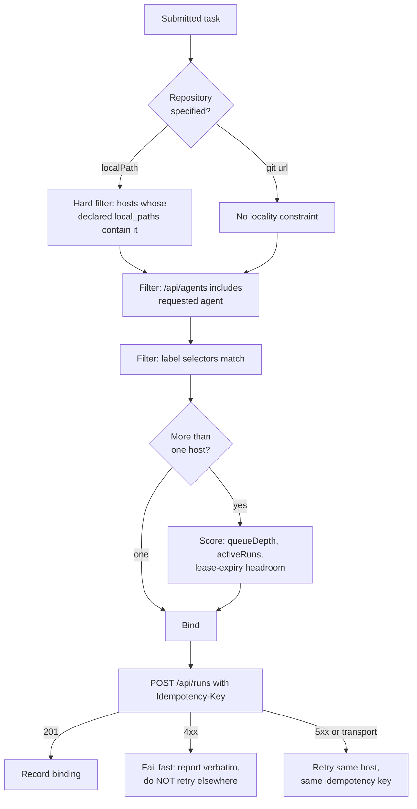

# Fleet: managing many Mercury instances from one place

Fleet is a layer **above** Mercury that dispatches Runs to several independent Mercury installations —
typically one per host — and presents them as one system: submit a task, get routed to a host that can
actually do it, watch one event stream, cancel one Run.

It is a client. That is the whole idea, and it is also the whole discipline.

## 1. Why this is possible when "multi-host Mercury" is not

The two questions sound related and are not.

Mercury cannot run two hosts against one database. Every component — queue, leases, run state, events —
coordinates through a single SQLite file, and SQLite in WAL mode is documented-unsafe on shared storage.
`docs/cross-process-event-push.md` section 3.3 works this through and concludes multi-host scale is blocked
on **storage**, not on event delivery.

Fleet does not touch that problem. It federates at the **HTTP API**, where each Mercury is already
complete and self-contained. No shared database, no shared filesystem, no host needing to know any other
host exists.

The asymmetry is worth stating plainly, because it is the reason this is cheap:

| | Mercury multi-host | Fleet federation |
| --- | --- | --- |
| Shared medium | one SQLite file | none — HTTP only |
| Coordination | leases on shared rows | routing decisions in Fleet |
| Blocked on | storage engine | nothing |
| Child needs | a networked database | nothing at all |

A child Mercury is **unmodified**. Fleet talks to stock Mercury. That is a hard requirement, not a
convenience: see section 9.

## 2. The one rule that keeps this honest

> **Fleet stores the binding. The child stores the truth.**

Fleet's database is authoritative for exactly two things: which hosts exist, and which host owns which
Run. Everything else it holds — status, event counts, timings — is a **cache that can be thrown away and
rebuilt by re-reading the children**.

Get this backwards and you get split-brain: Fleet records `FAILED` because a request timed out, the child
was actually fine, and the Run completes with nobody listening. The rule is what makes section 7's failure
semantics survivable.

The structural echo is deliberate. Fleet is to Mercury what Mercury is to `prime-agent`: a layer that turns
a noisy subprocess into durable, sequenced, queryable state, without becoming the thing that does the work.

## 3. What the stock API already gives a federation layer

Verified against `src/api/routes.ts` and `src/api/server.ts` at the time of writing.

| Endpoint | Why Fleet needs it |
| --- | --- |
| `POST /api/runs` + `Idempotency-Key` | Creates a Run; a retried submit reuses the Run instead of spending agent budget twice. Per-owner (`runService.create`). |
| `GET /api/runs/:id` | Status reconciliation. |
| `GET /api/runs/:id/events?after=&limit=` | Returns `nextCursor` **and** `hasMore`. `nextCursor` is the last sequence actually returned, not the run's max — so paging from it cannot skip events. This is the aggregation primitive. |
| `GET /api/runs/:id/stream` | SSE, resumable with `?after=`. |
| `POST /api/runs/:id/{input,cancel,retry}` | Interaction. Retry creates a **new** Run with `retryOf`. |
| `GET /api/agents` | `{ agents: string[] }` — which agents this host can run. |
| `GET /healthz` | `{ ok, ts }`. Public. Liveness. |
| `GET /healthz/workers` | `{ workers: [{ workerId, activeRuns, oldestLeaseExpiresAt }], queueDepth }`. Public. **Live capacity and backlog — the scheduler input.** Fields are camelCase: `activeLeases()` maps the SQL's snake_case row aliases into `ActiveLease` (`runQueue.ts`), so the wire shape is not the column shape. Returns `503 { error: "queue not configured" }` when no queue is wired — a probe must treat 503 as "reachable but not serving", not as down. |
| `GET /metrics` | Prometheus text, behind `requireAuth`. Note: mounted at the root, **not** under `/api`. Fleet scrapes and aggregates across hosts. |

Two properties matter more than the endpoints themselves:

- **Run IDs are UUID-derived** (`newRunId()` = `run_` + 16 hex chars). Aggregating many hosts into one
  namespace is therefore safe in practice. Fleet still keys on `(hostId, runId)` — see section 5 — but for a
  routing reason, not a collision reason.
- **Cursor semantics are already correct.** Issue #54 fixed the exact bug that would otherwise make
  federation lossy: reporting the run's true max sequence alongside a truncated page. Fleet inherits that
  fix for free.

## 4. What Mercury cannot tell you

These are real gaps. The design works around all of them; three are worth fixing upstream, filed in
section 12.

1. **No labels or metadata on a Run.** `Run` has no field Fleet could use to mark "created by Fleet job X".
   So Fleet cannot ask a child "what are all my Runs?" — it must remember the mapping itself. This is the
   single biggest constraint on the design, and it is why Fleet needs a durable store at all.
2. **Repository locality is invisible.** `repository.localPath` is resolved on the **worker's** filesystem
   (`existsSync` then `cpSync` in `workspaceManager.ts`). A child cannot report which paths exist on its
   disk, so Fleet cannot discover locality — an operator must declare it. This is the crux of routing
   (section 6).
3. **`/api/agents` returns bare names.** No capabilities, no version, no capacity per agent. Enough to
   filter "can this host run `hermes`", not enough to prefer one host over another.
4. **No completion callback.** Nothing pushes "Run finished" to Fleet. Fleet must poll or hold SSE.
5. **Clocks are independent.** Timestamps are ISO-8601 UTC strings compared lexicographically, which is
   correct within one host. Across hosts, Fleet must not assume two children agree on time; ordering
   Fleet's own aggregate view uses Fleet's clock plus per-host sequence, never child timestamps alone.

## 5. Data model

Fleet keeps its own SQLite database — same engine, same operational shape as Mercury, deliberately no new
infrastructure.

```
hosts        -- truth: what Fleet may dispatch to
  id TEXT PK             -- stable, operator-assigned (e.g. "mac-studio", "box-lan-2")
  base_url TEXT          -- https://host:3000
  credential_ref TEXT    -- name of a secret in the credentials file, NEVER the secret itself
  enabled INTEGER
  labels TEXT            -- JSON object, operator-declared: { "repo:mercury": "true", "gpu": "true" }
  local_paths TEXT       -- JSON array of repo paths this host actually has
  agents_cache TEXT      -- JSON array, refreshed by probe (advisory, not truth)
  added_at, last_seen_at

fleet_runs   -- truth: the binding, plus the client-facing identity
  fleet_run_id TEXT PK   -- Fleet's own id; what clients use
  host_id TEXT           -- FK; the routing decision, immutable after creation
  child_run_id TEXT      -- the id the child assigned
  client_token TEXT      -- caller-supplied idempotency across Fleet restarts
  requested JSON         -- the submit payload as received
  created_at, bound_at
  UNIQUE (host_id, child_run_id)

run_state    -- CACHE ONLY: rebuildable by re-reading children
  fleet_run_id TEXT PK
  status TEXT            -- child status, or UNKNOWN (section 7)
  cursor INTEGER         -- last event sequence mirrored
  last_seen_at, last_error TEXT

events       -- optional mirror; only if local history is wanted (section 8)
  fleet_run_id, sequence, host_sequence, type, payload, seen_at
```

The `truth` / `CACHE ONLY` split is not a comment convention — it is the line that decides what a Fleet
crash costs you. Lose `run_state` and Fleet re-reconciles. Lose `fleet_runs` and **you have orphaned Runs
on remote machines that nobody can find**, which is the worst failure this system can produce. `fleet_runs`
gets backed up with the same seriousness as a Mercury database; `run_state` does not.

`UNIQUE (host_id, child_run_id)` is what makes the binding safe independent of child id uniqueness, and it
is why Fleet never needs to trust that a 64-bit-truncated id is globally unique.

## 6. Routing: the actual hard problem

Capacity is the easy part. The binding constraint is **where the repository physically is**.

A task that says "fix the failing tests in `/Users/roman/devops/mercury`" can only run on the machine that
has that directory. Everything else is preference.

Routing therefore runs as an ordered filter, and the first stage is a hard constraint:



Three decisions in that flow are load-bearing:

**A `localPath` with no matching host is a submission error, not a scheduling wait.** Fleet must reject it
with the list of hosts it considered and why each was excluded. Silently queueing it forever, or rewriting
it to a URL the caller never gave, both turn a five-second mistake into an hour of confusion.

**A 4xx from the child is final.** A 400 means the payload is wrong; retrying on a different host produces
the same 400 and hides the reason. Only 5xx and transport failures are retryable, and only with the **same**
idempotency key — which is what makes a retry safe rather than a second paid agent run.

**Locality is declared, never inferred.** Fleet cannot see a child's disk (section 4.2). If an operator
forgets to declare a path, routing fails loudly with a clear reason. The alternative — try each host until
one works — spends agent budget on guesses.

### The escape hatch worth building first

`localPath` locality is a genuine limitation, and there is a cheap way around most of it: **Fleet can
rewrite `localPath` to a git URL** when the caller supplies one, or when a host-independent clone URL is
known for the repo. Children then `git clone` and locality stops mattering. This should be a first-class
Fleet feature rather than a caller responsibility, because it converts the hardest routing constraint into
a non-issue for most work.

## 7. Failure semantics: `UNKNOWN` is not `FAILED`

The child is the source of truth (section 2), so Fleet must never manufacture a terminal state.

| Observation | Fleet records | Why |
| --- | --- | --- |
| Child unreachable / timeout | `UNKNOWN` | A network partition is not a Run outcome. Marking `FAILED` would destroy a Run that is still running and spending money. |
| Child returns 404 for a bound Run | `LOST`, alert | The binding says it exists. Either the binding is corrupt or the child's database was reset. Both are operator events, not Run outcomes. |
| Child reports `COMPLETED`/`FAILED`/`CANCELLED`/`TIMED_OUT` | that status | The only states Fleet may copy. These are exactly `TERMINAL_STATUSES`. |
| Child returns 5xx | keep last known, `last_error` | Transient. Never overwrite good state with bad. |
| Fleet restarts | re-reconcile every non-terminal binding | `fleet_runs` is durable, so nothing is orphaned. |

`UNKNOWN` must be **visible in the UI as its own state**, not rendered as a spinner. An operator needs to
distinguish "running" from "we cannot reach the machine", and collapsing them is how a dead host looks
healthy for a week.

Reconciliation is a periodic sweep: for every binding whose status is not terminal, re-read the child,
advance the cache. This is the mechanism that makes everything else recoverable, so it runs from Fleet
startup and on a timer — not only on demand.

## 8. Event aggregation

Fleet exposes one stream per `fleet_run_id` to its own clients, backed by one child stream.

**The cursor is the correctness mechanism. SSE is only a latency optimisation.**

- Baseline: poll `GET /events?after=<cursor>` per active Run. Resumable, survives Fleet restarts, and it is
  the code path Mercury's own dashboard already depends on.
- Optimisation: hold SSE for Runs a client is actively watching, and on disconnect fall back to the cursor.
  Because the cursor is always valid, SSE loss costs latency and nothing else.

Never mirror events by holding N long-lived connections as the primary mechanism. A child's SSE has
backpressure handling that deliberately drops a wedged subscriber (issue #145) — correct for a browser tab,
but it means Fleet would silently miss events if it treated SSE as authoritative. Poll-by-cursor cannot
miss, because `nextCursor`/`hasMore` are designed for exactly this.

Mirroring event *bodies* into Fleet is optional. `events` is in the schema but off by default: agent output
can be large, and Fleet becomes a second copy of every Run's transcript, with all the retention and secret
questions that raises. Default to mirroring **metadata only** (type, sequence, timestamp) and let operators
opt into full mirroring per host.

## 9. Security: Fleet holds a credential for every host

Fleet is the highest-value target in this architecture. One Fleet token compromises every Mercury it can
reach. Non-negotiables:

- **Child credentials live in a `0600` file, referenced by name.** `credential_ref`, never the secret. Fleet
  never accepts a child credential as a command-line argument — argv is world-readable through `ps`. This is
  the same rule `docs/remote-client-setup.md` already states for client tokens.
- **Fleet binds `127.0.0.1` by default**, matching Mercury's own safe default. Reaching it across the
  network is an explicit opt-in, and then TLS is required for the same reason: the caller's bearer token
  would otherwise cross the LAN in plaintext.
- **Client-to-Fleet auth is separate from Fleet-to-child auth.** Fleet authenticates its own callers with
  its own token set, and never forwards a caller's credential to a child.
- **Per-caller host allowlist.** Without it, one leaked Fleet token equals every host. A caller that may
  only use `box-lan-2` must get `403`, not a silently narrowed host set.
- **Fleet must not proxy arbitrary paths to children.** Only the enumerated endpoints. A general
  "pass-through to host X" surface hands callers whatever internal routes a child later grows.

## 10. What Fleet is not

Stated because each of these is a plausible expectation and each would double the work:

- **Not a workflow engine.** No DAGs, no dependencies between Runs, no "run B after A". One task in, one
  routed Run out. Multi-step orchestration is a separate design with its own problems.
- **Not a scheduler with autoscaling.** It picks among hosts that exist. It does not start machines.
- **Not a new dashboard.** Each child already has one. Fleet links to it. Building a second UI that is
  worse than N existing ones is a bad trade; Fleet's UI need is a cross-host list and one merged timeline.
- **Not a shared-storage layer.** It does not make two Mercuries one system. Children stay independent, and
  a child must work perfectly with Fleet deleted.
- **Not a second source of Run truth.** See section 2.

## 11. Coupling rule

**Fleet must not import anything from Mercury's `src/`.** No shared types, no path dependencies, no
`workspace:` link. Fleet speaks HTTP and nothing else, so that it can talk to a Mercury it did not build
and a Mercury that has moved on since.

This is checkable rather than aspirational: a test asserting no file under `fleet/` resolves an import
outside `fleet/` (except Node builtins and its own declared dependencies) keeps the boundary honest. It is
the same style of source guard this repository already uses for the credential resolver and exit
settlement.

The practical benefit arrives the first time Mercury changes an internal type and Fleet does not care.

## 12. Build plan

Each phase is independently useful and ships behind its own PR, per `issue-fix-loop`.

**Phase 0 — registry and probe (small).** *Shipped: `fleet/`, `npm run fleet`.* `hosts` table, add/list/enable, and a prober that hits
`/healthz`, `/healthz/workers`, `/api/agents` on a timer. Output: a table of hosts with live capacity and
agent lists. No dispatch. This alone answers "what is my fleet doing?" and validates every assumption in
section 3 against real hosts.

**Phase 1 — dispatch with explicit host (small).** Submit a task, name the host, get a `fleet_run_id`,
binding recorded. No routing. Proves the idempotency and binding model, and the crash-recovery path
(restart Fleet, still find every Run).

**Phase 2 — reconciliation and merged status (medium).** The sweep from section 7, `UNKNOWN` handling, and
`GET /fleet/runs` showing one view across hosts. This is where durability gets exercised for real.

**Phase 3 — event aggregation (medium).** Cursor mirroring, Fleet-side SSE, metadata-only by default.

**Phase 4 — routing (medium).** Locality filter, agent filter, label selectors, capacity scoring, and the
`localPath` → git URL rewrite. Ship the rewrite **before** the scorer, since it removes most of the
constraint the scorer exists to work around.

**Phase 5 — interaction (small).** Input, cancel, retry through Fleet, including the binding update when
`retry` yields a new child Run id.

**Phase 6 — metrics rollup (small).** Scrape each child's `/metrics`, aggregate, expose one Prometheus
endpoint. Cheap and disproportionately useful.

## 13. Upstream changes worth filing against Mercury

Fleet does not need these, but each removes a workaround. They belong in Mercury, not in Fleet.

1. **Labels on Runs.** A `labels` JSON column plus `GET /api/runs?label=k=v`. Removes the biggest
   constraint in section 4: a child could then answer "which of these Runs are yours?" and Fleet's binding
   table becomes a cache rather than the only record. Owner-scoped, additive, backward compatible.
2. **Locality declaration.** Have `/healthz/workers` (or a new `/api/capabilities`) report configured
   `MERCURY_WORKSPACE_BASE` and, if configured, an allowlist of repo paths it will accept. Turns operator
   declaration into discovery.
3. **Completion webhook.** A per-Run `callbackUrl`, or a fleet-style alert on terminal transition. Turns
   reconciliation from polling into notification. Note the existing alert dedup work (issue #142) already
   solved the "N workers, one alert" problem this would need.
4. **Richer `/api/agents`.** Names plus version and declared capabilities, so routing can prefer rather
   than merely filter.

## 14. Open questions

1. **Where does Fleet run?** *Decided: one host, as a service. See section 15.* The schema supports both,
   but the credential file, TLS and logging story differ enough that the choice had to be made before any
   dispatch code existed. It was deferred long enough that Phase 0 shipped a laptop-shaped default
   credential path, which section 15 corrects.
2. **Multi-user?** Fleet inherits per-caller host allowlists but no tenancy model. If two people with
   different access levels share it, the allowlist needs to be real authorisation.
3. **How much history?** Metadata-only mirroring keeps Fleet small and is the default here, but it means
   Fleet cannot show a historical timeline for a host that has since garbage-collected its events.
4. **Does a Run ever move?** Deliberately assumed no: one Run, one host, for life. Moving a Run would mean
   moving a workspace and an agent session, which is a different and much harder design.

## 15. Fleet as a service

Fleet runs as a long-lived service on one host, not as a CLI on an operator's laptop. That was open
question 1, and it is not cosmetic: it changes where secrets live, who authenticates to what, and what a
crash costs.

### 15.1 Why the service shape forced a decision now

Phase 0 shipped registry and probe with no server, so it could dodge this. Phase 1 records a binding the
moment it dispatches, and a binding only has value if it outlives the process that wrote it. From here on,
Fleet is a daemon that clients talk to.

### 15.2 Secrets move out of `$HOME`

Phase 0 defaults `FLEET_CREDENTIALS_FILE` to `~/.fleet/credentials.json`. That is right for a laptop and
**wrong for a service**: `deploy/mercury.service` sets `ProtectHome=true`, and a Fleet unit that matches
Mercury's hardening would not be able to read anything under a home directory. The failure is also
asymmetric and easy to miss — the unit starts, the registry loads, and every probe reports `auth-fail`
because the credential store never resolved.

For a service the file lives at `/etc/fleet/credentials.json`, mode `0600`, owned by the `fleet` user, and
`ReadWritePaths` covers only `/var/lib/fleet`. The default stays laptop-shaped for development; the unit
sets `FLEET_CREDENTIALS_FILE` explicitly rather than relying on a default.

### 15.3 Fleet authenticates its own callers

Two separate credential boundaries, and conflating them is the mistake:

- **Caller → Fleet.** Fleet has its own token set. A caller's token is never forwarded to a child, so a
  Fleet token and a Mercury token are different things with different blast radii.
- **Fleet → child.** The `credential_ref` set in `/etc/fleet/credentials.json`.

The per-caller host allowlist from section 9 becomes real authorisation rather than a filter: a caller
permitted only for `box-lan-2` gets `403` when naming another host, not a silently narrowed choice. Without
that, one leaked Fleet token is every host on the LAN, which is the whole reason section 9 exists.

### 15.4 Fleet's own API surface

Enumerated rather than left open, because section 9 forbids a general pass-through to children and the only
alternative to a list is drift toward one.

```
GET  /healthz                       liveness, no auth
GET  /fleet/hosts                   registry + cached probe state
POST /fleet/hosts                   register a host (admin)
POST /fleet/hosts/:id/enable        enable|disable (admin)
DEL  /fleet/hosts/:id               forget a host (admin)
POST /fleet/hosts/:id/probe         probe now (admin)

POST /fleet/runs                    submit; body names a host (Phase 1), routing later
GET  /fleet/runs                    one merged view across hosts (Phase 2)
GET  /fleet/runs/:id                status, with UNKNOWN honoured
GET  /fleet/runs/:id/stream         merged SSE, cursor-backed (Phase 3)
POST /fleet/runs/:id/input          (Phase 5)
POST /fleet/runs/:id/cancel         (Phase 5)
POST /fleet/runs/:id/retry          (Phase 5; updates the binding)
GET  /metrics                       rollup of child /metrics (Phase 6)
```

Nothing here accepts a URL to fetch. A caller names a host by its registry id and Fleet resolves it. That is
what keeps "do not proxy arbitrary paths" true as the surface grows.

### 15.5 Logging and redaction

Fleet cannot import Mercury's redactor — section 11 forbids it — so Fleet carries its own. This is not
cosmetic parity. Fleet holds a credential for every Mercury on the network, and the failure mode is
specific: an HTTP client error can echo request headers, and a bearer token in a log line is a fleet-wide
compromise sitting in a file with journald's retention. Fleet redacts every known child secret and the
`Authorization` header pattern from log output, and the redactor is seeded from the credential store at
startup so a rotated file cannot leak through a stale list.

### 15.6 Lifecycle

- **Bind `127.0.0.1` by default.** Reaching Fleet across the LAN is opt-in, and then TLS is required for the
  same reason Mercury requires it: the caller's bearer token would otherwise cross the network in plaintext.
- **Startup order matters.** Load credentials, open the database, reconcile, then bind. Binding last means a
  client never gets a `200` from an endpoint that has not loaded the registry.
- **The prober is a separate timer**, not work inside the request path, and it is the same `createProber`
  Phase 0 shipped. Section 12's Phase 0 sweep and the service sweep are one implementation.
- **Shutdown is bounded.** In-flight probes are abandoned rather than awaited; the sweep writes cache rows,
  and cache is cheap to lose. `TimeoutStopSec` is the outer bound, matching Mercury's unit.
- **A crash must cost only cache.** Section 5's split is what makes this true: `hosts` and `fleet_runs`
  survive, `host_probe` and `run_state` are rebuilt by one sweep and one reconcile.

### 15.7 What the service shape does *not* buy

It is still not a dashboard (section 10), still not multi-tenant, and still one host: Fleet's own
availability is a single process on a single machine. That is deliberate. Making Fleet itself highly
available would mean replicating `fleet_runs`, and `fleet_runs` is the one table that cannot be rebuilt —
so HA for Fleet is a genuinely harder problem than HA for any child, and it is out of scope rather than
merely unbuilt.
