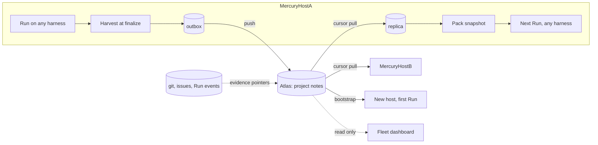
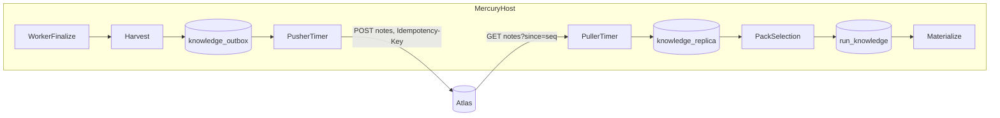

# Knowledge base: memory gathered from sub-harnesses, shared across the project

Status: **design only.** Nothing here is implemented. No package, endpoint, table, event type
or environment variable named below exists yet; every one of them is a proposal. Where a
sentence describes current behaviour it says so and names the file.

The service this document introduces is called **Atlas** throughout. The name is a one-line
decision, not a design choice; nothing below depends on it.

**Scope:** the host (`src/`), Fleet (`fleet/`) and a new third product. The host and Fleet
halves are small and described precisely; the third product is described to the level needed
to judge whether it should exist.

**Related:** [`overview.md`](overview.md), [`agents.md`](agents.md),
[`agent-adapters.md`](agent-adapters.md), [`crew/teams.md`](crew/teams.md),
[`crew/harness-capabilities.md`](crew/harness-capabilities.md),
[`crew/workflows.md`](crew/workflows.md), [`fleet-design.md`](fleet-design.md),
[`goals.md`](goals.md), [`operations.md`](operations.md),
[`configuration.md`](configuration.md), [`../ARCHITECTURE.md`](../ARCHITECTURE.md)

---

## 1. The problem at fleet scale

Mercury today is used on one large project. Fleet runs that project's Runs in parallel across
several independent hosts, and within a host the worker hands each Run to one of several
harnesses -- PrimeAgent, Hermes, Claude, Pi, Oh my Pi, or a declarative local or remote agent.
[`crew/teams.md`](crew/teams.md) §3 names each of those harnesses a **sub-team** with its own
namespace, its own registry and its own idea of what a skill is. This document calls them
sub-harnesses for the same reason: they are subordinate to Mercury's Run, and Mercury must not
reach inside them.

Every one of those Runs starts from zero. That is not a figure of speech; it is what the
current code does:

- A **skill** is authored guidance, snapshotted per Run into `run_skills` and materialized by
  `writeSkills()` in [`src/worker/worker.ts`](../src/worker/worker.ts). Nothing a Run learns
  is written back into it.
- `.mercury-context.json` is written per Run by the PrimeAgent, RPC and daemon adapters and
  describes the task, not the project.
- The workspace, with whatever notes the agent left in it, is deleted after
  `MERCURY_WORKSPACE_RETENTION_MS` (default seven days) by
  [`src/workspace/workspaceGC.ts`](../src/workspace/workspaceGC.ts).
- Each harness keeps its own memory in its own store -- `~/.hermes`, `~/.pi`, `~/.omp`,
  `~/.prime`, a `CLAUDE.md` -- which Mercury never reads, which is per host, and which is
  lost the moment a Team stage hands work from one harness to another.
- There is no project concept at all. [`src/config.ts`](../src/config.ts) knows a
  `repository` and extra `repositories[]` per Run; nothing groups Runs, hosts or harnesses
  into "the thing we are all working on".

The cost shows up in two places. Day to day, the fifth Run to touch a module rediscovers the
same test entry point, the same flaky fixture and the same convention the first four found --
on every host, in every harness, at full token price. At the scale Fleet is for, bootstrapping
another Mercury host means that host relearns the project from nothing, and there is no
artefact an operator can hand it that says "here is what we already know".

The requirement is therefore one **common, project-scoped knowledge base**: gathered from every
sub-harness on every host, curated in one place, and served back to every Run, so that
knowledge is learned once per project rather than once per host per harness, and a new host is
productive on its first Run.

The shape of the answer, before the detail:



Hosts push what their Runs learned and pull what the project has promoted. Atlas holds the
curated set and points at git for everything else. Fleet may look; it does not touch.

## 2. History is not knowledge

The first question a knowledge base raises is whether it should also be the project's history:
the record of decisions taken, bugs fixed, and changes made. It should not, and the reason is
that history and knowledge have opposite requirements.

| | History | Knowledge |
| --- | --- | --- |
| Mutability | append-only, never edited | superseded, retired, contested |
| Completeness | must be complete | must be small enough to inject into a context window |
| Growth | unbounded | byte-budgeted per Run |
| Queried by | time, commit, Run, issue | scope and topic, before touching code |
| Loss | unacceptable | acceptable if the evidence survives |

A store that tries to be both ends up either too large to serve into a Run or too lossy to
audit. Mercury already has three history stores, and they are the right ones:

| What happened | Where it lives today | Who aggregates it |
| --- | --- | --- |
| Code changed, and why | git commits, PR bodies; a Run records `finalCommits` and `prUrl` on the Run row | git itself, on every clone |
| A bug was fixed, and how | issues and PRs; the `issue-fix-loop` skill enforces one issue per PR with `Fixes #N` | the issue tracker |
| A Run did something | the per-Run event stream, monotonic, in the host's SQLite | Fleet mirrors events across hosts (`fleet_events`) |
| A design was chosen | `docs/*.md` in the repository, reviewed through a PR | git |

None of that needs re-storing in a fourth place, and re-storing it would create the failure this
repository has already paid for repeatedly: two copies of one fact that disagree. A run of
recent release commits (#444, #446, #447, #453) are all variations of "the package exists now;
four documents still said it did not". Two copies of a decision drift. A pointer to the
decision cannot.

### 2.1 The rule

> **A note is a claim. Git, the issue tracker and the Run event stream are the evidence. The
> knowledge base stores claims with pointers into evidence, and never copies of it.**

"This module's retry path breaks if the lease expires mid-flight" is a claim an agent needs
*before* it edits the module. The evidence for it is a commit, a PR, an issue or a Run's events.
The knowledge base holds the sentence and the pointer; git holds the diff.

Three consequences follow, and each is checkable:

1. `decision` and `pitfall` notes carry a **required** evidence reference (§3). A decision
   with no commit, PR, issue or Run behind it is an opinion, and Atlas rejects it as one.
2. Notes retire; evidence never does. Retention (§12) applies to notes only. The commit a
   retired note pointed at is still in git.
3. A note body is bounded (§7.5). Anything that does not fit in the bound belongs in a
   decision record in the repository (§6), and the note points at it.

### 2.2 The record of the knowledge itself

Atlas does keep one history: the history of its own notes. Every revision, promotion,
retirement and contest is retained in `note_revisions` and `promotions` (§11.3). That is the
audit trail of *what Mercury believed and when*, which is a different thing from the history of
the project, and it is the trail an operator needs when a promoted note turns out to be wrong.

## 3. Terminology

These terms are normative for this document and for any implementation of it.

- **Project** -- the unit all hosts and harnesses work for. Identified by `projectId`, an
  operator-assigned slug, and carrying a **repo identity set**: the normalized URLs of the
  repositories that belong to it (§5). One Atlas instance may hold several projects; a host
  contributes to exactly one.
- **Note** -- one bounded, attributed claim about the project. Identified by `noteId`, stable
  across revisions. A revision is immutable once written.
- **Note kind** -- a closed vocabulary. Closed because an open vocabulary degrades into prose,
  and prose cannot be matched or budgeted (the same reasoning
  [`crew/harness-capabilities.md`](crew/harness-capabilities.md) §3 applies to capabilities):

  | Kind | Means | Evidence |
  | --- | --- | --- |
  | `fact` | something true about the code or environment ("the integration tests need `docker compose` running") | optional |
  | `convention` | how this project does things ("migrations are appended to `MIGRATIONS`, never edited") | optional |
  | `pitfall` | something that goes wrong and how it presents | **required** |
  | `command` | a command that does a named thing, with its working directory | optional |
  | `decision` | a choice that was made and is not to be re-litigated by accident | **required** |
  | `artifact-pointer` | where something lives ("the release runbook is `docs/releasing.md`") | optional |

- **Scope key** -- what a note is about, from a closed grammar, never free text:
  `project` (the whole project), `repo:<hash>` (one repository), `repo:<hash>#<path>` (a path
  inside it), or `agent:<id>` (one harness; used for notes that are about a harness's
  behaviour on this project rather than about the project). `<hash>` is the identity hash of
  §5.
- **Tier** -- `candidate`, `promoted` or `retired`. Only promoted notes are served into Runs
  (§12).
- **Provenance** -- who produced the note and from what: `source` in
  `agent-reported | distilled | repo-record | operator`, the originating `hostId`, `runId`,
  `agent` id, and the harness version that executed that Run (recorded on the Run since
  migration v7, [`goals.md`](goals.md) §13.1).
- **Evidence reference** -- a pointer into history: a commit, a PR, an issue, a Run event, or
  a file at a commit. Never a copy of the thing pointed at.
- **Corroboration** -- the measured count of *distinct* Runs, hosts and harnesses that
  produced the same claim (§12). Measured, not estimated.
- **Knowledge Pack** -- the set of notes resolved for one Run at creation, identified by
  `packHash`, snapshotted on the Run and executed as snapshotted (§9).
- **Outbox** -- the host-local durable queue of notes harvested but not yet acknowledged by
  Atlas (§8.1).
- **Replica** -- the host-local copy of the project's promoted notes, refreshed by cursor
  (§8.3).

The note, as a record:

```ts
interface Note {
  noteId: string;
  revision: number;                 // 1..n; each revision is immutable
  projectId: string;
  kind: 'fact' | 'convention' | 'pitfall' | 'command' | 'decision' | 'artifact-pointer';
  scope: string;                    // 'project' | 'repo:<hash>' | 'repo:<hash>#<path>' | 'agent:<id>'
  claim: string;                    // one paragraph, bounded; what the agent needs to know
  detail?: string;                  // bounded elaboration; anything longer is a decision record
  evidence: EvidenceRef[];          // required for 'decision' and 'pitfall'
  tier: 'candidate' | 'promoted' | 'retired';
  supersededBy?: string;            // noteId
  contradicts?: string[];           // noteIds this note was declared to conflict with (§12)
  provenance: {
    source: 'agent-reported' | 'distilled' | 'repo-record' | 'operator';
    hostId: string;
    runId?: string;
    agent?: string;
    harnessVersion?: string | null;
    recordedAt: string;
  };
  corroboration: { runs: number; hosts: number; harnesses: number };
  seq: number;                      // per-project monotonic, assigned by Atlas on write
}

type EvidenceRef =
  | { type: 'commit';    repo: string; sha: string }
  | { type: 'pr';        url: string }
  | { type: 'issue';     url: string }
  | { type: 'run-event'; hostId: string; runId: string; seq: number }
  | { type: 'repo-file'; repo: string; path: string; sha: string };
```

`claim` and `detail` are the only free text in the record. Everything else is an identifier,
an enumeration or a pointer, which is what makes notes deduplicable (§12) and packs
deterministic (§9.1).

## 4. Invariants

Four rules carry the design. Each is stated once here and referred to by number below.

**K1 -- claims, not history.** §2.1. Atlas stores no diff, no event body, no transcript, no
decision prose beyond the bounded claim. Every `decision` and `pitfall` points at evidence.

**K2 -- the note is Mercury's; the rendering is the harness's.** A note may not contain a
harness-specific path, flag, model id or native skill name. This is
[`crew/teams.md`](crew/teams.md) §3 applied to knowledge: the team level speaks in neutral
terms, and each sub-harness owns resolution inside its own namespace. The concrete failure
that rule was written against -- Mercury handing skill ids into Hermes's namespace, where they
did not exist, so every Hermes Run failed in under a second -- is exactly what a note
containing `--skill planning` or `~/.hermes/profiles/x` would reproduce. Validation rejects
such notes at ingest; the adapter, and only the adapter, decides how a pack reaches its
harness (§9.3).

**K3 -- Mercury does not invent quality.** No confidence score, no relevance score, no
"trust" field that Mercury computed. The only signals on a note are ones Mercury *measured*:
corroboration counts, tier transitions with an actor and a reason, and evidence a reader can
open. This follows the precedent [`goals.md`](goals.md) §1 draws from `budgetTokens`: a field
that reads as a promise Mercury cannot keep is a defect, and a confidence number Mercury made
up is precisely that.

Corroboration deliberately counts distinct **harnesses** as well as distinct Runs and hosts.
Two Runs on PrimeAgent reaching the same conclusion says something about the project; one Run
on PrimeAgent and one on Claude reaching it says more, because a single vendor's quirk is much
less likely to be the cause. That is the closest Mercury can get to a quality signal without
inventing one.

**K4 -- Atlas is never on the critical path of a Run.** Run creation, claiming, execution and
finalization must succeed with Atlas unreachable, misconfigured or absent. A host with no
`MERCURY_ATLAS_URL` behaves exactly as today (Crew invariant 10 in
[`crew/README.md`](crew/README.md) §5, applied here). A host with Atlas configured but down
harvests into its outbox and selects packs from its replica; it loses freshness, never a Run.
Atlas also never writes into a host: every byte crosses the boundary because a host asked for
it.

The existing invariants Crew lists in [`crew/README.md`](crew/README.md) §5 all continue to
hold. In particular: a Run remains the durable unit of work and Atlas stores none of its
state (invariant 1); transitions still go only through `RunStore.transition` (2); events remain
monotonic and run-scoped, so a push failure with no Run behind it is a log line and a metric,
not a Run event (4); adapter-specific translation stays under `src/adapters/` (6); secrets never
enter a note (8, and §7.5); and unsupported *required* capabilities fail closed (9).

## 5. Project identity

There is no project concept in Mercury today, so this design has to introduce one, and it has
to do so in a way that a misconfigured host cannot silently pollute another project's
knowledge.

A host is configured with exactly one project:

```
MERCURY_ATLAS_PROJECT=<projectId>
```

Atlas holds, per project, a **repo identity set**: the normalized URLs of every repository
that belongs to it. Normalization is mechanical and the same on both sides:

1. Parse the URL; accept `https://`, `ssh://`, and the `git@host:org/repo` scp form.
2. Drop credentials, port defaults, query and fragment.
3. Lowercase the host. Keep the path case as given -- some forges are case-sensitive.
4. Strip a trailing `.git` and a trailing `/`.
5. Identity is `host/path`; the **identity hash** used in scope keys is the hex SHA-256 of
   that string, truncated to 16 characters.

So `git@github.com:aywengo/mercury.git`, `https://github.com/aywengo/mercury` and
`ssh://git@github.com/aywengo/Mercury.git` produce two identities, not one, because the third
differs in path case; the operator adds both to the set if both are in use. An identity that
is a local filesystem path (which Mercury accepts for `repository`) is normalized as
`file/<absolute path>` and is explicitly host-local -- it can never match another host's
identity, which is the correct outcome for a path.

The rule at harvest time is a cross-check, not a lookup:

- The host attaches `MERCURY_ATLAS_PROJECT` to every note it pushes.
- The host also attaches the identity of `run.repository` (and of each entry in
  `run.repositories[]` for notes scoped to an extra repository).
- Atlas accepts the note only if the contributor token is bound to that project **and** the
  repository identity is in the project's set. A note that fails the second check is rejected
  with `reason: repo-not-in-project`, and the host records a `knowledge.rejected` event on the
  Run so the misconfiguration is visible where the operator will look.

A Run whose primary repository is not in the set contributes nothing and receives an empty
pack. It does not fail (K4): a Run against an unrelated repository on a host that happens to
be configured for a project is a legitimate thing to do, and it should simply be outside the
knowledge base rather than inside the wrong one.

Two open points are deferred to §18: whether a project should be inferable from the repository
when `MERCURY_ATLAS_PROJECT` is absent (the design says no -- explicit beats inferred for a
setting that decides where knowledge lands), and how forks and mirrors of the same repository
should relate to one identity.

## 6. The git side: decision records

K1 says decisions live in git and Atlas points at them. For that to work, decisions need a
durable, reviewable home in the repository that is more structured than a PR comment thread and
more discoverable than a paragraph in a design document. This section specifies that home. It
is a convention for the **project repository**, not for Mercury's own; Mercury's repository
may adopt it, but nothing in Mercury depends on it doing so.

### 6.1 Format

One file per decision under `docs/decisions/`, named `NNNN-<slug>.md` with a zero-padded
sequence number and a kebab-case slug:

```markdown
---
id: 0007
title: Knowledge notes are claims, not history
status: accepted            # proposed | accepted | superseded | rejected
date: 2026-09-11
supersedes: 0003            # optional, one id
evidence:
  - https://github.com/aywengo/mercury/pull/487
  - commit: 7a546bc
  - https://github.com/aywengo/mercury/issues/459
---

## Decision

One paragraph. One falsifiable claim, in the present tense, that a reader can check against
the code: "Atlas stores claims with evidence pointers and never copies of the evidence."

## Context

Why this came up, what was tried, what the alternatives were. As long as it needs to be.

## Consequences

What becomes easier, what becomes harder, what is now forbidden.
```

The frontmatter is the machine-readable part; the body is for people. `status` follows the
usual decision-record lifecycle. A record is never edited to say something different: a
changed mind is a new record with `supersedes`, and the old record's `status` becomes
`superseded`. That is the same immutability rule notes have (§3), and it is what makes a
pointer to a record stable.

### 6.2 What makes a record indexable

A record becomes a `decision` note (§6.3) only if it meets four conditions. Records that do
not are still perfectly good documents; they are simply not turned into knowledge, and the
harvester says why.

1. Frontmatter parses and contains `id`, `title`, `status` and `date`.
2. A `## Decision` heading exists and its first paragraph is at most the note claim bound
   (§7.5). That paragraph **is** the note's `claim`, verbatim. If the decision cannot be
   stated in one bounded paragraph, the record is not a decision yet.
3. `evidence` lists at least one entry that parses as a commit, PR, issue or file reference.
   This is K1 applied at the source: a decision record with no evidence is rejected with
   `reason: decision-without-evidence`, which is the harvester telling the author what is
   missing rather than quietly dropping it.
4. `status` is `accepted`, `superseded` or `rejected`. A `proposed` record is not yet a
   decision and is not indexed; it becomes one when the PR that flips its status merges.

The note's `evidence` is the record's `evidence` list plus one `repo-file` reference to the
record itself at the commit the workspace was on, so the note always points back at its own
source. `status: superseded` produces a note whose `supersededBy` resolves to the note of the
superseding record; `status: rejected` produces a note whose claim is prefixed by the harvester
with `Rejected:` so a Run learns what *not* to do, which is often the more valuable half.

### 6.3 How records become notes

Indexing is done by the **Mercury host, during a Run, from the workspace the Run already has
checked out**. Atlas never clones, fetches or holds a git credential. This was a deliberate
choice between two options:

| | Host harvests from the workspace | Atlas indexes the repository itself |
| --- | --- | --- |
| Coverage | repositories a Run touched, at the commit it touched | complete, on a timer |
| New trust surface | none; the host already has the checkout | Atlas gains read access to every project repository |
| New code path | a diff of one directory at finalize | a git client, credential store and scheduler inside Atlas |
| Failure mode | a record nobody runs against is indexed late | a leaked Atlas credential reads every project's source |

The host option wins on the trust argument alone. Its coverage gap has two mitigations, and
the second is what closes it in practice:

- **Per-Run delta.** At finalize the harvester runs the equivalent of
  `git diff --name-status <base>..HEAD -- docs/decisions/` in the workspace, where `<base>` is
  the commit the worktree was created from. Records added or modified *by this Run* are parsed
  (§6.2) and contributed with `source: repo-record` and `provenance.runId` set. A Run that
  wrote a decision record therefore publishes the decision in the same breath as the code,
  with the Run as its provenance.
- **Operator index.** `node src/cli.ts knowledge index <checkout-path>` parses every record
  under `docs/decisions/` in a local checkout and pushes the result through the ordinary
  outbox with `source: repo-record` and no `runId`. This is the bootstrap path for a
  repository that already has records, it runs on the host with the host's existing access,
  and it needs nothing from Atlas beyond the contributor token the host already holds. It is
  idempotent: a record whose content hash is already known produces a corroboration, not a
  duplicate (§12).

Service-side indexing is recorded in §18 as an option to revisit if the coverage gap turns out
to matter more than the trust boundary. It is not designed here.

One property of this arrangement is worth stating because it does real work in §12: a
decision record with `status: accepted` has already been reviewed, by a human, through the
PR that merged it. Its note therefore lands **promoted**, not `candidate`. Git review *is* the
curation step for decisions, and running it through a second promotion queue would only add
latency to knowledge that is already the most trustworthy kind Atlas holds.

## 7. Ingest on the host: three tiers

Memory is gathered on the host, at the moment the worker finalizes a Run, from three sources of
decreasing agent cooperation. The tiers are additive: a Run contributes from every tier that
applies to it. All three land in the same outbox (§8.1) and are indistinguishable downstream
except by `provenance.source`.

The harvest runs **before** the workspace can be garbage-collected, in the finalize path of
[`src/worker/worker.ts`](../src/worker/worker.ts) that already emits `skill.completed` and the
terminal `run.*` event. It is bounded in time (a slow harvest must not hold a lease) and in
size (§7.5), and a harvest failure is logged and counted, never propagated into the Run's
terminal status. A Run that did its work and then tripped over its own notes is a completed
Run with a warning, not a failed one (K4).

### 7.1 Tier 1 -- agent-reported

The agent writes what it learned to a conventional file in the workspace:

```
.mercury/notes.jsonl
```

One JSON object per line, in the shape of the `Note` record minus the fields Mercury fills in
(`noteId`, `revision`, `projectId`, `tier`, `provenance`, `corroboration`, `seq`):

```json
{"kind":"pitfall","scope":"repo:3f9a1c2b7e6d5a40#src/queue","claim":"The lease-expiry test is timing-sensitive; it flakes under load and should be widened, not retried.","evidence":[{"type":"issue","url":"https://github.com/aywengo/mercury/issues/62"}]}
{"kind":"command","scope":"project","claim":"Run one test file with `node --test test/<name>.test.ts`; the whole suite takes ~25s and is not needed while iterating."}
```

The agent learns that this file exists, and what to put in it, from the pack itself: the
materialized `NOTES.md` (§9.2) ends with a short section that says, in effect, "when you learn
something durable about this project, append a line here". The instruction travels through the
same channel as the knowledge, so it needs no per-harness plumbing and no prompt change in any
adapter. That is the point of a file: it is the lowest common denominator across
`primeagent`, `hermes`, `claude`, `pi`, `omp` and every declarative local agent. All of them
can write a file into their working directory; none of them needs to speak a new protocol
event.

Each line is parsed, validated against the closed vocabularies, checked for K2 violations,
bounded and redacted (§7.5). Accepted lines produce a `knowledge.noted` event on the Run with
the note's `claimHash`; rejected lines produce `knowledge.rejected` with a `reason`. Both are
ordinary Run events, appended through `EventStore.append`, so the timeline shows what the Run
tried to teach and what was refused.

Honest gap: `remote-agents` execute on another machine and have no local workspace for the
worker to read. They get tier 2 only, unless the remote protocol grows a way to return notes,
which is not designed here.

### 7.2 Tier 2 -- distilled from events

For Runs whose agent wrote nothing, the host distils notes from the event stream it already
persisted. This is **deterministic extraction**, not summarization: a fixed set of rules over
event types, each producing a note of a fixed kind with the triggering events as evidence.

| Events observed | Note produced |
| --- | --- |
| `git.pr` with a URL | `artifact-pointer`, scope `repo:<hash>`, claim "Run `<id>` opened `<url>`", evidence `pr` + `run-event` |
| `tool.failed` with the same tool and a matching error twice or more in one Run | `pitfall`, scope from the tool's working path when present, claim from the error's first line, evidence `run-event` for each occurrence |
| `test.completed` naming a command | `command`, scope `repo:<hash>`, claim "tests run with `<command>`", evidence `run-event` |
| `input.required` whose prompt names a missing prerequisite | `fact`, scope `repo:<hash>`, claim from the prompt's first line, evidence `run-event` |

The list is short on purpose and every rule is a candidate for deletion if its notes do not
earn promotion (§12). Distilled notes are the lowest-trust tier -- an error's first line is
sometimes the right claim and sometimes noise -- so they always land as `candidate` and
auto-promotion (§12) is what separates the two.

No language model is called inside the worker. A summarizer that reads a Run's events and
writes better notes is a legitimate future component, but it is an **observable Run of its
own**, exactly as [`crew/workflows.md`](crew/workflows.md) already anticipates for
carry-forward summarization. Putting model calls into the finalize path would make Run
completion depend on a model endpoint, which K4 forbids.

### 7.3 Tier 3 -- repository records and harness-native files

Two sources the agent produced as a side effect of working, rather than as notes:

- **Decision records**, per §6.3: the per-Run delta of `docs/decisions/` in the workspace.
- **Harness-native memory files** the agent created or modified inside the workspace:
  `AGENTS.md`, `CLAUDE.md`, `SOUL.md`, `.cursor/rules/*.mdc`, and additions under
  `.agents/skills/`. The harvester diffs each against the base commit and imports the *added
  paragraphs* as `convention` candidates, scope `repo:<hash>` (or `repo:<hash>#<path>` when the
  file sits in a subdirectory), with a `repo-file` evidence reference to the file at `HEAD` of
  the workspace. It imports deltas, never whole files: a repository's existing `AGENTS.md` is
  already knowledge the agent will read from the checkout, and copying it into Atlas would be
  the second copy K1 exists to prevent.

Two boundaries hold here without exception. Every path is resolved through `resolveContained()`
([`src/skills/skillRegistry.ts`](../src/skills/skillRegistry.ts)), which already rejects
traversal and symlink escapes for skills, so the harvester cannot be steered outside the
workspace by a crafted symlink. And the harvester never opens `~/.hermes`, `~/.pi`, `~/.omp`,
`~/.prime` or any other harness home store. That is host state owned by the harness
([`crew/harness-capabilities.md`](crew/harness-capabilities.md) §5); reading it would make
Mercury a party to five vendors' private formats, and a note derived from it would almost
certainly violate K2.

### 7.4 Capability gating

Ingest is gated by a `knowledge` block in the capability descriptor that
[`crew/harness-capabilities.md`](crew/harness-capabilities.md) §3 proposes and
[`src/adapters/capabilities.ts`](../src/adapters/capabilities.ts) partly implements for goals:

- `knowledge.notesFile` -- the harness works in the workspace and can be expected to write
  `.mercury/notes.jsonl` when told to. Tier 1 applies.
- `knowledge.workspaceFile` -- the harness reads instructions from a named file in the
  working directory (`AGENTS.md`, `CLAUDE.md`, `SOUL.md`). Tier 3 applies, and §9.3 may
  render the pack into that file.
- `knowledge.contextFile` -- the harness is told to read `.mercury-context.json`. §9.2's
  `knowledge` block reaches it.

Ingest **fails open**: a harness with none of these still contributes tier 2, and a harness
whose capability is unknown because its version probe has not landed (the `version-unknown`
state `capabilities.ts` already models) is treated as having none until it lands. Nothing
about knowledge can prevent an agent from running, for the same reason `capabilities.ts`
gives for goals: a harness upgrade that changes a version string must not brick every Run
until a parser catches up.

Injection is the other way round (§9): a caller who *requires* knowledge on a harness that
cannot receive it is refused at create time, because silently running without the pack is the
degradation invariant 9 forbids.

### 7.5 Bounds and redaction

Every bound is an environment variable with a default, in the style of
[`configuration.md`](configuration.md):

| Variable | Default | Bounds |
| --- | --- | --- |
| `MERCURY_KNOWLEDGE_MAX_NOTES_PER_RUN` | `50` | lines of `.mercury/notes.jsonl` read; the rest are counted and dropped with one `knowledge.rejected` (`reason: over-limit`) |
| `MERCURY_KNOWLEDGE_MAX_CLAIM_BYTES` | `1024` | `claim` length; longer claims are rejected, not truncated, because a truncated claim is a different claim |
| `MERCURY_KNOWLEDGE_MAX_DETAIL_BYTES` | `4096` | `detail` length; same rule |
| `MERCURY_KNOWLEDGE_MAX_EVIDENCE` | `8` | evidence references per note |
| `MERCURY_KNOWLEDGE_HARVEST_TIMEOUT_MS` | `10000` | wall-clock for the whole harvest; on expiry, what was parsed is kept and the rest is logged |

Redaction happens at ingest, on the host, with the same `createRedactor()` from
[`src/domain/redact.ts`](../src/domain/redact.ts) that events already pass through, seeded with
`MERCURY_SECRETS` and the forwarded credential values the worker already knows. A note whose
`claim` or `detail` still matches a declared secret after redaction is rejected, not stored
redacted: a note is retained far longer than a workspace and replicated to every host, and
"we stored the token but with stars in it" is not a property anyone should have to defend.
Atlas redacts again on write and on read (§11.5), because `MERCURY_SECRETS` can grow after a
note is stored and a secret declared on Tuesday must not remain readable from a note written
on Monday.

## 8. The host half: outbox out, replica in

The host talks to Atlas in two independent directions, and both are designed so that Atlas
being unreachable costs freshness and nothing else (K4).



### 8.1 Outbox

Harvested notes are inserted into a host-local `knowledge_outbox` table **in the same SQLite
transaction that finalizes the Run**. If the transaction commits, the notes are durable; if it
does not, neither is the terminal state, and the Run will be finalized again. There is no
window in which a Run is complete and its notes are only in memory.

Each outbox row carries an idempotency key derived from `(runId, claimHash)`, so a batch that
was delivered but whose acknowledgement was lost is deduplicated by Atlas rather than
double-counted as corroboration.

### 8.2 Pusher

A pusher runs on **its own timer**, never inside the claim loop. AGENTS.md is explicit that
periodic work which must happen *while* a Run executes needs its own timer, and
[`src/worker/worker.ts`](../src/worker/worker.ts) already does exactly that for the stuck-run
check and for backlog alerting; the pusher is a third instance of the same pattern.

Every `MERCURY_KNOWLEDGE_PUSH_INTERVAL_MS` (default `30000`) it takes up to
`MERCURY_KNOWLEDGE_PUSH_BATCH` (default `100`) rows in insertion order and POSTs them as one
batch (§11.1) with the outbox's idempotency keys. Rows are deleted only for items Atlas
reports `accepted` or `duplicate`; items Atlas reports `rejected` are deleted and their reason
is recorded as a `knowledge.rejected` event on the originating Run, when that Run still exists.
A transport failure leaves every row in place, increments `attempts`, records `last_error`,
and backs off exponentially to a ceiling of ten minutes. Nothing is ever dropped for being
undeliverable; an outbox that grows is an operator signal, surfaced as
`mercury_knowledge_outbox_depth` on `/metrics` and as an alert threshold
`MERCURY_KNOWLEDGE_OUTBOX_ALERT_DEPTH` in the style of the existing backlog alert.

The HTTP client is injectable, as in
[`src/adapters/remoteAgentAdapter.ts`](../src/adapters/remoteAgentAdapter.ts), so the pusher
is tested without a network.

`node src/cli.ts knowledge flush` runs one push pass synchronously and prints what happened.
It exists for the operator who wants to see the outbox drain before decommissioning a host.

### 8.3 Replica

Inbound, the host maintains a **local replica** of the project's promoted notes in
`knowledge_replica`, refreshed by a puller on its own timer every
`MERCURY_KNOWLEDGE_PULL_INTERVAL_MS` (default `60000`). The puller asks Atlas for everything
after the cursor it holds (`GET .../notes?since=<seq>&tier=promoted`, §11.2), applies
insertions, revisions and retirements in `seq` order, and advances the cursor only after the
batch is committed. The cursor is a single row in `knowledge_replica_cursor`.

The replica is what pack selection reads (§9.1). `POST /api/runs` never makes a network call
to Atlas. This is the decision that makes K4 true rather than aspirational: Run creation
depends on a local SQLite table that is always readable, and the worst Atlas outage produces a
pack that is a few minutes stale.

On first start with Atlas configured and an empty cursor, the puller performs the bootstrap
pull of §13 instead of paging from `seq = 0`. Both paths converge on the same replica state;
the bootstrap path is simply one round trip instead of many.

### 8.4 Configuration

| Variable | Default | Effect |
| --- | --- | --- |
| `MERCURY_ATLAS_URL` | unset | Absent: the whole feature is off. No tables are read, no timers start, no events are emitted, and `POST /api/runs` rejects a `knowledge` block with `400`. Present: everything below applies. |
| `MERCURY_ATLAS_TOKEN` | unset | Contributor token for this host (§11.4). Required when the URL is set. |
| `MERCURY_ATLAS_PROJECT` | unset | The one project this host contributes to (§5). Required when the URL is set. |
| `MERCURY_ATLAS_HOST_ID` | hostname | The `hostId` recorded as provenance on every note. Operators running Fleet should use the same id they registered the host under, so the two can be joined by eye. |
| `MERCURY_ATLAS_CA_FILE` | unset | Private CA for the Atlas endpoint, same semantics as the client's CA option in [`client.md`](client.md). |
| `MERCURY_KNOWLEDGE_INJECT` | `true` | Whether Runs receive a pack by default. `false` leaves harvesting on and injection opt-in per Run. |
| `MERCURY_KNOWLEDGE_PACK_MAX_BYTES` | `32768` | Byte budget of a pack (§9.1). |
| `MERCURY_KNOWLEDGE_PUSH_INTERVAL_MS`, `MERCURY_KNOWLEDGE_PUSH_BATCH` | `30000`, `100` | §8.2 |
| `MERCURY_KNOWLEDGE_PULL_INTERVAL_MS` | `60000` | §8.3 |
| `MERCURY_KNOWLEDGE_OUTBOX_ALERT_DEPTH` | `1000` | §8.2 |

Plus the bounds in §7.5. All of it lands in [`src/config.ts`](../src/config.ts) and
[`configuration.md`](configuration.md) when implemented; none of it exists now.

### 8.5 Host API and events

Owner-scoped like every Run surface; a foreign or missing Run is `404`.

| Method and path | Purpose |
| --- | --- |
| `POST /api/runs` | accepts an optional `knowledge` block: `{ enabled?: boolean; scopes?: string[]; maxBytes?: number; require?: boolean }`. Omitted: current behaviour when Atlas is unset, default injection when it is set. `require: true` refuses creation with `400` if the agent cannot receive a pack (§7.4). |
| `GET /api/runs/:id/knowledge` | the pack snapshot this Run was given: `{ packHash, selectedAt, notes: Note[] }`, exactly as materialized, from `run_knowledge`. |
| `GET /api/runs/:id` and the list | `knowledge` appears as a **sibling** of the Run -- `{ run, skills, goal, knowledge }` -- never as a field on it and never in the status column, for the reason [`goals.md`](goals.md) §4 gives and enforces by test. |
| `GET /api/knowledge/status` | admin only: outbox depth, oldest outbox row, last successful push and pull, replica cursor, replica note count, configured project. |

Run events, appended through `EventStore.append` and added to `EVENT_TYPES` in
[`src/domain/types.ts`](../src/domain/types.ts):

| Event | When | Payload |
| --- | --- | --- |
| `knowledge.selected` | at create, after `skill.selected` | `{ packHash, count, bytes, scopes }` |
| `knowledge.noted` | at finalize, per accepted tier-1 or tier-3 note | `{ claimHash, kind, scope, source }` |
| `knowledge.rejected` | at finalize or on push, per refused note | `{ reason, kind?, scope?, source }` |

Push and pull outcomes are **not** Run events. A batch is not a Run, and Crew invariant 4 is
explicit that store synchronization without a Run behind it is a log or a metric. They are
logged at `info`/`warn` and exposed as `mercury_knowledge_outbox_depth`,
`mercury_knowledge_push_failures_total`, `mercury_knowledge_replica_seq` and
`mercury_knowledge_replica_notes` on `/metrics`.

### 8.6 Host persistence

One migration, **v8**, appended to `MIGRATIONS` in [`src/db/database.ts`](../src/db/database.ts)
after the current v7:

| Table | Columns | Role |
| --- | --- | --- |
| `knowledge_outbox` | `id`, `run_id`, `idempotency_key` (unique), `note_json`, `created_at`, `attempts`, `last_error` | durable queue, §8.1 |
| `knowledge_replica` | `note_id`, `revision`, `seq`, `kind`, `scope`, `note_json`; indexed on `(scope, kind)` and on `seq` | promoted notes, §8.3 |
| `knowledge_replica_cursor` | `project_id`, `seq` | one row |
| `run_knowledge` | `run_id` (FK to `runs`), `pack_hash`, `pack_json`, `selected_at` | the snapshot a Run executed, modeled on `run_skills` |

`run_knowledge` is the table that makes "resolve once, execute the snapshot" true for
knowledge: a note promoted, revised or retired after a Run was created does not change what
that Run received, and a retry (`retryOf`) copies the parent's pack rather than re-selecting,
for the same reason Crew invariant 3 says a retry copies the parent's preset snapshot.

## 9. Injection: neutral store plus per-harness rendering

Knowledge reaches a Run in two layers. The first is harness-neutral and identical for every
backend. The second is the adapter's translation of the first into whatever its harness
actually reads, and it lives in `src/adapters/` because that is the only place harness-specific
behaviour is allowed (Crew invariant 6).

### 9.1 Pack selection

Selection runs in `RunService.create()`, in the same transaction that resolves skills and
inserts the first events, and it reads only the local replica (§8.3). It is **deterministic**:
the same replica state, task text and request produce the same `packHash`, which is what
allows a test to assert what a Run was given.

1. Take promoted notes whose scope matches the Run: `repo:<hash>#<path>` where `<path>` is a
   prefix of a path named in the task or touched by the skills' capability terms; `repo:<hash>`
   for the primary repository and each extra repository; `project`; and `agent:<id>` for the
   Run's agent only. A caller's `knowledge.scopes` narrows this list; it cannot widen it.
2. Order by scope specificity (path, then repository, then project, then agent), then by
   corroboration (`runs` desc), then by `seq` desc, then by `noteId` for a total order.
3. Within the ordering, `convention` and `pitfall` notes precede other kinds at equal
   specificity: they are what prevents a Run from doing the wrong thing, which is worth more
   than what helps it do the right thing faster.
4. Take notes in order until adding the next would exceed the byte budget
   (`knowledge.maxBytes`, capped by `MERCURY_KNOWLEDGE_PACK_MAX_BYTES`). Do not skip ahead to
   fit a smaller note; a deterministic prefix is more valuable than a fuller pack.
5. Compute `packHash` over the ordered `(noteId, revision)` pairs, write `run_knowledge`,
   emit `knowledge.selected`.

There is no relevance model and no embedding. The task text participates only through the
path prefix match in step 1. This is the same posture `skillSelector` takes in
[`src/skills/skillSelector.ts`](../src/skills/skillSelector.ts): deterministic, explainable,
cheap, and improvable later without changing the contract.

### 9.2 Materialization

The worker materializes the snapshot into the workspace, after `writeSkills()` and before the
adapter starts:

```
.mercury/knowledge/pack.json     # the snapshot, verbatim: { packHash, notes: Note[] }
.mercury/knowledge/NOTES.md      # the same notes rendered for reading, grouped by scope then kind
.mercury/notes.jsonl             # created empty, so tier 1 has a file to append to
```

`NOTES.md` is written for a reader with no context: a one-line header naming the project and
the pack hash, one section per scope from most to least specific, and within each a bulleted
claim with its kind, its evidence references as plain links, and its corroboration as
"seen in N Runs on M harnesses". It closes with the tier-1 instruction of §7.1 and a
one-paragraph description of the notes file format. Everything an agent needs to consume and
contribute knowledge is in that one file, which is what makes the design portable to a
harness Mercury has never met.

The `.mercury-context.json` that the PrimeAgent, RPC and daemon adapters already write gains a
`knowledge` block, `{ packHash, path: ".mercury/knowledge/NOTES.md", count }`, so a harness
that is told to read the context file (as those adapters' prompts already say) finds the
pointer without a prompt change.

### 9.3 Per-harness rendering

Everything above is neutral. What follows is the adapter's job, and each row is a statement
about one adapter in `src/adapters/`, gated on the capability of §7.4:

| Adapter | Renders the pack as | Why this and not something else |
| --- | --- | --- |
| `PrimeAgentAdapter` | a synthetic skill directory `.agents/skills/mercury-knowledge/SKILL.md` containing `NOTES.md`, passed with the existing `--skill <path>` argument that [`src/adapters/primeAgentAdapter.ts`](../src/adapters/primeAgentAdapter.ts) already builds | reuses `writeSkills()` and the flag PrimeAgent already reads; zero new protocol |
| `RpcAgentAdapter` (`pi`, `omp`) | the `.mercury-context.json` pointer plus one added line in the prompt that already tells the agent to read the context file and `.agents/skills/` | these harnesses receive no `--skill` flag today; the prompt is the channel that exists |
| `ClaudeCodeAdapter` | `CLAUDE.md` in the workspace root, **only if none is tracked** in the repository; otherwise the `.mercury-context.json` pointer and a line in the stdin task text | Claude Code reads `CLAUDE.md` from the working directory; a tracked one is the project's and must not be edited by Mercury (§9.4) |
| `HermesAgentAdapter` | appended persona text via the profile mechanism `persona.append` names, containing the `NOTES.md` pointer | Hermes resolves `-s <name>` in its **own** skill store and rejects unknown names ([`crew/teams.md`](crew/teams.md) §3), so a knowledge skill would fail the Run. K2 forbids pretending otherwise. Blocked until Teams Phase 0 lands `persona.append`. |
| `LocalAgentAdapter` | the neutral files only, plus the context pointer when the registry entry declares `knowledge.contextFile` | a declarative CLI agent has no known instruction channel beyond its working directory |
| `RemoteAgentAdapter` | the pack included in the request payload as an opaque `knowledge` field, if the remote declares `knowledge.payload` | there is no workspace on the remote side to write into |
| `FakeAgentAdapter` | asserts the neutral files exist and echoes `packHash` in an `agent.message` | the test double's job is to make injection observable |

The rule behind the table: an adapter renders the pack into the channel its harness already
reads, and if its harness has no such channel the neutral files are the answer. No adapter
invents a channel, and no adapter names anything inside another harness's namespace.

### 9.4 Keeping the pack out of the diff

A pack written into the workspace is a file the agent might commit, and a `CLAUDE.md` Mercury
generated appearing in a project PR would be both embarrassing and, under K1, a second copy
of knowledge that now lives in git.

- Every generated path -- `.mercury/`, the synthetic skill directory, a generated
  `CLAUDE.md` -- is appended to the worktree's `info/exclude` (resolved via
  `git rev-parse --git-path info/exclude`, which handles the worktree layout that
  [`src/workspace/workspaceManager.ts`](../src/workspace/workspaceManager.ts) creates) at
  materialization. Excluded paths cannot be committed by `git add -A` or by an agent's
  `git commit -a`.
- Mercury **never modifies a tracked file**. If the harness's canonical instruction file
  (`CLAUDE.md`, `AGENTS.md`) is tracked in the repository, the adapter falls back to the
  neutral pointer and the compatibility matrix (§10) marks that combination *degraded*. The
  earlier idea of appending between fenced markers and stripping them before commit was
  rejected: the agent commits, not Mercury, and there is no reliable hook between the two.
- Tier-1 notes in `.mercury/notes.jsonl` are excluded with the rest. They are harvested from
  the workspace, not from git.

## 10. Compatibility matrix

Every claim in the *status* column is about today's code; every claim in the other columns is
this design. "Unverified" means nobody has run the combination; it is not a euphemism for
"works".

| Backend | Tier 1 (`notes.jsonl`) | Tier 3 native file | Injection channel | Status |
| --- | --- | --- | --- | --- |
| `primeagent` | yes -- works in the workspace | `AGENTS.md` deltas | synthetic skill via `--skill` + context pointer | the `--skill` and context-file paths exist and are tested for skills; knowledge itself is unbuilt |
| `pi`, `omp` (`rpc-agents/`) | yes -- work in the workspace | unknown | context pointer + prompt line | whether they act on a prompt line pointing at a file is unverified; [`crew/harness-capabilities.md`](crew/harness-capabilities.md) §7 Q3 asks the same about persona |
| `claude` | yes | `CLAUDE.md` deltas | generated `CLAUDE.md` when none is tracked; else context pointer -- *degraded* | the task-over-stdin path exists; whether a generated `CLAUDE.md` is honoured alongside a tracked one is unverified, hence the fallback |
| `hermes` | yes | `SOUL.md` deltas | appended persona (`persona.append`) | **blocked**: Hermes cannot complete any Run through Mercury today because of the skill-namespace failure in [`crew/teams.md`](crew/teams.md) §3; nothing about knowledge is testable until Teams Phase -1 and 0 land |
| `local-agents/` | yes, if the CLI works in cwd | depends on the CLI | neutral files; context pointer if declared | unverified per entry; `local-agents/` ships no example entry today |
| `remote-agents/` | **no** -- no local workspace | no | opaque `knowledge` payload field, if declared | tier 2 only; the payload field is a protocol addition not yet designed |
| `fake` | n/a | n/a | asserts and echoes | the test double for every host-side test in §16 |

The matrix is expected to change as combinations are exercised, and a row moving from
unverified to verified should cite the Run that proved it, in the way
[`goals.md`](goals.md) §2 cites the versions it checked.

## 11. Atlas: the service

Atlas is a small HTTP service with one job: hold a project's notes, assign them a sequence,
accept contributions from hosts, and serve the promoted set back. It is a **third product**
beside the host and Fleet (§15), for two reasons that were weighed against extending Fleet:

- [`fleet-design.md`](fleet-design.md) §10 lists "a shared-storage layer" and "a second
  source of Run truth" as things Fleet is not, and §2's rule -- *Fleet stores the binding, the
  child stores the truth* -- is what keeps Fleet's failure modes honest. A knowledge store is
  shared storage by definition. Putting it in `fleet.db` would either violate that rule or
  require rewriting it, and the rule is worth more than the saved deployment.
- Fleet is optional. A host does not know Fleet exists, and a single host on a single project
  should be able to keep knowledge without federating anything. Atlas works with one host or
  fifty; Fleet is neither required for it nor changed by it (§14).

### 11.1 API v1

All routes are under `/v1`. Auth is a Bearer token in one of two classes (§11.4). A caller
whose token is not bound to `:projectId` receives `404`, not `403`, for the same reason the
host's owner scoping does: the existence of a project is itself information.

| Method and path | Token | Purpose |
| --- | --- | --- |
| `GET /healthz` | none | `{ ok, product: "atlas", version, ts }`, in the shape Fleet already probes on hosts |
| `GET /metrics` | any | Prometheus text: notes per project by tier and kind, contributions and rejections by reason, replication lag per contributor |
| `POST /v1/projects/:projectId/notes` | contributor | contribute a batch; `Idempotency-Key` header required; response is **per item**, `{ accepted: noteId } | { duplicate: noteId } | { rejected: reason }`, so one bad note never fails a batch |
| `GET /v1/projects/:projectId/notes?since=&tier=&scope=&kind=&limit=` | contributor, reader | cursor replication (§11.2); returns `{ notes, nextSeq }` in `seq` order, retirements included as revisions |
| `GET /v1/projects/:projectId/notes/:noteId` | contributor, reader | current revision plus `revisions[]` and `sources[]` |
| `GET /v1/projects/:projectId/bootstrap` | contributor | the full promoted set and the `seq` to continue from, as one response (§13) |
| `POST /v1/projects/:projectId/notes/:noteId/promote` | admin | `candidate -> promoted`, with `{ reason }`; recorded in `promotions` with the actor |
| `POST /v1/projects/:projectId/notes/:noteId/retire` | admin | `-> retired`, with `{ reason, supersededBy? }` |
| `POST /v1/projects/:projectId/notes/:noteId/contest` | admin, contributor | declare `{ contradicts: noteId }`; both notes gain the flag (§12) |
| `POST /v1/projects/:projectId/notes` with `source: operator` | admin | an operator-authored note; the same validation as any other, lands promoted |
| `GET`, `POST /v1/projects` and `GET`, `PATCH /v1/projects/:projectId` | admin | project registry: `id`, `name`, repo identity set, promotion policy (§12) |
| `GET`, `POST`, `DELETE /v1/contributors` | admin | contributor registry: which token hash is which `hostId` on which projects |

No route proxies to a host, and no route accepts a payload Atlas does not validate. Atlas does
not know what a Run is beyond the `runId` string in provenance, and it must never grow an
endpoint that does.

### 11.2 Sequence and replication

Every write to a project's notes -- a new note, a revision, a promotion, a retirement, a
contest -- is assigned the next value of a **per-project monotonic `seq`** inside a
`BEGIN IMMEDIATE` transaction, the way the host's `EventStore.append` assigns per-Run event
sequences. A single writer per project is a constraint Atlas accepts deliberately: it is what
makes a cursor a complete, gapless description of "everything that changed after I last
asked", and it is why a replica that pulls in `seq` order and commits before advancing its
cursor can never miss a retirement or apply a revision before the note it revises.

`GET .../notes?since=<seq>` returns writes with `seq > since`, bounded by `limit` (default and
maximum `500`), with `nextSeq` set to the last `seq` returned. A client pages until a response
returns fewer than `limit` items. `tier=promoted` filters to writes that concern the promoted
set, **including** the transition out of it: a retirement of a promoted note is a promoted-set
change and appears in the feed, so a replica learns to drop it.

### 11.3 Persistence

SQLite via `node:sqlite`, the same stack as the host and Fleet, at `ATLAS_DB`. Migrations are
appended to a `MIGRATIONS` array and applied idempotently at start, copying
[`src/db/database.ts`](../src/db/database.ts) in shape and its WAL and `busy_timeout`
handling in substance.

| Table | Role |
| --- | --- |
| `projects` | `id`, `name`, `repo_identities_json`, `promotion_policy_json`, `created_at` |
| `contributors` | `token_hash`, `host_id`, `project_ids_json`, `created_at`, `last_seen_at`; the secret is never stored, only its hash |
| `notes` | `note_id`, `project_id`, `current_revision`, `tier`, `kind`, `scope`, `claim_hash`, `seq`; indexed on `(project_id, seq)`, `(project_id, tier, scope)`, `(project_id, claim_hash)` |
| `note_revisions` | `note_id`, `revision`, `note_json`, `seq`, `created_at`; immutable rows |
| `note_sources` | `note_id`, `host_id`, `run_id`, `agent`, `harness_version`, `source`, `recorded_at`; unique on `(note_id, host_id, run_id)`; this is what corroboration is counted from |
| `promotions` | `note_id`, `from_tier`, `to_tier`, `actor`, `reason`, `seq`, `at` |
| `contests` | `note_id`, `contradicts_note_id`, `actor`, `seq`, `at` |
| `idempotency_keys` | `contributor`, `key`, `response_json`, `created_at`, primary key `(contributor, key)`; scoped to the contributor for the reason the host's migration v3 scoped its keys to the owner -- a global key lets one caller replay another's -- and swept after a bounded retention |

`claim_hash` is the SHA-256 of `kind + scope + normalize(claim)`, where `normalize` lowercases,
collapses whitespace and strips trailing punctuation. It is the deduplication key: a
contribution whose `claim_hash` already exists in the project adds a `note_sources` row and
returns `duplicate`, and the note's corroboration counters are recomputed from `note_sources`
(distinct `run_id`, distinct `host_id`, distinct `agent`). Corroboration is therefore always
derivable and never authoritative in a column, the same posture
[`crew/teams.md`](crew/teams.md) §8 takes for cached Team status.

Backup is the operator's: `ATLAS_DB` is one file plus WAL, and the host's
[`deploy/`](../deploy/README.md) backup script pattern applies unchanged. Losing it loses the
curated set and its audit trail; it does **not** lose the evidence, which is in git, and a
project's promoted set can be rebuilt from every host's replica (§8.3), which is a copy of
exactly that set. This is the one place K1 pays for itself in an outage.

### 11.4 Auth and configuration

Two token classes, as Fleet has, and for the same reason: a host that can contribute must not
be able to promote, and the token an operator uses to promote must never be on a host.

| Variable | Default | Effect |
| --- | --- | --- |
| `ATLAS_DB` | `atlas.db` | SQLite path |
| `ATLAS_BIND_HOST`, `ATLAS_PORT` | `127.0.0.1`, `4100` | loopback by default, as the host and Fleet are |
| `ATLAS_TLS_CERT`, `ATLAS_TLS_KEY` | unset | **required** when `ATLAS_BIND_HOST` is not loopback; Atlas refuses to start otherwise, as Fleet does |
| `ATLAS_ADMIN_TOKEN` | unset | the admin class; project and contributor registry, promotion, retirement |
| `ATLAS_CONTRIBUTORS_FILE` | `~/.atlas/contributors.json` | `0600` JSON map of contributor token to `{ hostId, projects: [] }`, seeded into `contributors` at start; the file form exists so a token can be rotated without a database edit |
| `ATLAS_READER_TOKENS` | unset | the reader class, `token:label:project1+project2`, for Fleet dashboards and operators who should see but not write (§14) |
| `ATLAS_SECRETS` | unset | comma-separated declared secrets for Atlas's own redaction pass (§11.5) |
| `ATLAS_MAX_CLAIM_BYTES`, `ATLAS_MAX_DETAIL_BYTES`, `ATLAS_MAX_BATCH` | `1024`, `4096`, `500` | server-side bounds; a host's bounds may be tighter, never looser |

A contributor token is bound to one `hostId` and a set of projects. The `hostId` in a note's
provenance is **taken from the token binding, not from the request body**, so a host cannot
impersonate another host's provenance by editing a field. The body's `hostId` is checked
against the binding and a mismatch is `rejected: host-mismatch` -- visible, not silently
corrected.

Contributor tokens are secrets a host holds in its environment as `MERCURY_ATLAS_TOKEN`,
alongside the harness credentials it already holds in the harness's own store. Atlas holds no
credential for any host, any repository or any harness. The direction of trust is one way:
hosts trust Atlas with claims, Atlas trusts nothing with anything.

### 11.5 Redaction

Atlas redacts on write with `ATLAS_SECRETS` and rejects a note that still matches after
redaction (`rejected: secret-detected`), exactly as the host does at harvest (§7.5). It
redacts **again on every read**, because a secret declared after a note was stored must not
be readable from that note, and because a project's promoted set is replicated to every
host and a read-time pass is the only one that reaches copies already made. The read-time
pass is a string scan over bounded fields; it is cheap, and its cost is the price of being
able to say that adding a secret to `ATLAS_SECRETS` takes effect immediately.

Atlas logs request lines without bodies and never logs a `claim` or `detail`, following the
rule Fleet adopted for its own logging in [`fleet-design.md`](fleet-design.md) §15.5.

### 11.6 Coupling rule and tests

Atlas imports nothing from `src/` or `fleet/`, and neither of them imports from `atlas/`.
This is Fleet's coupling rule ([`fleet-design.md`](fleet-design.md) §11) applied a second
time, and it is enforced the same way Fleet enforces it: a test that reads the import graph
and fails on a cross-boundary import.

Three test layers, mirroring Fleet's:

- `atlas/test/*.test.ts` -- in-process unit tests of validation, dedup, sequence assignment,
  promotion policy and redaction, run by `npm run test:atlas`.
- `test/atlasContract.test.ts` -- in the root suite, because it needs the real host code: it
  spawns `atlas serve` as a child process, runs a real Mercury host in-process with
  `MERCURY_ATLAS_URL` pointing at it, drives a `fake` Run that writes `.mercury/notes.jsonl`,
  and asserts that the note arrives in Atlas with the right provenance, that a second Run on a
  second `hostId` corroborates rather than duplicates it, that the replica on the host
  converges, and that the wire shapes of every enumerated route have not drifted. It also
  asserts the host's behaviour with Atlas **stopped**: Run completes, outbox holds the note,
  a restart of Atlas drains it.
- `e2e/` -- the containerized suite gains one scenario when Atlas has a release: two hosts,
  one Atlas, one project, a note learned on host A materialized on host B.

## 12. Curation: candidate to promoted

Only promoted notes are served into Runs. Everything a Run or a distillation rule produces
lands as `candidate`, and something has to happen for it to cross over. Two things can:

**An operator promotes it**, with a reason, through the admin route. The reason is required and
recorded; a promotion without a reason is the placement-without-`placementReason` that
[`crew/teams.md`](crew/teams.md) §7.1 refuses to allow, for the same debugging-at-3am reason.

**Corroboration promotes it**, per the project's promotion policy:

```json
{ "auto": { "minRuns": 3, "minDistinctHarnessesOrHosts": 2, "kinds": ["fact", "convention", "command", "pitfall"] } }
```

A candidate is promoted automatically when at least `minRuns` distinct Runs have produced the
same `claim_hash` **and** those Runs span at least `minDistinctHarnessesOrHosts` distinct
harnesses or hosts. The second condition is the K3 argument made operational: three PrimeAgent
Runs on one host agreeing is weaker evidence than one PrimeAgent Run and one Claude Run
agreeing, because the former can be a shared vendor quirk and the latter cannot. `decision`
and `artifact-pointer` are excluded from `kinds` by default: a decision is promoted by git
review (§6.3), and a pointer is cheap enough to promote by hand. Setting `auto` to `null`
disables it for projects whose operators want every promotion to be a human act.

Two rules about what Atlas does **not** do:

- **Atlas does not detect contradictions.** It has no model of meaning, and pretending
  otherwise would be K3's invented quality with extra steps. A contest is *declared*: by an
  operator, or by a contributor whose note carries `contradicts: [noteId]` -- which an agent
  can do when its `NOTES.md` told it one thing and the code told it another. Both notes gain
  the flag, both stay in their tiers, and a pack that includes either includes the flag, so
  the Run sees "these two disagree" rather than one side presented as settled.
- **Atlas does not pick a winner.** A contest is resolved by an operator retiring one side
  with `supersededBy`, or by a decision record (§6) that settles it and lands promoted. The
  retired note's revision history remains readable; a reader who wants to know what Mercury
  believed before the decision can find out.

Retention applies to notes only (K1). `retired` notes are kept for `ATLAS_RETIRED_RETENTION_MS`
(default 180 days) and then deleted with their revisions; the promotions and contests rows
that reference them are kept as the audit trail. `candidate` notes that have not been
promoted or corroborated within `ATLAS_CANDIDATE_RETENTION_MS` (default 90 days) are retired
automatically with `reason: stale`, which is how the noise tier 2 inevitably produces is
drained without an operator having to sweep it.

## 13. Scaling: bootstrapping a host

This is the sequence the whole design exists for. A new Mercury host, on a project with an
established knowledge base, from install to a first Run that already knows the project:

1. Install the host release and configure it as [`../QUICKSTART.md`](../QUICKSTART.md)
   describes. Nothing about that step changes.
2. An operator registers a contributor for the new host in Atlas (§11.1) and puts the token in
   the host's environment with `MERCURY_ATLAS_URL` and `MERCURY_ATLAS_PROJECT`.
3. On first start, the puller finds an empty cursor and calls
   `GET /v1/projects/:projectId/bootstrap`. One response: the full promoted set and the `seq`
   to continue from. It is written to `knowledge_replica` in one transaction and the cursor is
   set. `node src/cli.ts knowledge bootstrap` does the same thing synchronously and prints
   the count, for the operator who wants to see it happen.
4. The host is registered with Fleet, if Fleet is in use. Unchanged, and optional.
5. The first Run created on the host selects its pack from a replica that is already complete.
   Its `NOTES.md` carries every promoted convention, pitfall, command and decision the project
   has accumulated, on every other host and every harness, with pointers into the git history
   the host also has.

What bootstrap does not give the new host, and should not: the project's *history*, which it
gets by cloning the repository, as it always did; harness credentials, which live in each
harness's own store; and skills, which come from the skill library in the checkout. Bootstrap
gives the host exactly the layer that had no home before: what the project has learned about
itself.

The same endpoint serves a host whose replica was lost. `knowledge_replica` is a cache of
Atlas's promoted set; deleting it and restarting the host rebuilds it. And the reverse holds
(§11.3): a lost `atlas.db` can have its promoted set rebuilt from any host's replica. Neither
side is a single point of loss for the curated set.

## 14. Fleet's role

Fleet is a **reader** of Atlas and nothing more. It holds an `ATLAS_READER_TOKEN` for the
projects it displays, it never contributes, promotes or proxies a write, and no host route it
calls changes.

What a reader token buys Fleet, in order of when it would be worth building:

1. **Dashboard.** Per project: promoted note count by kind, candidates awaiting promotion,
   contested pairs, and per contributor `hostId` the last time a note arrived -- which, joined
   by eye with Fleet's host registry when operators use the same ids (§8.4), shows which hosts
   are learning and which have gone quiet.
2. **Placement signal, soft only.** A host whose `GET /api/knowledge/status` shows a stale
   replica cursor is a host that will run with old knowledge. Fleet may rank it below a fresh
   one in the soft-rank stage of [`crew/harness-capabilities.md`](crew/harness-capabilities.md)
   §4. It must never hard-filter on it: knowledge freshness is a preference, not a
   capability, and refusing to place work because a note is two minutes old would be a Run
   lost to a cache.

Independence is symmetric and deliberate. Atlas has no notion of Fleet: a project with one host
and no federation keeps its knowledge exactly as a fifty-host fleet does. Fleet has no
dependency on Atlas: `FLEET_ATLAS_URL` unset means the dashboard section is absent and
placement is unchanged. Neither product's release depends on the other's, and neither
product's contract test starts the other's process.

## 15. Packaging as a third product

Atlas ships the way Fleet ships, because Fleet already paid for the lessons:

| Concern | Atlas | Precedent |
| --- | --- | --- |
| Source | `atlas/` at the repository root | `fleet/` |
| Package | `@aywengo/mercury-atlas`, own `package.json`, own version, own `CHANGELOG.md` | `fleet/package.json` |
| Binary | `atlas` pointing at compiled `dist/cli.js`, **never** at a `.ts` file | the failure recorded in the comments of `tsconfig.fleet.json`: Node refuses to type-strip under `node_modules`, so a `.ts` `bin` installs and then fails on first use |
| Build | `tsconfig.atlas.json` extending the root config, `rewriteRelativeImportExtensions` on | `tsconfig.fleet.json` |
| Tests | `npm run test:atlas` over `atlas/test/*.test.ts`, wired into the root `npm test`; `test/atlasContract.test.ts` in the core suite | `test:fleet`, `test/fleetContract.test.ts` |
| Release | its own tag namespace and `docs/releases/atlas/`, documented in [`releasing.md`](releasing.md) when the first release is cut | `docs/releases/fleet/` |
| Deploy | a systemd unit and environment file under `deploy/`, alongside the host's | `deploy/` |

Two things this document deliberately does not do. It does not add an `atlas` row to
[`distribution.md`](distribution.md) or a section to [`releasing.md`](releasing.md): those
documents describe what exists, and the tests in `test/releaseDocs.test.ts` hold them to it.
And it offers **no `npm install` command** for a package that does not exist. This repository
has a scarred history of documents advertising installs that were not there -- #446, #447 and
#453 are the record -- and the test that now checks the Fleet package's claims against the
registry exists because of it. When Atlas has a first release, its release notes will say how
to install it, and not before.

## 16. Phase order

Each phase is independently useful and each is small enough to be one PR series. Nothing
later is worth building until the phase before it has been exercised by a real Run.

0. **Atlas skeleton.** Project and contributor registries, `notes` with tiers and
   `claim_hash` dedup, per-project `seq`, cursor replication, bootstrap, the two token
   classes, redaction, `/healthz` and `/metrics`, `atlas/test/`, and the coupling test.
   No host changes. Proven by `test/atlasContract.test.ts` driving it over HTTP with a script
   standing in for a host.
1. **Host outbox and pusher, operator notes.** Migration v8, the outbox, the pusher on its own
   timer, `node src/cli.ts knowledge flush`, `GET /api/knowledge/status`, and the metrics.
   Operator-authored notes through the admin route are already useful here: a project's
   conventions can be written down and will be waiting when injection arrives. Proven by the
   contract test with Atlas stopped and restarted.
2. **Replica and injection on PrimeAgent.** The puller, `knowledge_replica`, pack selection,
   `run_knowledge`, materialization of the neutral files, the `knowledge` block in
   `.mercury-context.json`, the synthetic skill for PrimeAgent, `info/exclude` handling,
   `knowledge.selected`, `GET /api/runs/:id/knowledge` and the sibling field. **Proven by a
   real Run whose output depends on a promoted note** -- a note that names a command the
   agent would not otherwise have found, and a transcript showing it used. Everything before
   this is plumbing; this is the phase that shows the plumbing carries water.
3. **Tier 1.** `.mercury/notes.jsonl` harvest at finalize, validation, K2 checks, bounds,
   host-side redaction, `knowledge.noted` and `knowledge.rejected`. Proven by a Run on host A
   teaching a Run on host B, through Atlas, in the e2e suite.
4. **Tier 2 and auto-promotion.** The distillation rules of §7.2 and the corroboration policy
   of §12. Proven by a candidate crossing to promoted on the second harness without an
   operator touching it -- which requires a second harness to complete a Run, and so may wait
   on Teams Phase -1.
5. **Tier 3 and the remaining adapters.** Decision-record harvesting and the operator index
   (§6.3), harness-native deltas, and the `ClaudeCodeAdapter`, `RpcAgentAdapter` and
   `HermesAgentAdapter` renderings of §9.3 as their capability gates land. Depends on
   capability advertisement ([`crew/harness-capabilities.md`](crew/harness-capabilities.md)
   §6), which does not exist yet, and on `persona.append` for Hermes.
6. **Fleet reader and hardening.** `FLEET_ATLAS_URL`, the dashboard section, the soft
   placement signal, and the retention sweeps of §12. First Atlas release; `distribution.md`
   and `releasing.md` are updated then, with the tests that hold them to it.

## 17. Non-goals

Atlas is not:

- **a history store** -- git, issues and the event stream are (K1);
- **a retrieval service** -- no embeddings, no vector index, no relevance model; selection is
  the deterministic ordering of §9.1 and may stay that way indefinitely;
- **a place a model runs** -- no LLM call in the worker's finalize path or in Atlas; a
  summarizer is an observable Run (§7.2);
- **a secret store** -- notes that contain one are rejected, and Atlas holds no credential
  for anything;
- **a second source of Run truth** -- Atlas stores a `runId` string as provenance and nothing
  else about a Run;
- **an agent-to-agent channel** -- a note is read at the start of a Run and written at the end
  of one; two live Runs cannot talk through it, and Crew's NG4 stands;
- **a shared mutable workspace** -- packs are materialized per Run into that Run's own
  workspace;
- **a judge of quality** -- no score Mercury invented (K3);
- **a replacement for skills** (authored guidance) or **goals** (whether a Run met its
  objective); a note tells a Run what the project knows, not what to do or whether it did it;
- **cross-project** -- a contributor is bound to its projects and a pack is drawn from one;
- **a writer into hosts** -- every byte a host holds, it pulled (K4).

## 18. Open questions

1. **Project inference.** §5 requires `MERCURY_ATLAS_PROJECT` and refuses to infer a project
   from the repository. Is that too strict for an operator who runs one project per host and
   would rather not set it? The cost of inference is a Run landing knowledge in the wrong
   project silently; the cost of the requirement is one environment variable.
2. **Forks and mirrors.** Should a fork of a project repository share its identity? The
   normalization of §5 says no; an operator can add the fork to the identity set by hand. Is
   that enough, or does the identity set need a notion of "same repository, different
   remote"?
3. **Replica versus server-side packs.** §8.3 puts selection on the host over a full replica.
   For a very large promoted set, a `GET .../pack?scope=` route that selects on Atlas would
   move less data. It would also put Atlas on the create path, which K4 forbids. The likely
   answer is a bounded replica (promoted notes only, which it already is) and a size alarm.
4. **Full-text search.** `node:sqlite` may or may not expose FTS5 on every platform Mercury
   supports. Phase 0 uses the `(project_id, tier, scope)` index and `LIKE` on `claim`; an
   operator search route waits until FTS5 availability is verified rather than assumed.
5. **Promotion thresholds.** `minRuns: 3` and `minDistinctHarnessesOrHosts: 2` are guesses.
   Is cross-harness distinctness the right second condition, or does it starve a project that
   runs one harness of auto-promotion entirely? A per-project policy lets operators answer
   locally, but the defaults should be set from observed candidate volumes, not from this
   document.
6. **Retention of retired notes.** 180 days is a guess. The audit trail (`promotions`,
   `contests`) is kept indefinitely; is the retired note body worth keeping longer, given its
   evidence is in git anyway?
7. **Owner scoping.** Notes are project-scoped, not owner-scoped, and every Run on a project
   sees the same promoted set regardless of who created it. Is that right when a project has
   several teams with different clearances, or does a note need an owner or a visibility
   label? The design says project-scoped until a real project needs otherwise.
8. **Service-side indexing.** §6.3 chose host-side harvesting of decision records over Atlas
   cloning the repository. If the coverage gap -- records nobody runs against -- turns out to
   matter, the `knowledge index` CLI is the cheap fix and Atlas-side indexing is the
   expensive one. Revisit only with evidence of the gap.
9. **Git mirror of the promoted set.** An Atlas that periodically writes its promoted set to
   a branch of a knowledge repository would give operators `git log` over what Mercury
   believes and a bootstrap path that needs no Atlas at all. It is also a second copy, which
   K1 is suspicious of. Deferred until someone asks for offline review.
10. **The remote-agent payload.** §9.3 hands the pack to a remote agent as an opaque field
    "if the remote declares `knowledge.payload`". That capability and the field are not
    designed; the remote registry format would need both.
