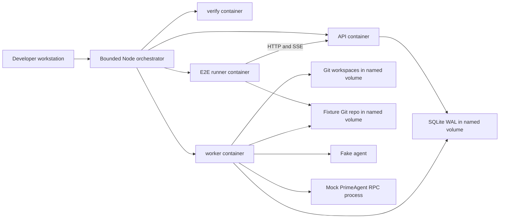
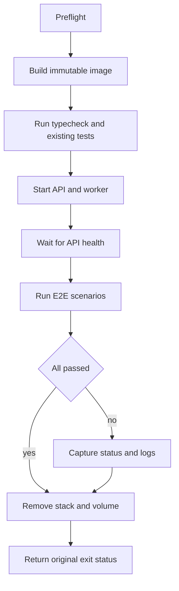

# Local pre-PR end-to-end testing

Status: **proposed design; not implemented**

This document designs a local end-to-end test gate for Mercury. The gate runs on a
developer workstation before a pull request is opened. It is deliberately separate
from CI.

The recommended design uses:

- Docker Compose for process, network and filesystem isolation;
- Node and TypeScript for orchestration and assertions;
- Mercury's existing fake agent for the default system journey;
- the existing mock PrimeAgent RPC fixture for deterministic adapter coverage;
- explicit opt-in tiers for real agents and Mercury's own container sandbox.

No command or file described as "proposed" exists until the corresponding roadmap
phase is implemented.

Related documents:

- [Architecture](../ARCHITECTURE.md)
- [Testing](testing.md)
- [Operations](operations.md)
- [Configuration](configuration.md)
- [Quickstart](../QUICKSTART.md)
- [Agent adapters](agent-adapters.md)

---

## 1. Problem

Mercury already has broad automated coverage. The current test suite includes:

- pure domain and state-machine tests;
- in-process API, worker, event and persistence integration tests;
- real child-process tests for adapter protocol fixtures;
- real multi-process SQLite contention and event wake-up tests;
- CLI wiring tests for selected server and worker behavior;
- Fleet tests against local stub hosts.

Normal tests correctly avoid real LLMs and external network services. They use
`FakeAgentAdapter` and protocol fixtures, and they run through Node's built-in test
runner.

The missing layer is one external client journey against the production process
shape:

```text
client -> API process -> shared SQLite <- worker process -> workspace -> agent
```

No current test starts separate API and worker processes, submits a Run through the
public API, observes it through REST and SSE, and waits for the worker to complete it.
There is also no Dockerfile, Compose stack or local pre-PR wrapper.

That gap matters because in-process tests cannot prove all of these conditions
together:

- API and worker receive compatible environment configuration;
- both processes open the same SQLite database and workspace root;
- CLI startup wiring matches the documented production commands;
- container paths are valid from both processes;
- the public authentication, Run, event and SSE endpoints compose into one journey;
- processes stop and disposable state is removed after success or failure.

---

## 2. Goals

The framework should:

1. Provide one memorable local command before opening a PR.
2. Test the current checkout, including uncommitted changes.
3. Run dependency installation, typechecking, existing tests and system E2E in a
   clean Linux environment.
4. Start the API and worker as separate processes.
5. Drive Mercury only through public HTTP and SSE interfaces.
6. Avoid real LLM calls, provider credentials and external network dependencies in
   the default gate.
7. Use a real disposable Git repository and Mercury's normal `git-worktree`
   workspace mode.
8. Bound every build, test, startup, request and teardown operation.
9. Produce useful diagnostics when a process exits, a request fails or a deadline
   expires.
10. Remove containers, networks and volumes by default.
11. Run independently of CI and remain opt-in from `npm test`.
12. Leave extension points for real-agent and real-sandbox compatibility checks.

## 3. Non-goals

The first implementation should not:

- replace the existing unit and integration suites;
- run automatically in GitHub Actions;
- require PrimeAgent, Hermes, Claude, provider credentials or an LLM;
- mount the Docker socket in the default stack;
- prove Docker or Podman behavior inside Mercury's `SandboxManager`;
- test the dashboard in a browser;
- include Fleet in the host system journey;
- test deployment units, reverse proxies, TLS or backup restoration;
- provide load, soak, chaos or performance testing;
- publish E2E assets in the npm package;
- assert every Run state-machine edge already covered by focused tests.

The framework is a final confidence layer, not a second copy of the full test suite.

---

## 4. Design decisions

### 4.1 Use Node and TypeScript for control and assertions

The repository already uses Node's built-in test runner and requires Node 22.18 or
newer. A Node orchestrator can:

- spawn commands with argument arrays instead of shell interpolation;
- apply an `AbortSignal` deadline to each child process;
- consume stdout and stderr without deadlocking on full pipes;
- make HTTP requests and parse SSE without adding curl or jq;
- share assertion conventions with the existing tests;
- handle macOS without depending on GNU `timeout`.

A small shell wrapper would be acceptable as a convenience entry point, but it
should not own lifecycle, timeout or assertion logic.

### 4.2 Use Docker Compose for topology

Compose describes the production-shaped process graph clearly and is available with
Docker Desktop on macOS. The default runtime stack needs three long-lived or
one-shot services:

- `api`: `node src/cli.ts server`;
- `worker`: `node src/cli.ts worker`;
- `e2e-runner`: a one-shot Node test process.

A separate `verify` service runs typechecking and the existing core and Fleet tests
before the system stack starts.

Compose is preferred over adding Testcontainers because the topology is small,
declarative and does not justify another runtime dependency. The Node orchestrator
still owns sequencing and failure reporting.

### 4.3 Build an image from the current checkout

The image should copy the checkout rather than bind-mount it at runtime.

This gives the test a stable source snapshot and avoids Docker Desktop host-path
sharing problems. A proposed `.dockerignore` excludes at least:

- `.git/`;
- host `node_modules/`;
- `dist/`;
- `*.db`, `*.db-wal` and `*.db-shm`;
- `workspaces/`;
- local `.env` files;
- editor and operating-system metadata.

The image should:

- derive from the exact supported Node floor, initially
  `node:22.18.0-bookworm-slim`;
- install Git and no unrelated system packages;
- copy `package.json` and `package-lock.json` before running `npm ci`, allowing safe
  Docker layer caching;
- copy the remaining source only after dependencies are installed;
- create `/state` and make it writable by the image's non-root user;
- run all services as the same non-root UID.

Using the Node floor catches syntax or runtime usage that accidentally requires a
newer release. The existing CI matrix remains responsible for the second Node
version.

### 4.4 Isolate runtime state in a named volume

API, worker and runner share one named volume mounted at the same absolute path:

```text
/state/
  mercury.db
  mercury.db-wal
  mercury.db-shm
  fixture-repo/
  workspaces/
    repos/
    worktrees/
```

The same path in every container avoids ambiguity in persisted workspace paths and
Git worktree metadata.

The runner creates `fixture-repo` before submitting a Run:

1. `git init --initial-branch=main`;
2. configure a fixture-only author name and email;
3. add a small tracked file;
4. create the initial commit.

The Run request uses:

```json
{
  "task": "E2E plumbing run",
  "agent": "fake",
  "repository": {
    "localPath": "/state/fixture-repo",
    "baseBranch": "main"
  }
}
```

This exercises Mercury's normal `git-worktree` path rather than weakening the test
with copy mode.

### 4.5 Keep runtime networking internal

The Compose runtime network should be internal. The API does not need a host port:
the E2E runner calls `http://api:3000` over the Compose network.

Benefits:

- no collision with a developer's local port 3000;
- no accidental exposure on the workstation;
- no external network access during deterministic scenarios;
- parallel runs can use independent Compose project names.

The API must bind `0.0.0.0` inside its container. This is safe because it is attached
only to the private test network and no port is published.

Image pulls and `npm ci` need network access during image build. Runtime scenarios
do not.

### 4.6 Keep the default gate deterministic

The default worker registers Mercury's normal fake adapter and PrimeAgent adapter.
The PrimeAgent command points to the existing mock RPC fixture:

```text
MERCURY_PRIMEAGENT_CMD=/usr/local/bin/node
MERCURY_PRIMEAGENT_ARGS=/app/test/fixtures/mock-prime-agent-rpc.mjs
```

The default gate passes no model-provider credentials. It performs no LLM calls.

---

## 5. Proposed topology



### 5.1 Service responsibilities

#### `verify`

One-shot service that proves the copied checkout is installable and passes the
existing local quality gate:

1. dependency installation is already completed by the image build through
   `npm ci`;
2. run `npm run typecheck`;
3. run `npm test`.

It does not start Mercury and does not share the runtime state volume.

#### `api`

Long-lived service that:

- runs `node src/cli.ts server`;
- opens `/state/mercury.db`;
- serves HTTP on container port 3000;
- receives Run requests and serves REST/SSE observations;
- never executes an agent.

#### `worker`

Long-lived service that:

- runs `node src/cli.ts worker`;
- opens the same `/state/mercury.db`;
- creates worktrees under `/state/workspaces`;
- executes fake or mock-RPC adapters;
- shuts down gracefully when Compose sends `SIGTERM`.

#### `e2e-runner`

One-shot service that:

- initializes the fixture Git repository;
- waits for API startup with a bounded deadline;
- proves worker availability by completing a probe Run;
- executes sequential public-API scenarios;
- exits zero only when every assertion passes.

The runner must not import Mercury stores, database modules or worker internals.
Importing domain types for compile-time response typing is acceptable, but runtime
behavior must be observed through HTTP and SSE.

---

## 6. Proposed configuration

API and worker must receive identical persistence and agent configuration:

```text
MERCURY_DB=/state/mercury.db
MERCURY_WORKSPACE_BASE=/state/workspaces
MERCURY_WORKSPACE_MODE=git-worktree
MERCURY_API_TOKENS=tok-alice:alice,tok-bob:bob
MERCURY_DEFAULT_AGENT=fake
MERCURY_BIND_HOST=0.0.0.0
MERCURY_PORT=3000
MERCURY_POLL_MS=50
MERCURY_LOG_LEVEL=info
MERCURY_PRIMEAGENT_CMD=/usr/local/bin/node
MERCURY_PRIMEAGENT_ARGS=/app/test/fixtures/mock-prime-agent-rpc.mjs
```

The values are test-only and contain no real secret. The runner receives only:

```text
MERCURY_E2E_BASE_URL=http://api:3000
MERCURY_E2E_TOKEN=tok-alice
MERCURY_E2E_OTHER_TOKEN=tok-bob
MERCURY_E2E_REPOSITORY=/state/fixture-repo
```

The E2E-specific prefix prevents confusion with product configuration.

`/healthz/workers` is not sufficient worker readiness when the queue is idle:
the endpoint reports active Run leases, so a healthy idle worker can produce an
empty `workers` array. The first fake Run is therefore the authoritative readiness
probe for the API-to-database-to-worker path.

---

## 7. Proposed local commands

These names are design targets, not current commands:

```bash
# Complete isolated pre-PR gate:
# image build/npm ci -> typecheck -> existing tests -> deterministic E2E
npm run prepr

# Deterministic Docker system E2E only, for iteration
npm run test:e2e

# Validate the Compose model without starting services
npm run test:e2e:config
```

The full gate should not be added to `npm test`. `npm test` must remain fast and
usable without Docker.

The implementation should also expose the underlying direct command:

```bash
node e2e/run.ts
```

Useful proposed flags:

```text
--e2e-only       skip the verify service
--keep-on-fail   retain the failed Compose project for inspection
--verbose        stream service logs while scenarios run
```

The default remains cleanup-on-failure. `--keep-on-fail` is an explicit debugging
escape hatch, and the orchestrator must print the exact cleanup command when it is
used.

---

## 8. Orchestration lifecycle

The host orchestrator owns the whole lifecycle.



### 8.1 Preflight

Before building, verify:

- Node satisfies the repository floor;
- `docker version` succeeds;
- `docker compose version` succeeds;
- the Docker daemon is reachable;
- the required Compose file exists;
- no unsupported opt-in tier was requested.

Preflight failure should be short and actionable. It should not leave resources.

### 8.2 Unique project identity

Generate a Compose project name from:

- a fixed `mercury-e2e` prefix;
- the orchestrator process ID;
- a short random suffix.

This allows two worktrees or terminals to run E2E concurrently without sharing
containers, networks or volumes.

### 8.3 Stage execution

Every spawned command uses:

- an argument array;
- inherited interactive output or captured output that is drained continuously;
- an external deadline;
- a clear stage label;
- termination escalation from `SIGTERM` to `SIGKILL` when necessary.

Suggested initial outer deadlines:

- preflight command: 30 seconds each;
- image build, including first pull and `npm ci`: 10 minutes;
- typecheck plus current tests: 3 minutes;
- service startup: 30 seconds;
- each HTTP request: 5 seconds;
- each deterministic Run scenario: 60 seconds;
- diagnostics collection: 20 seconds;
- Compose teardown: 30 seconds.

These are safety ceilings, not expected durations. The current typecheck and full
suite normally complete much faster.

### 8.4 Signal handling

On `SIGINT`, `SIGTERM`, normal completion or an exception:

1. stop accepting new work;
2. preserve the first failure or signal as the final result;
3. request Compose shutdown;
4. collect logs first if the result is a failure;
5. remove the project and named volume unless `--keep-on-fail` was selected;
6. exit with a non-zero status for interruption or failure.

Cleanup errors must be reported but must not replace the original test failure.

---

## 9. Deterministic scenario set

Scenarios should run sequentially. Parallel scenarios would share one queue,
worker and fixture repository, making failures harder to attribute while providing
little extra confidence.

### 9.1 API startup and authentication

Assertions:

1. `GET /healthz` returns 200.
2. Response `product` and `version` are present.
3. Authenticated `GET /api/agents` returns the `fake` and `primeagent` ids.
4. An unauthenticated `/api` request returns 401.

This proves server startup, route wiring and bearer authentication.

### 9.2 Fake-agent Run lifecycle

Steps:

1. Submit a Run as Alice with `agent: fake` and the fixture repository.
2. Require `201` with a `runId` and initial `QUEUED` status.
3. Open the Run's SSE stream, allowing persisted backlog delivery if the fake agent
   completed before the stream connected.
4. Wait for a terminal event and stream closure.
5. Fetch the final Run and event page through REST.

Assertions:

- final status is `COMPLETED`;
- events contain `run.created`, `run.started` and `run.completed`;
- event sequences are strictly increasing and have no duplicate sequence;
- the SSE terminal event agrees with the final REST state;
- `workspacePath` is under `/state/workspaces/worktrees/`;
- `workspaceBranch` is the expected `agent/<runId>` branch;
- no event reports an error;
- the Run remains retrievable after SSE disconnect.

This is also the worker readiness probe. A timeout here should report API and worker
logs rather than claim only that readiness failed.

### 9.3 Owner scoping

Using the Run from the previous scenario:

1. Alice can fetch it.
2. Bob receives 404, not 403.
3. Bob cannot fetch its events.

Focused API tests remain the primary authorization proof. This scenario only checks
that the production-shaped configuration did not bypass owner scoping.

### 9.4 Mock-RPC human-input journey

Run this scenario with `MOCK_RPC_MODE=input` in the worker:

1. Submit a Run with `agent: primeagent`.
2. Wait for status `NEEDS_INPUT`.
3. Confirm an `input.required` event with a request id.
4. Submit an answer through `POST /api/runs/:runId/input`.
5. Wait for `COMPLETED`.
6. Confirm the translated agent message contains the fixture's acknowledgement.

This covers the real adapter subprocess and JSONL translation path without a model.

### 9.5 What stays in focused tests

Do not initially duplicate:

- cancellation timing races;
- retry backoff and lease expiry;
- queue claim contention;
- shutdown handback ordering;
- SSE backpressure;
- timeout and stuck-Run alerting;
- sandbox command construction;
- every mock RPC failure mode.

Those behaviors have stronger deterministic tests close to their implementation.
They should move into E2E only when a production wiring regression demonstrates a
specific missing system assertion.

---

## 10. Assertions and polling rules

Tests must poll state, not sleep for guessed durations.

Each poll helper should:

- accept an absolute deadline;
- apply a request timeout shorter than that deadline;
- preserve the last response status and body;
- stop immediately on an unexpected terminal state;
- include the Run id and last observation in its timeout error;
- use a short fixed interval, initially 100 milliseconds.

SSE parsing should:

- handle comment and keepalive lines;
- parse `event:` and `data:` fields;
- reject malformed JSON with the raw frame in the error;
- track the last sequence;
- close the response body on timeout;
- accept terminal events delivered from persisted backlog;
- avoid assuming that every intermediate state is observable through REST.

The state machine may progress faster than a polling client. The durable events,
not repeated status snapshots, prove the intermediate lifecycle.

---

## 11. Failure diagnostics

The framework must make a failure actionable without rerunning in verbose mode.

On failure, report:

- failing stage and elapsed time;
- exact child exit code or signal;
- scenario name and Run id, if available;
- last HTTP status and bounded response body;
- last observed Run status and event sequence;
- `docker compose ps` output;
- bounded API and worker logs;
- whether cleanup succeeded;
- retained project name and cleanup command when `--keep-on-fail` is active.

Large output should be written to a temporary host directory such as:

```text
/tmp/mercury-e2e-<project>/
  compose-ps.txt
  api.log
  worker.log
  runner.log
  summary.json
```

Print that path on failure. Delete it after a successful run. Logs should have a
size cap so a runaway process cannot exhaust the workstation disk.

The deterministic stack contains only fixed test tokens. The future real-agent tier
must add redaction before logs are persisted.

---

## 12. Isolation and security model

### 12.1 Guarantees of the default gate

The proposed default gate isolates:

- Node dependencies from host `node_modules`;
- Linux runtime behavior from macOS host behavior;
- API and worker into separate processes and containers;
- database, repositories and workspaces in a unique disposable volume;
- service traffic on a private Compose network;
- concurrent runs through unique Compose project names;
- process users from container root after image setup.

It does not provide a hostile-code security boundary. Docker itself and the image
build remain trusted developer tooling.

### 12.2 No host source mount

The runtime stack should not bind-mount the checkout. This prevents a fake or mock
agent from modifying the developer's files and avoids absolute-path mismatch between
macOS and Linux.

The only current-checkout exposure is Docker's read-only build context transfer.

### 12.3 No Docker socket by default

Never mount `/var/run/docker.sock` in the default pre-PR gate.

A container with access to that socket can create privileged containers and mount
host paths. It is effectively able to control the host Docker daemon. Calling that
configuration "isolated" would be misleading.

### 12.4 Secrets

The default stack uses fixed non-production tokens and forwards no provider
credentials.

Rules for future opt-in tiers:

- load credentials from an explicitly named local env file or secret mechanism;
- keep that file ignored by Git;
- never copy it into an image layer;
- never print the environment;
- forward only adapter-specific variables;
- redact captured logs;
- fail closed when required credentials are missing.

---

## 13. Real-agent compatibility tier

Real-agent testing is useful but cannot be part of the deterministic pre-PR result.
It is slower, costs money, depends on third-party availability and may produce
non-repeatable repository changes.

A future command may look like:

```bash
npm run test:e2e:real -- --agent primeagent --env-file ~/.config/mercury/e2e.env
```

Design requirements:

- use a user-supplied derived worker image containing the selected binary;
- print the binary version before running;
- use a separate Compose project and volume;
- require explicit agent selection;
- require explicit credential forwarding;
- use a harmless fixture task with an objective filesystem assertion;
- cap duration and model budget where the adapter supports it;
- report compatibility separately from the deterministic gate;
- never make `npm run prepr` fail because this tier was not run.

This tier should begin with one supported agent. Generalizing before one real
compatibility test works would add configuration without evidence.

---

## 14. Mercury sandbox tier

Testing the framework inside Docker and testing Mercury's sandbox are different:

- the default gate runs Mercury services in containers;
- a sandbox test asks the worker container to start another agent container.

The second case needs Docker-outside-of-Docker or Docker-in-Docker.

### 14.1 Recommended approach

If implemented, use Docker-outside-of-Docker:

- install only the Docker CLI in the worker test image;
- mount the host Docker socket through a separate Compose override;
- build a purpose-specific sandbox image containing Node, Git and the mock RPC
  fixture;
- mount `/state` at the same absolute path in both worker and sandbox container;
- use a unique sandbox image tag and labels for cleanup;
- require an acknowledgement flag before startup.

Example proposed acknowledgement:

```text
MERCURY_E2E_ALLOW_DOCKER_SOCKET=1
```

Without that exact value, the orchestrator should refuse the sandbox tier.

### 14.2 Why not Docker-in-Docker first

Docker-in-Docker provides a separate daemon but adds:

- privileged container requirements;
- another storage layer;
- slower image pulls and builds;
- more complex cleanup;
- behavior that differs from the developer's normal Docker daemon.

It may become useful for stronger isolation later, but it is not the simplest first
compatibility check.

### 14.3 Sandbox assertions

The opt-in sandbox scenario should prove:

- a constrained Run starts only when a sandbox runtime is configured;
- the adapter process runs in the sandbox image;
- workspace changes are visible to the worker after container exit;
- CPU and memory options appear on the real container;
- allowed-network behavior matches the requested policy;
- the child container is removed on success, failure and cancellation;
- no child container remains after orchestrator cleanup.

Disk limits should remain separately opt-in because Docker storage drivers do not
support them uniformly.

---

## 15. Proposed repository layout

The following is a target layout, not current state:

```text
.dockerignore
e2e/
  Dockerfile
  compose.yml
  compose.sandbox.yml
  run.ts
  helpers.ts
  system.test.ts
  README.md
docs/
  local-e2e-design.md
```

Prospective modifications:

- `package.json`: add local `prepr` and E2E scripts;
- `tsconfig.json`: include `e2e/` in typechecking;
- `docs/testing.md`: link to the implemented local workflow;
- `.gitignore`: ignore only local E2E credential or artifact paths if needed.

Do not:

- add E2E files to the npm `files` whitelist;
- place E2E tests under `test/*.test.ts`, which would silently add Docker
  requirements to `npm test`;
- change `.github/workflows/ci.yml` as part of this framework;
- put generated databases, repositories or logs in the checkout.

---

## 16. Alternatives considered

### 16.1 Bash and curl only

Advantages:

- few files;
- familiar manual debugging;
- no application-level orchestration code.

Rejected as the primary design because:

- macOS lacks GNU `timeout`;
- process teardown and signal escalation are error-prone;
- JSON and SSE parsing would require jq or brittle text matching;
- child output can deadlock if pipes are not drained;
- structured diagnostics and reusable polling are harder.

A thin shell launcher may still call the Node orchestrator.

### 16.2 Host-only split-process tests

Advantages:

- fastest startup;
- easiest reuse of current child-process helpers;
- no Docker requirement.

Not selected as the final gate because it does not isolate dependencies, Linux
runtime behavior, ports or filesystem state. A host-only test can be a focused
developer loop later, but it should exercise the same scenario module as Docker.

### 16.3 One container with embedded worker

Advantages:

- minimal topology;
- closely matches the Quickstart.

Rejected because it does not test the production boundary between API and worker or
their shared SQLite configuration. The existing tests already cover embedded
in-process behavior well.

### 16.4 Testcontainers

Advantages:

- container lifecycle in TypeScript;
- dynamic ports and logs;
- programmatic composition.

Deferred because Compose already describes the required topology without a new npm
dependency. Reconsider only if Compose orchestration becomes difficult to maintain.

### 16.5 Browser E2E

Playwright would validate the dashboard but would not close the primary API/worker
gap. Browser testing should be a separate later proposal with its own maintenance
budget.

---

## 17. Implementation roadmap

Each phase should be independently reviewable. A later phase starts only after the
previous phase's acceptance gate is met.

### Phase 0 — design

Deliverable:

- this design document.

Acceptance gate:

- goals and non-goals are agreed;
- Docker Compose plus Node is accepted;
- deterministic and opt-in tiers are clearly separated;
- no implementation or CI behavior changes.

### Phase 1 — container and Compose foundation

Deliverables:

- `.dockerignore`;
- `e2e/Dockerfile`;
- `e2e/compose.yml`;
- a minimal bounded orchestrator with preflight, build, start and teardown;
- Compose configuration validation.

Acceptance gate:

- image builds from a clean checkout and from a dirty working tree;
- API and worker start as non-root separate containers;
- both use one named SQLite/workspace volume;
- no host port, source bind mount, credential or Docker socket is present;
- interrupting startup removes the project and volume;
- existing `npm test` behavior is unchanged.

Recommended PR boundary: foundation only, with a basic health probe but no broad
scenario set.

### Phase 2 — fake-agent system journey

Deliverables:

- disposable Git fixture creation;
- public HTTP and SSE helpers;
- API/auth, fake lifecycle and owner-scoping scenarios;
- failure log collection;
- `npm run test:e2e`.

Acceptance gate:

- a Run completes through separate API and worker containers;
- event sequence and terminal-state assertions pass;
- the test fails clearly if the worker is absent;
- forced API exit and assertion failure both produce useful diagnostics;
- success and failure leave no Compose resources by default.

Recommended PR boundary: the first useful E2E command.

### Phase 3 — full pre-PR gate

Deliverables:

- `verify` service;
- `npm run prepr`;
- stage summaries and independent deadlines;
- local usage and troubleshooting documentation.

Acceptance gate:

- one command runs image build/`npm ci`, typecheck, current core/Fleet tests and E2E;
- a failure returns the failing stage's non-zero status;
- no stage is unbounded;
- Docker build cache invalidates when package manifests change;
- E2E remains outside `npm test` and CI.

Recommended PR boundary: local developer workflow and documentation.

### Phase 4 — mock PrimeAgent RPC journey

Deliverables:

- worker configuration for the existing mock RPC fixture;
- human-input scenario;
- process-exit and translated-event assertions.

Acceptance gate:

- `primeagent` reaches `NEEDS_INPUT`;
- API input reaches the mock subprocess;
- the Run completes and records the translated acknowledgement;
- the mock process is gone after completion;
- no provider credential or external network access is used.

Recommended PR boundary: deterministic adapter integration.

### Phase 5 — robustness hardening

Deliverables:

- parallel-project collision test;
- signal and timeout fault-injection tests;
- log size caps;
- `--keep-on-fail` and `--verbose`;
- disk-space and stale-project troubleshooting.

Acceptance gate:

- two E2E projects can run concurrently;
- a hung child cannot hang the orchestrator;
- `SIGINT` and `SIGTERM` clean up;
- cleanup failure does not hide the original failure;
- retained projects print exact inspection and cleanup commands.

Recommended PR boundary: reliability after real developer usage identifies the
highest-value hardening cases.

### Phase 6 — one real-agent compatibility check

Deliverables:

- derived worker-image contract;
- explicit credential and binary-version checks;
- one harmless real-agent scenario;
- separate result reporting.

Acceptance gate:

- the tier cannot start accidentally;
- credentials are absent from image history and logs;
- cost and duration are bounded;
- default `prepr` remains deterministic and unchanged.

This phase is optional and should not block normal PRs.

### Phase 7 — real sandbox compatibility

Deliverables:

- separate sandbox Compose override;
- Docker CLI worker image;
- purpose-built mock sandbox image;
- Docker-socket acknowledgement;
- child-container cleanup checks.

Acceptance gate:

- no socket is mounted without explicit acknowledgement;
- constrained mock Run executes in a real child container;
- workspace, resource and cleanup assertions pass;
- all child resources carry unique labels and are removable;
- documentation states that socket access weakens host isolation.

This phase is optional and security-sensitive.

---

## 18. Suggested pull-request sequence

Keep implementation changes reviewable:

1. **Design PR** — this document only.
2. **Foundation PR** — image, Compose model, bounded lifecycle and health.
3. **System journey PR** — fixture repository, fake Run, SSE and diagnostics.
4. **Pre-PR command PR** — verifier, package scripts and user documentation.
5. **Mock RPC PR** — human-input adapter journey.
6. **Hardening PRs** — only for failure modes observed or deliberately injected.
7. **Optional compatibility PRs** — real agent and sandbox, separately.

Do not combine the Docker-socket tier with the deterministic foundation. The
security review and operational trade-offs are materially different.

---

## 19. Risks and mitigations

### Docker Desktop availability

Risk: Docker is not installed, the daemon is stopped or Compose v2 is missing.

Mitigation: fail during preflight with the exact failed prerequisite. Keep
`npm test` Docker-free.

### Slow first build

Risk: the first Node image pull and `npm ci` take longer than normal tests.

Mitigation: use safe layer caching, a separate 10-minute build ceiling and a visible
stage timer.

### Stale resources

Risk: process crashes or workstation shutdown bypasses cleanup.

Mitigation: unique project prefix and labels, plus a documented command to list and
remove stale `mercury-e2e-*` projects and volumes.

### SQLite filesystem behavior

Risk: SQLite WAL behaves poorly on network filesystems.

Mitigation: use a local Docker named volume, never NFS or a synchronized host folder.

### Git worktree path mismatch

Risk: the primary repository and workspace are visible at different absolute paths.

Mitigation: place both under `/state` and mount that volume at `/state` everywhere.

### False worker readiness

Risk: an empty `workers` array is interpreted as an unavailable worker.

Mitigation: use a completed fake Run as the readiness proof.

### Fast lifecycle observations

Risk: REST polling misses intermediate statuses because the fake agent completes
quickly.

Mitigation: assert intermediate lifecycle through durable events and use REST only
for initial and final states.

### Flaky real-agent tier

Risk: provider, network, model and output variability make results unreliable.

Mitigation: separate compatibility reporting from the deterministic gate and never
run it implicitly.

### Docker socket exposure

Risk: a sandbox worker controls the host Docker daemon.

Mitigation: separate override, explicit acknowledgement, no credentials, clear
warning and unique resource labels.

---

## 20. Success criteria

The framework is complete for its initial scope when:

- `npm run prepr` is the only command a developer needs to remember;
- it tests an immutable copy of the current checkout in Linux containers;
- dependency installation, typechecking and existing tests run before system E2E;
- API and worker run separately against one SQLite WAL database;
- an external runner completes a fake Run through public API and SSE interfaces;
- a mock PrimeAgent Run completes a human-input round trip;
- no real LLM, provider credential, external runtime service or Docker socket is
  required;
- failures identify the stage, process and last system observation;
- all operations have external deadlines;
- resources are removed on pass, failure and interruption;
- `npm test`, package contents and CI remain unchanged.

Real-agent and sandbox tiers are enhancements, not part of this completion
definition.

---

## 21. Decision summary

The recommended path is:

1. keep the existing focused suites as the primary correctness layer;
2. add a Docker Compose system layer for the missing process boundary;
3. write orchestration and scenarios in Node/TypeScript;
4. use fake and mock-RPC agents for deterministic coverage;
5. run the full local gate explicitly before opening a PR;
6. keep CI, real agents and nested Docker outside the default design;
7. implement in small PRs, with the Docker-socket tier last and separately reviewed.
