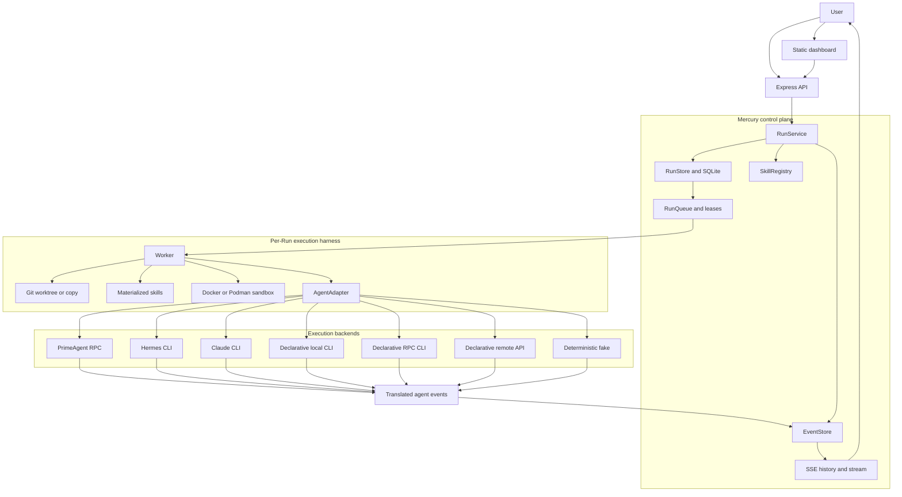

# System overview

Mercury is the durable orchestration and control layer between users and coding
agents. A user submits a task and receives a stable Run id; the Run continues
through browser closure, API disconnection and SSE reconnection.

For the complete design contract, see [`ARCHITECTURE.md`](../ARCHITECTURE.md).

## Responsibilities

Mercury owns:

- authentication and owner-scoped authorization;
- Run creation, state and history;
- agent and skill selection;
- queueing, leases and retries;
- workspace and process isolation;
- timeouts, cancellation and human input;
- structured events, streaming and observability.

Agents own:

- repository inspection;
- planning and implementation;
- tool execution and tests;
- commits and pull requests;
- progress and result reporting.

The `AgentAdapter` boundary translates between these two domains. Mercury does
not spread agent-specific protocols through its API, queue or worker logic.

## Runtime architecture



Production runs the API and worker as separate processes against the same
single-host SQLite database. `MERCURY_EMBEDDED_WORKER=true` combines them only
for development.

## Durable Run flow

```mermaid
flowchart LR
    Submit[SubmitTask] --> Create["Create Run transaction"]
    Create --> QueueRun[QueueRun]
    QueueRun --> Claim["Worker claims lease"]
    Claim --> Prepare["Prepare workspace and skills"]
    Prepare --> Start["Start AgentAdapter"]
    Start --> Drive["Persist events and controls"]
    Drive --> Finalize["Finalize status and artifacts"]
    Finalize --> Inspect["Inspect later through API"]
```



Run creation returns after durable scheduling. It does not wait for the agent.
The worker then:

1. claims one queued Run under a lease;
2. verifies that it still owns a non-terminal Run;
3. applies required sandbox policy;
4. creates an isolated workspace pinned to the base commit;
5. materializes selected skills;
6. starts or resumes the selected adapter;
7. persists translated events and handles input, cancellation and timeout;
8. records commits, pull-request metadata, duration and final status;
9. terminates adapter processes before releasing the lease.

## Run lifecycle

```text
QUEUED -> STARTING -> RUNNING <-> NEEDS_INPUT
                         |
                         +-> COMPLETED
                         +-> FAILED
                         +-> CANCELLED
                         +-> TIMED_OUT
```

Important rules:

- terminal Runs never execute again;
- retry creates a new Run with `retryOf`;
- the retry reuses the original resolved base commit unless explicitly changed;
- infrastructure failures may retry automatically up to `maxRetries`;
- agent and task failures require manual retry;
- cancellation is cooperative first and forceful after a grace period;
- input waits may time out independently from execution;
- graceful worker shutdown may requeue an owned in-flight Run;
- a worker that lost its lease stops local work but does not mutate the Run.

All lifecycle transitions are persisted through `RunStore.transition`.

## Queue and recovery

The SQLite-backed queue uses leases so two workers cannot intentionally execute
the same Run at once. Workers heartbeat while a Run is active. Expired leases
are failed as infrastructure errors and recover through retry-as-new-Run where
policy allows.

SQLite WAL coordinates multiple processes on one host. Mercury does not support
placing the database on shared network storage or running one database across
several hosts. Fleet federates independent Mercury installations over HTTP
instead; see [`fleet-design.md`](fleet-design.md).

## Skills

Skills are reusable guidance, separate from execution backends. A caller may
choose skills explicitly or use deterministic keyword selection. Mercury loads
only a small relevant set and records:

- id and version;
- description and capabilities;
- source files;
- SHA-256 content hash;
- serialized snapshot.

Current limitation: `run_skills` persists complete snapshots, but the worker
currently takes their ids and re-resolves the live filesystem registry before
writing `.agents/skills/` into the workspace. Therefore the stored hash is an
audit record, but queued execution is not yet guaranteed to use those exact
bytes. The Crew roadmap makes snapshot-backed materialization a prerequisite;
see [`crew/role-presets.md`](crew/role-presets.md).

Skills are guidance rather than enforced phases. `skill.started` and
`skill.completed` are agent-reported markers.

## Workspaces

Each independent Run receives its own mutable workspace:

- **git-worktree** — default; creates `agent/<runId>` from a resolved base
  commit;
- **copy** — copies a local source tree for tests and non-Git inputs.

Additional repositories are placed under `workspace/repos/`; the primary
repository remains the workspace root. Workspaces survive terminal status for
inspection and are later removed by retention and quota GC.

Container sandboxing is optional unless a Run requests `resourceLimits` or
`allowedNetworks`. Requested isolation fails closed when no runtime is
available. See [`operations.md`](operations.md) for the exact network and image
limitations.

## Events and live progress

Raw agent output is not the domain model. Adapters translate it into events such
as:

- `agent.message`;
- `tool.started`, `tool.completed`, `tool.failed`;
- `test.started`, `test.completed`;
- `git.changed`, `git.commit`, `git.pr`;
- `input.required`, `input.received`;
- terminal Run events.

`EventStore` assigns a monotonic sequence per Run and redacts before persistence.
Clients first fetch history, then connect to SSE with `?after=<sequence>`.
Reconnection recovers from the durable cursor; SSE is a latency mechanism, not
the source of truth.

Same-process appends wake subscribers directly. An optional same-host Unix
socket wakes the API when a separate worker appends. Database polling remains
the correctness fallback.

## Human control

When an adapter reports a supported input request, Mercury transitions the Run
to `NEEDS_INPUT`, persists the request and exposes it through API and dashboard.
An authorized response returns the Run to `RUNNING`.

Cancellation and input endpoints use the same owner/admin checks as Run reads.
A foreign Run returns `404` rather than revealing that it exists.

## Design boundaries

- The API server never executes agents except in explicit embedded development
  mode.
- Agent-specific behavior stays in `src/adapters/`.
- Events are appended through `EventStore`.
- Run states change through `RunStore.transition`.
- Workspaces are isolated per independent Run.
- Platform-wide credentials do not belong in workspaces, events or prompts.
- Crew Role Presets extend Run inputs; they do not replace the Run lifecycle.
